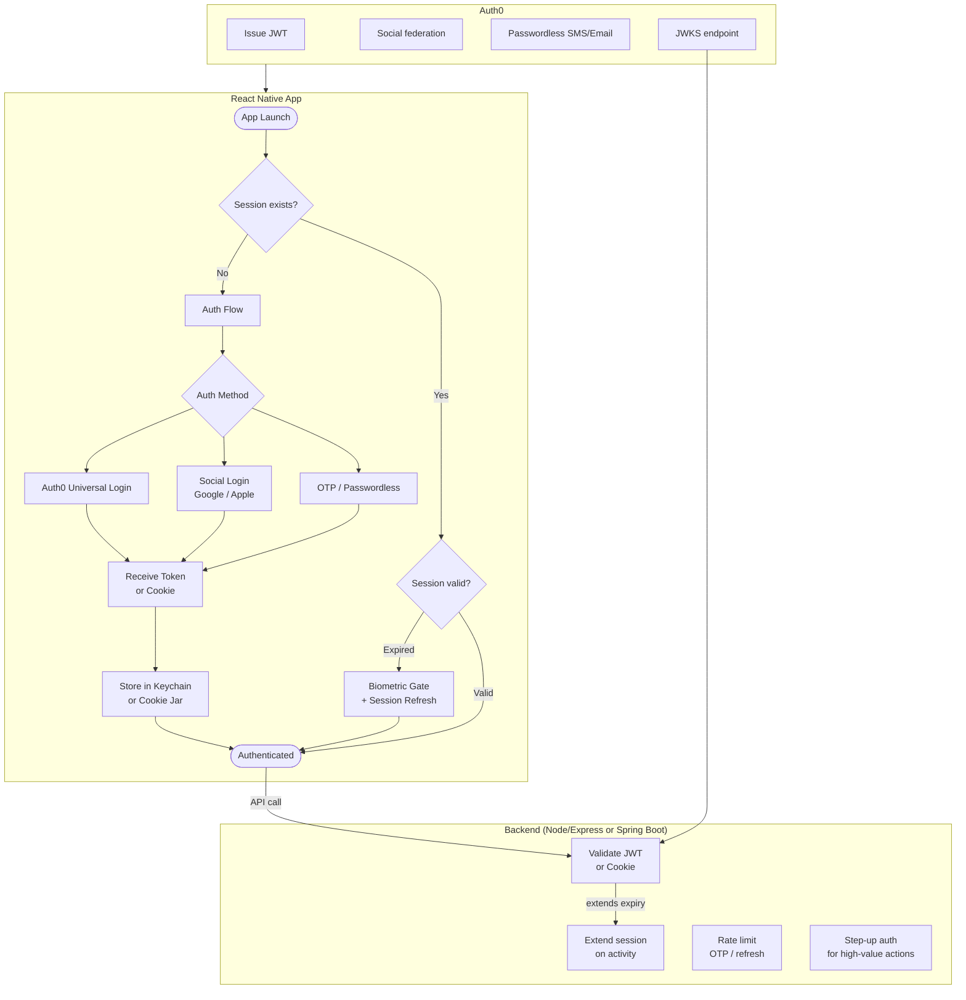
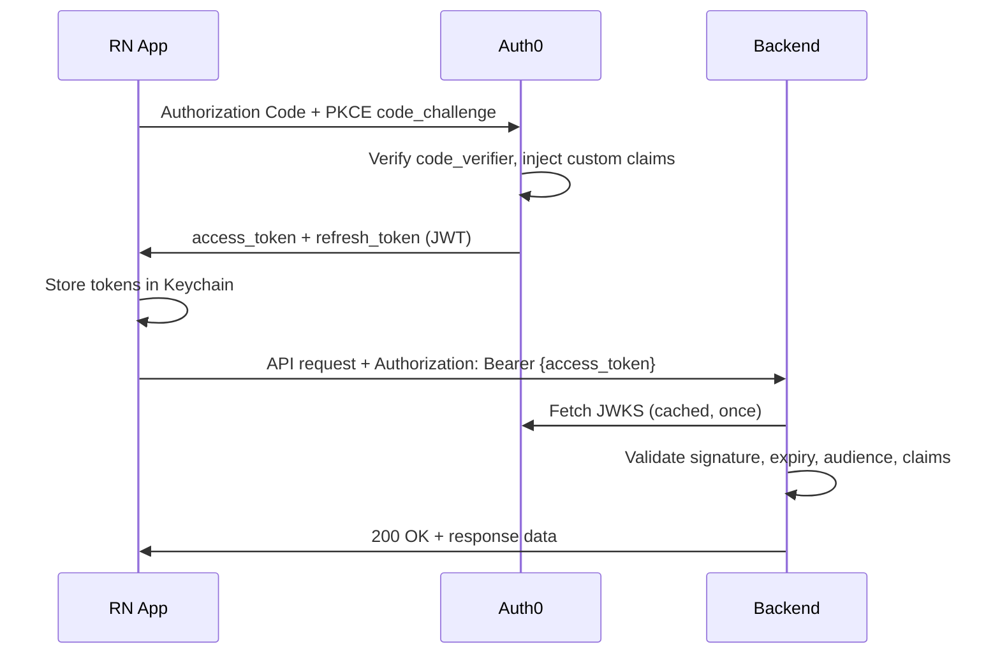
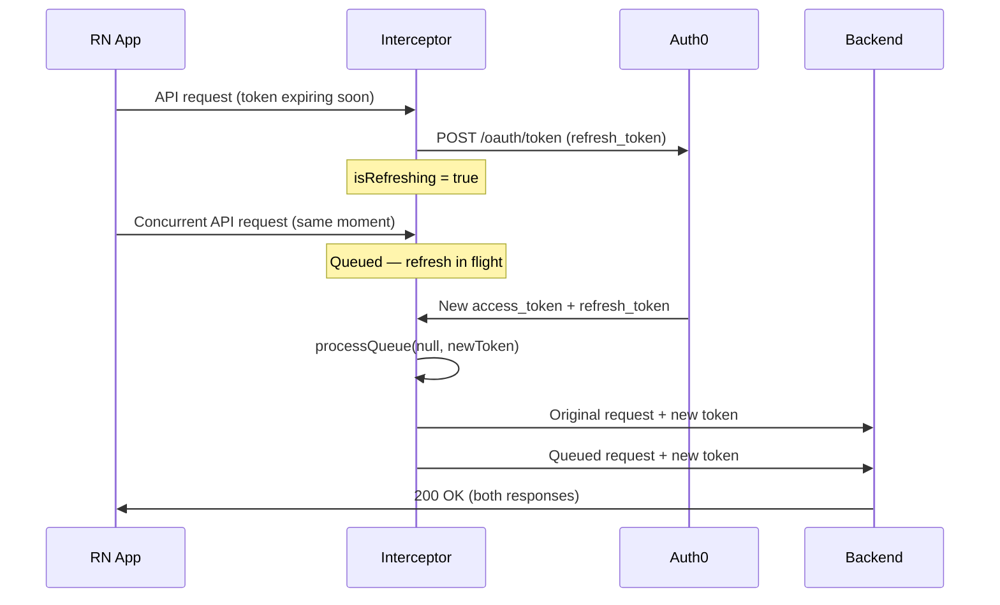
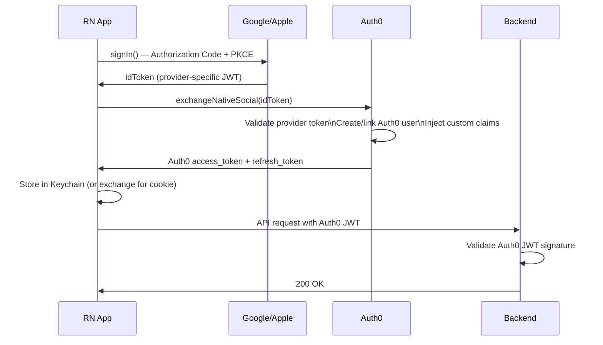
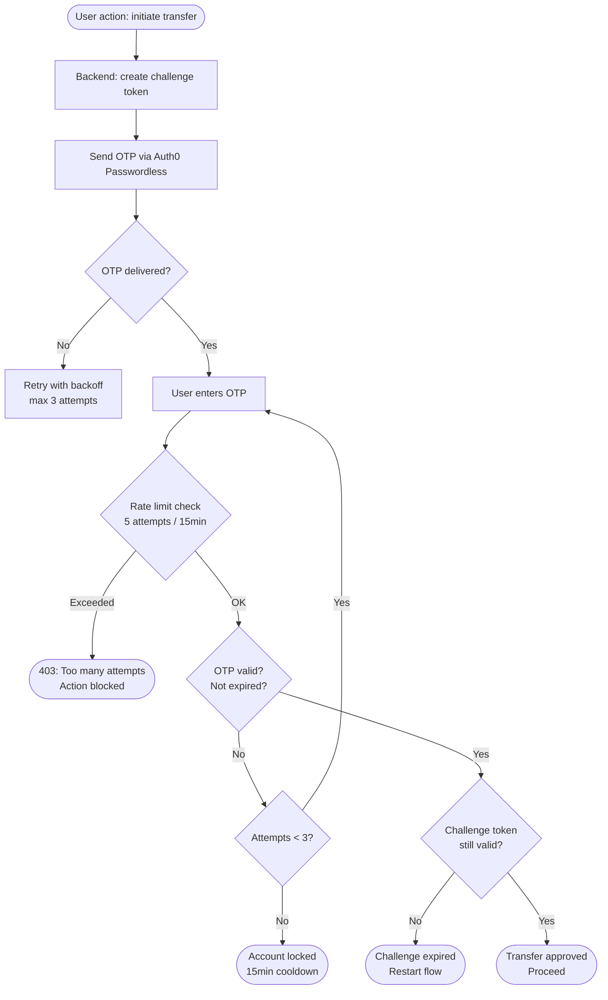
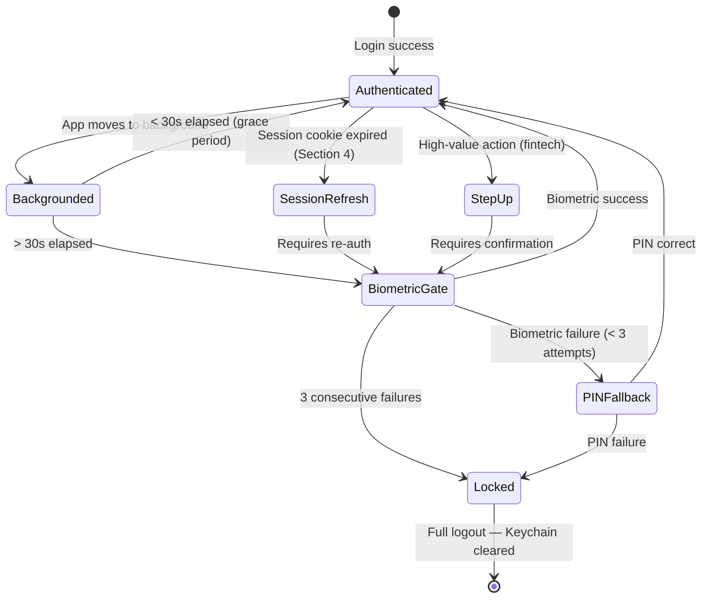
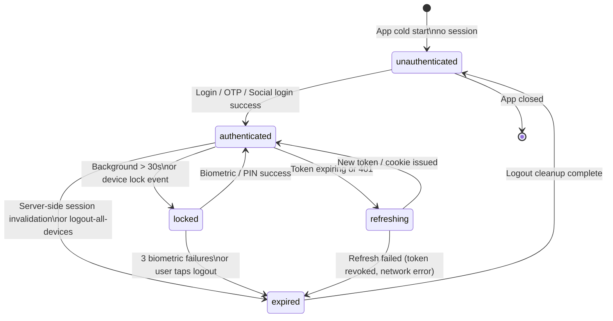
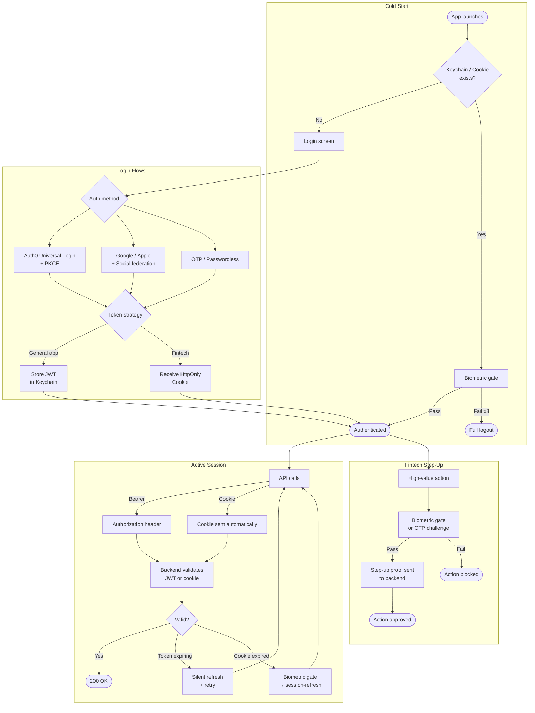
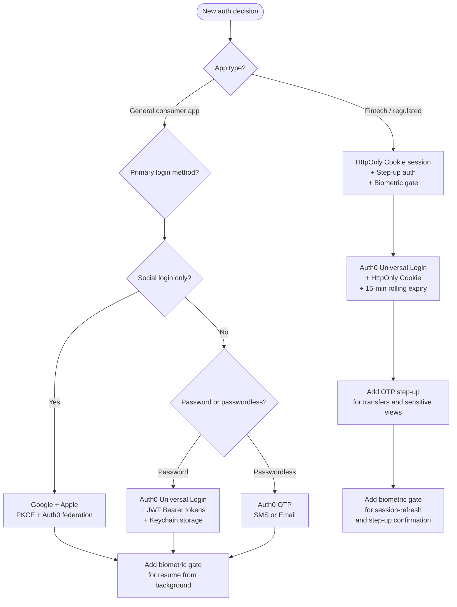

# React Native Authentication: A Complete Architecture Guide

> **Last reviewed:** May 2025 — Tested against React Native 0.76+, Auth0 SDK v4.x, react-native-biometrics 3.x. Authentication patterns evolve with security research; always verify library versions and OAuth specs before shipping.

---

## Prerequisites

This guide is for engineers building authenticated React Native apps — from general consumer apps to fintech and regulated products. It assumes you are comfortable with:

- TypeScript and React hooks
- HTTP fundamentals (headers, cookies, status codes)
- A backend already running (Node/Express or Spring Boot examples provided)
- An Auth0 tenant set up, or familiarity with a comparable IdP (Cognito, Firebase Auth)

Sections marked **fintech** are relevant specifically to apps handling payments, KYC, lending, or money movement. General-purpose apps can skip those sections without losing continuity.

This guide builds on top of the [React Native Security: Defense-in-Depth Implementation Guide](../security/01-rn-security-defense-in-depth.md). Token storage, Keychain usage, and biometric patterns here assume the security stack described there is already in place.

---

## 1. Introduction

Authentication is the highest-value attack target in any mobile app. It is the gate that separates public from private, anonymous from accountable, and unauthenticated traffic from your users' data. A misconfigured auth layer doesn't just expose one user — it exposes every user, and the damage compounds with scale.

### Why Mobile Auth Is Uniquely Complex

Web authentication has decades of established patterns. Mobile authentication — particularly React Native — introduces a distinct set of constraints that web patterns don't address cleanly:

- **No secure cookie jar by default**: Browsers handle cookies automatically, with `HttpOnly` preventing JS access. RN apps need explicit cookie jar configuration to replicate this.
- **JS bundle exposure**: Tokens stored carelessly in JS-land can be extracted from a decompiled bundle or read from memory on a rooted device.
- **Background and foreground transitions**: Apps move between states constantly — background, foreground, locked, killed — and each transition is a potential session management failure point.
- **Biometric APIs are OS-level, not app-level**: Face ID and fingerprint don't authenticate to your server. They unlock a locally stored credential. Most implementations conflate these two things and get the architecture wrong.
- **Multiple token types in flight**: Access tokens, refresh tokens, social provider tokens, and OTP codes often coexist in the same session flow. Managing their lifetimes, storage, and rotation without subtle races is harder than it looks.

### The Auth Layer Model

No single tool or pattern handles authentication end-to-end. A production auth implementation is layered, with each layer addressing a specific threat:

| Layer | Tool / Pattern | Threat Addressed |
|---|---|---|
| Identity Provider | Auth0 | Credential management, MFA, social federation, token issuance |
| Token Strategy | JWT Bearer or HttpOnly Cookie | Session hijacking, token theft, replay attacks |
| Social Login | Google, Apple (PKCE) | Credential stuffing, weak password reuse |
| Passwordless / OTP | Auth0 Passwordless + SMS/Email | Phishing, password spray, step-up challenges |
| Biometric Gate | react-native-biometrics + Keychain | Unattended access, physical device theft |
| Session Lifecycle | State machine + activity-based expiry | Session fixation, stale sessions, background leakage |
| Backend Enforcement | Node/Express or Spring Boot middleware | Forged tokens, replay attacks, privilege escalation |

Each layer assumes the one below it can be compromised. Together they form a defense-in-depth auth strategy that significantly raises the cost and complexity of an account takeover attack.

### OWASP Mobile Top 10 Coverage

This guide's patterns directly address five of the [OWASP Mobile Top 10 (2024)](https://owasp.org/www-project-mobile-top-10/) risk categories:

| OWASP Category | Risk | This Guide's Defense |
|---|---|---|
| M3 — Insecure Authentication | Weak or bypassable auth flows, missing re-auth for sensitive actions | Auth0 + PKCE ([Section 2](#2-auth0-integration--identity-foundation)); Biometric step-up ([Section 7](#7-biometric-re-authentication)) |
| M4 — Insufficient Input/Output Validation | OTP brute-force, token replay, malformed JWT acceptance | OTP rate limiting ([Section 6](#6-otp--passwordless-authentication)); JWT validation middleware ([Section 9](#9-backend-implementation-reference)) |
| M6 — Inadequate Privacy Controls | Session data leakage in background, navigation stack exposure | Session state machine ([Section 8](#8-session-management--state-machine)); logout completeness |
| M9 — Insecure Data Storage | Tokens in AsyncStorage, credentials in JS memory | Keychain-only storage ([Section 3](#3-jwt-token-strategy--bearer-token-approach)); HttpOnly Cookie ([Section 4](#4-httponly-cookie-session-strategy)) |
| M10 — Insufficient Cryptography | Weak token signing, implicit flow, short-lived secrets without rotation | PKCE enforcement ([Section 5](#5-oauth-20--social-login)); refresh token rotation ([Section 3](#3-jwt-token-strategy--bearer-token-approach)) |

### End-to-End Architecture Overview



---

## 2. Auth0 Integration — Identity Foundation

> Auth0 is your Identity Provider (IdP) — it handles credential storage, token issuance, MFA, social federation, and passwordless flows. Your backend validates tokens Auth0 issues. Your app never stores or handles raw passwords. This division of responsibility is the key architectural decision.

### Responsibility Split

Before writing any code, it helps to be clear about what each layer owns:

| Responsibility | Auth0 | Your Backend | Your App |
|---|---|---|---|
| Password storage and hashing | ✅ | ❌ | ❌ |
| Token issuance (JWT signing) | ✅ | ❌ | ❌ |
| Token validation | ❌ | ✅ | ❌ |
| Social login federation | ✅ | ❌ | ❌ |
| MFA / OTP delivery | ✅ | ❌ | ❌ |
| Role / permission claims | ✅ (custom claims) | ✅ (enforcement) | ❌ |
| Session cookie management | ❌ | ✅ | Partial |
| Biometric gate | ❌ | ❌ | ✅ |
| Refresh token rotation | ✅ | ✅ (cookie sessions) | ❌ |

### Installation

```bash
yarn add react-native-auth0
cd ios && pod install
```

### Auth0 Application Configuration

In your Auth0 dashboard, create a **Native** application (not SPA — Native gives you refresh token support without client secrets). Configure:

- **Allowed Callback URLs**: `com.yourapp://auth0/callback`
- **Allowed Logout URLs**: `com.yourapp://auth0/logout`
- **Refresh Token Rotation**: Enabled
- **Refresh Token Expiration**: Absolute expiration enabled (e.g., 30 days)
- **Token Endpoint Authentication Method**: None (PKCE apps don't use client secrets)

### Universal Login vs. Embedded Login

Always use **Universal Login** on mobile. Never build a custom login form that calls Auth0's authentication API directly.

| | Universal Login | Embedded Login |
|---|---|---|
| Password manager / passkey support | ✅ OS-native | ❌ Manual only |
| Phishing resistance | ✅ Auth0 domain | ❌ App-controlled form |
| MFA compatibility | ✅ Full | ⚠️ Partial |
| Social login UX | ✅ Handled by Auth0 | ❌ Manual per provider |
| Compliance (SOC2, ISO27001) | ✅ Covered | ❌ Your responsibility |
| Implementation complexity | Low | High |

The XSS surface of an embedded login form entirely negates the security benefits of using an IdP in the first place. Universal Login delegates the sensitive credential-handling to Auth0's domain.

### Authorization Code + PKCE Setup

PKCE (Proof Key for Code Exchange) is the only correct OAuth flow for mobile apps. There is no client secret — instead, a cryptographic code challenge proves that the entity completing the auth flow is the same one that started it, preventing authorization code interception attacks.

```ts
// auth/auth0.ts
import Auth0 from 'react-native-auth0';

export const auth0 = new Auth0({
  domain: process.env.AUTH0_DOMAIN!,
  clientId: process.env.AUTH0_CLIENT_ID!,
});

export const AUTH0_CONFIG = {
  audience: process.env.AUTH0_AUDIENCE!, // your backend API identifier
  scope: 'openid profile email offline_access', // offline_access = refresh tokens
} as const;
```

```ts
// auth/useAuth0Login.ts
import { useAuth0 } from 'react-native-auth0';
import { AUTH0_CONFIG } from './auth0';

export const useAuth0Login = () => {
  const { authorize, clearSession, user, error } = useAuth0();

  const login = async () => {
    try {
      const credentials = await authorize({
        audience: AUTH0_CONFIG.audience,
        scope: AUTH0_CONFIG.scope,
      });
      // credentials.accessToken, credentials.refreshToken, credentials.idToken
      return credentials;
    } catch (e) {
      throw new Error(`Auth0 login failed: ${e}`);
    }
  };

  const logout = async () => {
    await clearSession();
  };

  return { login, logout, user, error };
};
```

### Connecting Auth0 to Your Backend

Your backend validates Auth0-issued JWTs using Auth0's public JWKS endpoint. It never calls Auth0's API at runtime — validation is done locally using the public key.

**Node/Express:**
```bash
yarn add express-oauth2-jwt-bearer
```

```ts
// middleware/auth.ts (Node/Express)
import { auth } from 'express-oauth2-jwt-bearer';

export const requireAuth = auth({
  audience: process.env.AUTH0_AUDIENCE,
  issuerBaseURL: `https://${process.env.AUTH0_DOMAIN}/`,
  tokenSigningAlg: 'RS256',
});
```

**Spring Boot note:**
```yaml
# application.yml
spring:
  security:
    oauth2:
      resourceserver:
        jwt:
          issuer-uri: https://YOUR_DOMAIN.auth0.com/
          audiences: YOUR_API_AUDIENCE
```

### Auth0 Custom Claims — Injecting App Context Into Tokens

Auth0 lets you inject arbitrary claims into JWTs via Actions (the successor to Rules). This is how you attach fintech-specific context — KYC status, account tier, risk flags — to every token without a database call on every request.

```js
// Auth0 Action: "Add custom claims to access token"
exports.onExecutePostLogin = async (event, api) => {
  const namespace = 'https://yourapp.com';

  api.accessToken.setCustomClaim(`${namespace}/role`, event.user.app_metadata?.role ?? 'user');
  api.accessToken.setCustomClaim(`${namespace}/kyc_status`, event.user.app_metadata?.kyc_status ?? 'pending');
  api.accessToken.setCustomClaim(`${namespace}/account_tier`, event.user.app_metadata?.account_tier ?? 'standard');
};
```

On your backend, these claims are accessible as:

```ts
// Node/Express — after requireAuth middleware
const role = req.auth?.payload['https://yourapp.com/role'];
const kycStatus = req.auth?.payload['https://yourapp.com/kyc_status'];
```



---

## 3. JWT Token Strategy — Bearer Token Approach

> The Bearer token pattern stores access and refresh tokens in Keychain, sends the access token in the `Authorization` header on every request, and silently refreshes it before it expires. It is the standard pattern for general-purpose apps. Fintech apps should evaluate the [HttpOnly Cookie approach](#4-httponly-cookie-session-strategy) instead.

### Token Lifetime Decisions

| Token | Recommended Lifetime | Rationale |
|---|---|---|
| Access token | 15 minutes | Short enough to limit damage if stolen; long enough to avoid constant refreshes |
| Refresh token | 7–30 days (absolute) | Longer sessions reduce friction; absolute expiry forces re-login for abandoned sessions |
| ID token | Same as access token | Used for user profile only — never sent to your resource server |

For fintech apps, consider reducing access token lifetime to 5–10 minutes and enforcing step-up auth for high-value actions rather than relying purely on token freshness.

### Refresh Token Rotation

Refresh token rotation issues a **new refresh token on every use** and invalidates the old one. If a stolen refresh token is replayed, Auth0 detects the reuse and invalidates the entire token family — logging the user out of all devices.

Enable in Auth0 dashboard: **Applications → Your App → Refresh Token Rotation: On**.

Configure family invalidation (reuse detection) — this is what catches the attacker:

```
Refresh Token Reuse Interval: 0 seconds (no grace period in production)
```

### Token Storage — Keychain Only

Never store tokens in AsyncStorage. Always use Keychain (covered in depth in the [Security Guide Section 6](../security/01-rn-security-defense-in-depth.md#6-securing-data-at-rest-and-authentication)).

```ts
// auth/tokenStorage.ts
import * as Keychain from 'react-native-keychain';

const ACCESS_TOKEN_KEY = 'com.yourapp.access_token';
const REFRESH_TOKEN_KEY = 'com.yourapp.refresh_token';

export const tokenStorage = {
  saveTokens: async (accessToken: string, refreshToken: string) => {
    await Keychain.setGenericPassword('access', accessToken, {
      service: ACCESS_TOKEN_KEY,
      accessible: Keychain.ACCESSIBLE.WHEN_UNLOCKED_THIS_DEVICE_ONLY,
    });
    await Keychain.setGenericPassword('refresh', refreshToken, {
      service: REFRESH_TOKEN_KEY,
      accessible: Keychain.ACCESSIBLE.WHEN_UNLOCKED_THIS_DEVICE_ONLY,
    });
  },

  getAccessToken: async (): Promise<string | null> => {
    const result = await Keychain.getGenericPassword({ service: ACCESS_TOKEN_KEY });
    return result ? result.password : null;
  },

  getRefreshToken: async (): Promise<string | null> => {
    const result = await Keychain.getGenericPassword({ service: REFRESH_TOKEN_KEY });
    return result ? result.password : null;
  },

  clearTokens: async () => {
    await Keychain.resetGenericPassword({ service: ACCESS_TOKEN_KEY });
    await Keychain.resetGenericPassword({ service: REFRESH_TOKEN_KEY });
  },
};
```

### Silent Refresh — Proactive + Reactive

Use both strategies. Proactive refresh prevents the user from ever hitting a 401. Reactive refresh handles edge cases where proactive missed (app was in background, device clock skew).

```ts
// auth/tokenRefresh.ts
import { auth0, AUTH0_CONFIG } from './auth0';
import { tokenStorage } from './tokenStorage';
import { jwtDecode } from 'jwt-decode';

const TOKEN_REFRESH_BUFFER_SECONDS = 60; // refresh 60s before expiry

export const isTokenExpiringSoon = (accessToken: string): boolean => {
  const { exp } = jwtDecode<{ exp: number }>(accessToken);
  const nowInSeconds = Date.now() / 1000;
  return exp - nowInSeconds < TOKEN_REFRESH_BUFFER_SECONDS;
};

export const refreshAccessToken = async (): Promise<string> => {
  const refreshToken = await tokenStorage.getRefreshToken();
  if (!refreshToken) throw new Error('No refresh token — full login required');

  const credentials = await auth0.auth.refreshToken({
    refreshToken,
    scope: AUTH0_CONFIG.scope,
  });

  await tokenStorage.saveTokens(credentials.accessToken, credentials.refreshToken);
  return credentials.accessToken;
};
```

### Axios Interceptor — Queue-Based Concurrent Refresh

The most common implementation mistake: two concurrent requests both get a 401, both trigger a refresh, the second refresh uses an already-rotated token and fails, logging the user out unexpectedly. The fix is a queue that holds concurrent requests while a single refresh is in flight.

```ts
// api/axiosClient.ts
import axios from 'axios';
import { tokenStorage } from '../auth/tokenStorage';
import { isTokenExpiringSoon, refreshAccessToken } from '../auth/tokenRefresh';

const apiClient = axios.create({
  baseURL: process.env.API_BASE_URL,
  timeout: 10000,
});

let isRefreshing = false;
let refreshQueue: Array<{
  resolve: (token: string) => void;
  reject: (error: unknown) => void;
}> = [];

const processQueue = (error: unknown, token: string | null) => {
  refreshQueue.forEach(({ resolve, reject }) => {
    if (error) reject(error);
    else resolve(token!);
  });
  refreshQueue = [];
};

// Request interceptor — proactive refresh
apiClient.interceptors.request.use(async (config) => {
  let accessToken = await tokenStorage.getAccessToken();

  if (accessToken && isTokenExpiringSoon(accessToken)) {
    accessToken = await refreshAccessToken();
  }

  if (accessToken) {
    config.headers.Authorization = `Bearer ${accessToken}`;
  }

  return config;
});

// Response interceptor — reactive refresh (handles 401s)
apiClient.interceptors.response.use(
  (response) => response,
  async (error) => {
    const originalRequest = error.config;

    if (error.response?.status !== 401 || originalRequest._retry) {
      return Promise.reject(error);
    }

    if (isRefreshing) {
      // Queue this request — a refresh is already in flight
      return new Promise((resolve, reject) => {
        refreshQueue.push({ resolve, reject });
      }).then((token) => {
        originalRequest.headers.Authorization = `Bearer ${token}`;
        return apiClient(originalRequest);
      });
    }

    originalRequest._retry = true;
    isRefreshing = true;

    try {
      const newToken = await refreshAccessToken();
      processQueue(null, newToken);
      originalRequest.headers.Authorization = `Bearer ${newToken}`;
      return apiClient(originalRequest);
    } catch (refreshError) {
      processQueue(refreshError, null);
      await tokenStorage.clearTokens();
      // Trigger navigation to login — use your navigation ref or event emitter
      throw refreshError;
    } finally {
      isRefreshing = false;
    }
  },
);

export default apiClient;
```



---

## 4. HttpOnly Cookie Session Strategy

> **Recommended for fintech and high-security apps.** General-purpose apps can use [Bearer tokens (Section 3)](#3-jwt-token-strategy--bearer-token-approach) and skip this section.

The HttpOnly Cookie strategy is architecturally stronger than Bearer tokens for apps where session credential theft is a meaningful threat. The key difference: **the session credential never touches JavaScript**. The cookie is set by the server, stored by the OS, sent automatically by the HTTP layer, and is invisible to JS code — it cannot be read, logged, or stolen via JS-land exploits.

### Why This Is Stronger Than Bearer Tokens for Fintech

With Bearer tokens, the flow is:
1. App receives access token in a JSON response body
2. App stores it in Keychain (JS reads it, passes it to native Keychain API)
3. App reads it from Keychain on every request (JS reads it again)
4. App attaches it to the `Authorization` header (JS constructs the header)

Each step where JS touches the token is a potential exposure point on a compromised device.

With HttpOnly cookies:
1. App POSTs credentials to `/auth/login`
2. Server sets `Set-Cookie: session=...; HttpOnly; Secure; SameSite=Strict`
3. HTTP layer (OS-managed) stores and sends the cookie automatically
4. JS never sees the cookie value — it cannot read `document.cookie` equivalents in RN's HTTP layer

The session credential is managed entirely below the JS layer.

### Login Flow — Setting the Cookie

```ts
// api/authApi.ts — cookie-based login
import axios from 'axios';

const authClient = axios.create({
  baseURL: process.env.API_BASE_URL,
  withCredentials: true, // send/receive cookies
});

export const login = async (email: string, password: string) => {
  // POST /auth/login — backend sets HttpOnly cookie in response
  const response = await authClient.post('/auth/login', { email, password });
  return response.data; // { user, expiresAt } — no token in body
};

export const sessionRefresh = async () => {
  // POST /session-refresh — re-authenticates and issues new cookie
  const response = await authClient.post('/auth/session-refresh');
  return response.data;
};

export const logout = async () => {
  await authClient.post('/auth/logout'); // backend clears the cookie
};
```

### Cookie Jar Configuration for React Native

React Native's `fetch` and `axios` don't handle cookies automatically out of the box. You need `@react-native-cookies/cookies` to manage the cookie jar:

```bash
yarn add @react-native-cookies/cookies
cd ios && pod install
```

```ts
// api/cookieClient.ts
import axios from 'axios';
import CookieManager from '@react-native-cookies/cookies';

// Enable cookie handling globally
CookieManager.setFromResponse(
  process.env.API_BASE_URL!,
  'session=; Path=/; HttpOnly; Secure'
);

export const cookieApiClient = axios.create({
  baseURL: process.env.API_BASE_URL,
  withCredentials: true,
});

// Response interceptor — handle session expiry (401)
cookieApiClient.interceptors.response.use(
  (response) => response,
  async (error) => {
    if (error.response?.status === 401) {
      try {
        // Trigger biometric gate before calling session-refresh
        await requireBiometricConfirmation(); // see Section 7
        await sessionRefresh();
        return cookieApiClient(error.config); // retry original request
      } catch {
        // Biometric failed or session-refresh failed — full logout
        await CookieManager.clearAll();
        // Navigate to login
      }
    }
    return Promise.reject(error);
  },
);
```

### Backend Implementation — Activity-Based Expiry Extension

Every authenticated request extends the session. If no request is made within 15 minutes, the cookie expires and the client must call `/session-refresh`.

**Node/Express:**
```ts
// middleware/session.ts
import session from 'express-session';
import RedisStore from 'connect-redis';
import { createClient } from 'redis';

const redisClient = createClient({ url: process.env.REDIS_URL });
await redisClient.connect();

export const sessionMiddleware = session({
  store: new RedisStore({ client: redisClient }),
  secret: process.env.SESSION_SECRET!,
  resave: false,
  saveUninitialized: false,
  rolling: true, // ← extends expiry on every request (activity-based)
  cookie: {
    httpOnly: true,     // JS cannot read this cookie
    secure: true,       // HTTPS only
    sameSite: 'strict', // no cross-site requests
    maxAge: 15 * 60 * 1000, // 15 minutes — resets on every request
    domain: process.env.COOKIE_DOMAIN,
    path: '/',
  },
});
```

**Spring Boot equivalent:**
```java
// SecurityConfig.java
@Bean
public SecurityFilterChain filterChain(HttpSecurity http) throws Exception {
    http
        .sessionManagement(session -> session
            .sessionCreationPolicy(SessionCreationPolicy.IF_REQUIRED)
            .maximumSessions(1)
            .maxSessionsPreventsLogin(false)
        )
        .rememberMe(rememberMe -> rememberMe
            .tokenValiditySeconds(900) // 15 minutes
            .useSecureCookie(true)
        );
    return http.build();
}
```

### `/session-refresh` Endpoint

Called when the session cookie has expired. It re-authenticates the user (biometric confirmation happens on the client before this call is made) and issues a new cookie.

```ts
// routes/auth.ts (Node/Express)
router.post('/auth/session-refresh', requireBiometricToken, async (req, res) => {
  // requireBiometricToken verifies a short-lived proof from the app
  // that biometric confirmation was completed on-device

  const userId = req.biometricClaims.sub;
  const user = await userService.findById(userId);

  if (!user || user.isLocked) {
    return res.status(401).json({ error: 'Session refresh denied' });
  }

  // Regenerate session — old session is invalidated
  req.session.regenerate((err) => {
    if (err) return res.status(500).json({ error: 'Session error' });

    req.session.userId = userId;
    req.session.refreshedAt = new Date().toISOString();

    // Cookie is set automatically by express-session with rolling: true
    res.json({ user: { id: user.id, email: user.email } });
  });
});
```

### Bearer Token vs. HttpOnly Cookie — When to Use Each

| | Bearer Token | HttpOnly Cookie |
|---|---|---|
| Token visible to JavaScript | Yes — Keychain read in JS | No — invisible to JS entirely |
| Client-side storage attack surface | Keychain extraction on rooted device | None — no credential stored on JS layer |
| CORS configuration required | Minimal | Yes — `credentials: 'include'`, explicit `Access-Control-Allow-Origin` |
| Session extension mechanism | Manual proactive/reactive refresh | Automatic — `rolling: true` on every request |
| Concurrent request handling | Queue-based interceptor needed | Handled by HTTP layer |
| Mobile WebView support | Full | Requires `@react-native-cookies/cookies` |
| Works with Auth0 Universal Login | ✅ | Partial — Auth0 issues JWT; backend wraps it in a cookie |
| Recommended for | General apps, third-party API access | Fintech, banking, high-security apps |

```mermaid
sequenceDiagram
    participant App as RN App
    participant Backend
    participant Redis

    App->>Backend: POST /auth/login {email, password}
    Backend->>Backend: Validate credentials via Auth0
    Backend->>Redis: Create session
    Backend->>App: 200 OK + Set-Cookie: session=...; HttpOnly; Secure
    Note over App: Cookie stored by OS — JS never sees it

    loop Every authenticated request (resets 15-min timer)
        App->>Backend: GET /api/data (cookie sent automatically)
        Backend->>Redis: Validate + extend session TTL
        Backend->>App: 200 OK + data
    end

    Note over App: 15 min with no requests — cookie expires

    App->>App: Biometric confirmation (Section 7)
    App->>Backend: POST /auth/session-refresh (biometric proof)
    Backend->>Redis: Invalidate old session, create new
    Backend->>App: 200 OK + Set-Cookie: new session cookie
```

---

## 5. OAuth 2.0 — Social Login (Google + Apple)

> Social login reduces friction and eliminates password storage concerns. The architectural rule is: **social provider tokens never reach your resource server**. They are exchanged with Auth0, which issues your standard JWT or cookie — your backend has one auth standard regardless of how the user signed in.

### Authorization Code + PKCE — The Only Correct Mobile Flow

The OAuth 2.0 implicit flow is deprecated. The [OAuth 2.1 draft](https://oauth.net/2.1/) removes it entirely. On mobile, implicit flow is dangerous: the access token is returned in the URL fragment and can be intercepted. Always use Authorization Code + PKCE.

### Google Sign-In

```bash
yarn add @react-native-google-signin/google-signin
cd ios && pod install
```

```ts
// auth/googleAuth.ts
import {
  GoogleSignin,
  statusCodes,
} from '@react-native-google-signin/google-signin';
import { auth0 } from './auth0';

GoogleSignin.configure({
  webClientId: process.env.GOOGLE_WEB_CLIENT_ID!, // from Google Cloud Console
  offlineAccess: false, // we don't need Google refresh tokens — Auth0 handles sessions
  scopes: ['email', 'profile'],
});

export const signInWithGoogle = async () => {
  await GoogleSignin.hasPlayServices({ showPlayServicesUpdateDialog: true });

  const { idToken } = await GoogleSignin.signIn();

  if (!idToken) throw new Error('Google Sign-In failed — no idToken returned');

  // Exchange Google idToken with Auth0 — Auth0 federates and issues its own JWT
  const credentials = await auth0.auth.exchangeNativeSocial({
    subjectTokenType: 'http://auth0.com/oauth/token-type/google-id-token',
    subjectToken: idToken,
    audience: process.env.AUTH0_AUDIENCE!,
    scope: 'openid profile email offline_access',
  });

  return credentials; // Auth0 JWT — same shape as password login
};
```

### Apple Sign In (Mandatory on iOS)

Apple requires apps that offer any third-party login to also offer Sign in with Apple. Submitting to the App Store without it when you have Google login will result in rejection.

```bash
yarn add @invertase/react-native-apple-authentication
cd ios && pod install
```

Enable the **Sign in with Apple** capability in Xcode: Signing & Capabilities → + Capability → Sign in with Apple.

```ts
// auth/appleAuth.ts
import appleAuth from '@invertase/react-native-apple-authentication';
import { auth0 } from './auth0';

export const signInWithApple = async () => {
  const appleAuthRequestResponse = await appleAuth.performRequest({
    requestedOperation: appleAuth.Operation.LOGIN,
    requestedScopes: [appleAuth.Scope.EMAIL, appleAuth.Scope.FULL_NAME],
  });

  const { identityToken, nonce } = appleAuthRequestResponse;

  if (!identityToken) throw new Error('Apple Sign-In failed — no identityToken');

  // Exchange Apple identityToken with Auth0
  const credentials = await auth0.auth.exchangeNativeSocial({
    subjectTokenType: 'http://auth0.com/oauth/token-type/apple-id-token',
    subjectToken: identityToken,
    audience: process.env.AUTH0_AUDIENCE!,
    scope: 'openid profile email offline_access',
  });

  return credentials;
};
```

> **Apple name data**: Apple only provides `fullName` on the **first** sign-in. On subsequent logins it returns null. Always persist the user's name to your backend on first login. Relying on Apple to provide it again will fail.

### Social Login Federation Flow



---

## 6. OTP / Passwordless Authentication

> OTP is used in two distinct contexts: as the **primary login method** (passwordless onboarding) and as a **step-up challenge** (re-verifying identity before a high-value action). The implementation differs for each — don't conflate them.

### When to Use OTP

| Use Case | Pattern |
|---|---|
| Fintech onboarding — no password friction | Passwordless primary login via Auth0 |
| New device registration | OTP step-up after initial biometric setup |
| High-value action confirmation (fintech) | Step-up OTP challenge from backend |
| Account recovery | OTP as fallback when biometric fails |

### Auth0 Passwordless Setup

Enable the **Passwordless** connection in Auth0 dashboard:
- SMS via Twilio: Auth0 → Authentication → Passwordless → SMS
- Email magic link: Auth0 → Authentication → Passwordless → Email

Configure your Twilio SID and auth token in Auth0's Twilio integration. Auth0 handles OTP generation, delivery, rate limiting at the IdP level, and code expiry.

```ts
// auth/otpAuth.ts
import { auth0 } from './auth0';

export const sendOTP = async (phoneNumber: string) => {
  await auth0.auth.passwordlessWithSMS({
    phoneNumber,
    send: 'code',
  });
};

export const verifyOTP = async (phoneNumber: string, code: string) => {
  const credentials = await auth0.auth.loginWithSMS({
    phoneNumber,
    code,
    audience: process.env.AUTH0_AUDIENCE!,
    scope: 'openid profile email offline_access',
  });

  return credentials;
};
```

### Auto-Read OTP on Android

Android's SMS Retriever API allows the app to read the OTP automatically without requiring SMS permission. The OTP message must end with an 11-character app hash.

```bash
yarn add react-native-otp-verify
```

```ts
// auth/smsAutoRead.ts
import OtpVerify from 'react-native-otp-verify';

export const startSMSListener = (onCode: (code: string) => void) => {
  OtpVerify.getOtp()
    .then(() =>
      OtpVerify.addListener((message: string) => {
        const match = message.match(/\b(\d{6})\b/); // extract 6-digit code
        if (match) onCode(match[1]);
      }),
    )
    .catch(console.error);

  return () => OtpVerify.removeListener();
};
```

### Step-Up OTP for High-Value Actions (Fintech)

Step-up auth triggers an OTP challenge mid-session for actions like initiating a transfer, viewing full account numbers, or changing security settings. The user is already authenticated — this is additional verification, not login.

```ts
// auth/stepUpAuth.ts — client side
export const initiateTransfer = async (transferPayload: TransferPayload) => {
  // Step 1: Request step-up challenge from backend
  const { challengeToken } = await apiClient.post('/auth/step-up/initiate', {
    action: 'INITIATE_TRANSFER',
    context: { amount: transferPayload.amount },
  });

  // Step 2: Send OTP to user
  await auth0.auth.passwordlessWithSMS({
    phoneNumber: currentUser.phoneNumber,
    send: 'code',
  });

  // Step 3: User enters OTP — UI collects it
  return challengeToken; // used in final submit
};

export const submitTransferWithOTP = async (
  transferPayload: TransferPayload,
  otp: string,
  challengeToken: string,
) => {
  return apiClient.post('/transfers', {
    ...transferPayload,
    stepUpProof: { otp, challengeToken },
  });
};
```

**Backend step-up endpoint (Node/Express):**
```ts
// routes/stepUp.ts
router.post('/auth/step-up/initiate', requireAuth, async (req, res) => {
  const { action, context } = req.body;

  // Create a short-lived challenge token
  const challengeToken = await createStepUpChallenge({
    userId: req.auth.payload.sub,
    action,
    context,
    expiresInSeconds: 300, // 5 minutes to complete OTP
  });

  res.json({ challengeToken });
});

// In the transfer handler:
router.post('/transfers', requireAuth, async (req, res) => {
  const { stepUpProof, ...transferData } = req.body;

  // Validate step-up proof before processing
  const isValid = await validateStepUpProof(stepUpProof, {
    userId: req.auth.payload.sub,
    action: 'INITIATE_TRANSFER',
  });

  if (!isValid) {
    return res.status(403).json({ error: 'Step-up verification required' });
  }

  // Proceed with transfer
});
```

### OTP Abuse Prevention

Auth0 provides rate limiting at the IdP level for passwordless flows. For step-up OTPs generated by your own backend, you need your own rate limiting.

**Node/Express:**
```ts
import rateLimit from 'express-rate-limit';

export const otpRateLimit = rateLimit({
  windowMs: 15 * 60 * 1000, // 15 minutes
  max: 5, // max 5 OTP requests per 15 min per IP
  keyGenerator: (req) => req.auth?.payload.sub ?? req.ip, // per user, not just IP
  message: { error: 'Too many OTP requests — try again in 15 minutes' },
  standardHeaders: true,
  legacyHeaders: false,
});

// On the resend endpoint specifically — stricter
export const otpResendLimit = rateLimit({
  windowMs: 60 * 1000, // 1 minute
  max: 1, // one resend per minute
  keyGenerator: (req) => req.auth?.payload.sub ?? req.ip,
});
```



---

## 7. Biometric Re-Authentication

> Biometrics are a **presence gate**, not an authentication mechanism. Face ID and fingerprint don't authenticate the user to your server — they unlock a locally stored credential. Most implementations get this distinction wrong and build a false sense of security.

### The Critical Distinction

**Wrong mental model:** "User passes Face ID → user is authenticated"

**Correct mental model:** "User passes Face ID → Keychain releases stored credential → credential authenticates to server"

If the biometric check isn't backed by a Keychain-stored credential or a re-auth call, it provides no server-side security — only UX convenience. An attacker with device access and a biometric bypass can skip straight to the app.

### Three Biometric Use Cases

Biometrics appear at three distinct points in the auth lifecycle, each requiring different handling:

| Use Case | Trigger | What Happens After |
|---|---|---|
| App resume from background | `AppState` change to `active` | Silent check — no network call, unlock local state |
| Session expiry | 401 response or cookie timeout | Gate before `/session-refresh` call |
| Step-up for high-value action | User initiates sensitive action (fintech) | Gate before step-up OTP or direct backend call |

### Installation

```bash
yarn add react-native-biometrics react-native-keychain
cd ios && pod install
```

Add to `ios/YourApp/Info.plist`:
```xml
<key>NSFaceIDUsageDescription</key>
<string>Authenticate to access your account securely</string>
```

### Core Biometric Pattern

```ts
// auth/biometrics.ts
import ReactNativeBiometrics, { BiometryTypes } from 'react-native-biometrics';
import * as Keychain from 'react-native-keychain';

const rnBiometrics = new ReactNativeBiometrics({ allowDeviceCredentials: true });

export const isBiometricAvailable = async (): Promise<boolean> => {
  const { available, biometryType } = await rnBiometrics.isSensorAvailable();
  return available && biometryType !== undefined;
};

// Use case 1: App resume — silent gate, no network call
export const requireBiometricPresence = async (): Promise<boolean> => {
  const { success } = await rnBiometrics.simplePrompt({
    promptMessage: 'Confirm your identity',
    cancelButtonText: 'Cancel',
    fallbackPromptMessage: 'Use PIN',
  });
  return success;
};

// Use case 2 & 3: Session refresh / step-up — produces a signed proof
// The backend verifies this proof before issuing a new session or approving the action
export const generateBiometricProof = async (payload: string): Promise<string> => {
  // Check if a biometric keypair exists — create on first use
  const { keysExist } = await rnBiometrics.biometricKeysExist();

  if (!keysExist) {
    await rnBiometrics.createKeys();
  }

  const { success, signature } = await rnBiometrics.createSignature({
    promptMessage: 'Confirm to continue',
    payload, // challenge nonce from the server — prevents replay
    cancelButtonText: 'Cancel',
  });

  if (!success || !signature) throw new Error('Biometric confirmation failed');

  return signature;
};
```

### Biometric Key Enrollment — First-Time Setup

On first login, register the device's biometric public key with your backend. On subsequent session refreshes, the backend verifies the signature without any server-side secret.

```ts
// auth/deviceEnrollment.ts
export const enrollBiometricDevice = async (userId: string) => {
  const { publicKey } = await rnBiometrics.createKeys();

  // Register public key with backend
  await apiClient.post('/auth/devices/enroll', {
    userId,
    publicKey,
    deviceId: await getDeviceId(), // stable identifier
    platform: Platform.OS,
  });
};
```

**Backend enrollment handler (Node/Express):**
```ts
router.post('/auth/devices/enroll', requireAuth, async (req, res) => {
  const { publicKey, deviceId, platform } = req.body;

  await deviceService.registerBiometricKey({
    userId: req.auth.payload.sub,
    publicKey,
    deviceId,
    platform,
    enrolledAt: new Date(),
  });

  res.json({ enrolled: true });
});
```

### App State Transitions — Background Lock

```ts
// auth/useAppStateLock.ts
import { useEffect, useRef } from 'react';
import { AppState, AppStateStatus } from 'react-native';

const BACKGROUND_LOCK_THRESHOLD_MS = 30 * 1000; // lock after 30s in background

export const useAppStateLock = (onLocked: () => void) => {
  const backgroundedAt = useRef<number | null>(null);

  useEffect(() => {
    const handleChange = async (nextState: AppStateStatus) => {
      if (nextState === 'background' || nextState === 'inactive') {
        backgroundedAt.current = Date.now();
      }

      if (nextState === 'active' && backgroundedAt.current !== null) {
        const elapsed = Date.now() - backgroundedAt.current;
        if (elapsed >= BACKGROUND_LOCK_THRESHOLD_MS) {
          onLocked(); // show biometric gate
        }
        backgroundedAt.current = null;
      }
    };

    const subscription = AppState.addEventListener('change', handleChange);
    return () => subscription.remove();
  }, [onLocked]);
};
```

### Fallback Path — PIN and Lockout

```ts
// auth/biometricWithFallback.ts
const MAX_BIOMETRIC_FAILURES = 3;

export const authenticateWithFallback = async (): Promise<'biometric' | 'pin' | 'locked'> => {
  const failures = await getFailureCount(); // from encrypted MMKV

  if (failures >= MAX_BIOMETRIC_FAILURES) return 'locked';

  try {
    const { success } = await rnBiometrics.simplePrompt({
      promptMessage: 'Confirm your identity',
      allowDeviceCredentials: true, // falls back to device PIN/pattern
    });

    if (success) {
      await resetFailureCount();
      return 'biometric';
    }

    await incrementFailureCount();
    return failures + 1 >= MAX_BIOMETRIC_FAILURES ? 'locked' : 'pin';
  } catch {
    await incrementFailureCount();
    throw new Error('Biometric authentication failed');
  }
};
```



---

## 8. Session Management — State Machine

> Session management is where most apps have subtle, hard-to-reproduce bugs. The state machine below makes the states and transitions explicit. Every auth-related UI state maps to exactly one state in this machine.

### Session States

| State | Description | Allowed Actions |
|---|---|---|
| `unauthenticated` | No session exists | Login, social login, OTP |
| `authenticated` | Valid session, app in foreground | All API calls |
| `locked` | Session may be valid, but biometric required | Biometric prompt only |
| `refreshing` | Session refresh in flight | Queue API calls |
| `expired` | Session definitively ended | Login only |

### Session State Machine Implementation

```ts
// auth/sessionStore.ts (Zustand)
import { create } from 'zustand';

type SessionState = 'unauthenticated' | 'authenticated' | 'locked' | 'refreshing' | 'expired';

interface SessionStore {
  state: SessionState;
  user: User | null;
  setState: (state: SessionState) => void;
  setUser: (user: User | null) => void;
  reset: () => void;
}

export const useSessionStore = create<SessionStore>((set) => ({
  state: 'unauthenticated',
  user: null,
  setState: (state) => set({ state }),
  setUser: (user) => set({ user }),
  reset: () => set({ state: 'unauthenticated', user: null }),
}));
```

### App Lifecycle Event Handlers

```ts
// auth/SessionProvider.tsx
import React, { useEffect } from 'react';
import { AppState } from 'react-native';
import { useSessionStore } from './sessionStore';
import { useAppStateLock } from './useAppStateLock';

export const SessionProvider: React.FC<{ children: React.ReactNode }> = ({ children }) => {
  const { state, setState, reset } = useSessionStore();

  // Background lock
  useAppStateLock(() => {
    if (state === 'authenticated') setState('locked');
  });

  // Restore session on mount
  useEffect(() => {
    const restoreSession = async () => {
      const hasSession = await checkSessionExists(); // check Keychain or cookie
      if (hasSession) setState('locked'); // always require biometric on cold start
      else setState('unauthenticated');
    };

    restoreSession();
  }, []);

  return <>{children}</>;
};
```

### Multi-Device Session Invalidation

For apps where a user can be logged in on multiple devices (most consumer apps), you need a mechanism to invalidate all sessions on security events: password change, suspicious activity detected, manual "logout all devices".

```ts
// routes/sessions.ts (Node/Express)
router.post('/auth/logout-all', requireAuth, async (req, res) => {
  const userId = req.auth.payload.sub;

  // 1. Revoke all Auth0 refresh tokens for this user
  await auth0ManagementClient.users.invalidateSessions({ id: userId });

  // 2. Clear all server-side sessions in Redis
  await sessionStore.deleteAllForUser(userId);

  // 3. Log the event for audit trail
  await auditLog.record({
    userId,
    event: 'LOGOUT_ALL_DEVICES',
    initiatedBy: req.auth.payload.sub,
    ip: req.ip,
  });

  res.json({ success: true });
});
```

### Logout — What It Actually Means

Most implementations only do step 1. All five steps are required for a complete logout:

```ts
// auth/logout.ts
import CookieManager from '@react-native-cookies/cookies';
import { tokenStorage } from './tokenStorage';
import { auth0 } from './auth0';
import { navigationRef } from '../navigation/navigationRef';
import { useSessionStore } from './sessionStore';

export const performFullLogout = async () => {
  try {
    // 1. Revoke Auth0 refresh token (Bearer token apps)
    const refreshToken = await tokenStorage.getRefreshToken();
    if (refreshToken) {
      await auth0.auth.revoke({ refreshToken });
    }

    // 2. Invalidate server-side session cookie
    await authApi.logout(); // POST /auth/logout — backend clears session

    // 3. Clear Keychain — tokens, keys, MMKV encryption key
    await tokenStorage.clearTokens();
    await Keychain.resetGenericPassword({ service: 'com.yourapp.mmkv-key' });

    // 4. Clear cookie jar
    await CookieManager.clearAll();

    // 5. Reset Zustand store
    useSessionStore.getState().reset();

    // 6. Reset navigation stack — prevent back-navigation to authenticated screens
    navigationRef.current?.reset({
      index: 0,
      routes: [{ name: 'Login' }],
    });
  } catch (error) {
    // Even if some steps fail, always reset local state and navigate to login
    useSessionStore.getState().reset();
    navigationRef.current?.reset({ index: 0, routes: [{ name: 'Login' }] });
    throw error;
  }
};
```



---

## 9. Backend Implementation Reference

*Node/Express is used as the primary implementation throughout. Spring Boot equivalents are shown where the configuration differs meaningfully. The concepts — JWT validation, session middleware, rate limiting, role-based access — are identical across stacks.*

### JWT Validation Middleware

**Node/Express:**
```ts
// middleware/requireAuth.ts
import { auth, InsufficientScopeError, InvalidTokenError } from 'express-oauth2-jwt-bearer';

export const requireAuth = auth({
  audience: process.env.AUTH0_AUDIENCE,
  issuerBaseURL: `https://${process.env.AUTH0_DOMAIN}/`,
  tokenSigningAlg: 'RS256',
});

// Typed access to claims
export const requireRole = (role: string) => (
  req: Request, res: Response, next: NextFunction
) => {
  const userRole = req.auth?.payload[`${process.env.AUTH0_NAMESPACE}/role`];
  if (userRole !== role) {
    return res.status(403).json({ error: 'Insufficient permissions' });
  }
  next();
};
```

**Spring Boot equivalent:**
```java
@Configuration
@EnableWebSecurity
@EnableMethodSecurity
public class SecurityConfig {
    @Bean
    public SecurityFilterChain filterChain(HttpSecurity http) throws Exception {
        http
            .authorizeHttpRequests(auth -> auth
                .requestMatchers("/auth/**").permitAll()
                .anyRequest().authenticated()
            )
            .oauth2ResourceServer(oauth2 -> oauth2
                .jwt(jwt -> jwt.jwtAuthenticationConverter(jwtConverter()))
            );
        return http.build();
    }

    @Bean
    public JwtAuthenticationConverter jwtConverter() {
        JwtGrantedAuthoritiesConverter converter = new JwtGrantedAuthoritiesConverter();
        converter.setAuthoritiesClaimName("https://yourapp.com/role");
        converter.setAuthorityPrefix("ROLE_");
        JwtAuthenticationConverter jwtConverter = new JwtAuthenticationConverter();
        jwtConverter.setJwtGrantedAuthoritiesConverter(converter);
        return jwtConverter;
    }
}
```

### Rate Limiting

```ts
// middleware/rateLimits.ts
import rateLimit from 'express-rate-limit';
import RedisStore from 'rate-limit-redis';
import { createClient } from 'redis';

const redisClient = createClient({ url: process.env.REDIS_URL });

const makeRedisStore = (prefix: string) =>
  new RedisStore({ sendCommand: (...args) => redisClient.sendCommand(args), prefix });

// Login attempts
export const loginRateLimit = rateLimit({
  windowMs: 15 * 60 * 1000,
  max: 10,
  store: makeRedisStore('rl:login:'),
  keyGenerator: (req) => req.ip,
});

// OTP requests
export const otpRateLimit = rateLimit({
  windowMs: 15 * 60 * 1000,
  max: 5,
  store: makeRedisStore('rl:otp:'),
  keyGenerator: (req) => req.auth?.payload.sub ?? req.ip,
});

// Session refresh
export const sessionRefreshLimit = rateLimit({
  windowMs: 5 * 60 * 1000,
  max: 10,
  store: makeRedisStore('rl:refresh:'),
  keyGenerator: (req) => req.auth?.payload.sub ?? req.ip,
});
```

### Refresh Token Reuse Detection (Bearer Token Apps)

Auth0 handles reuse detection automatically when rotation is enabled. On your backend, additionally track the last-seen refresh token to detect cases where Auth0's window is exploited:

```ts
// services/refreshTokenService.ts
export const validateAndRotateRefreshToken = async (
  incomingToken: string,
  userId: string,
): Promise<{ valid: boolean; familyCompromised: boolean }> => {
  const stored = await db.refreshTokens.findByUserId(userId);

  if (!stored) return { valid: false, familyCompromised: false };

  if (stored.token !== incomingToken) {
    // Reuse detected — invalidate entire family
    await db.refreshTokens.deleteAllForUser(userId);
    await auditLog.record({ userId, event: 'REFRESH_TOKEN_REUSE_DETECTED' });
    return { valid: false, familyCompromised: true };
  }

  return { valid: true, familyCompromised: false };
};
```

### Applying Middleware — Complete Route Setup

```ts
// routes/index.ts
import express from 'express';
import { requireAuth, requireRole } from '../middleware/requireAuth';
import { sessionMiddleware } from '../middleware/session';
import { loginRateLimit, otpRateLimit, sessionRefreshLimit } from '../middleware/rateLimits';

const router = express.Router();

// Public routes
router.post('/auth/login', loginRateLimit, authController.login);
router.post('/auth/otp/send', otpRateLimit, authController.sendOTP);
router.post('/auth/otp/verify', otpRateLimit, authController.verifyOTP);

// Session management
router.post('/auth/session-refresh', sessionRefreshLimit, requireBiometricToken, authController.sessionRefresh);
router.post('/auth/logout', requireAuth, authController.logout);
router.post('/auth/logout-all', requireAuth, authController.logoutAll);

// Protected routes — JWT (Bearer token apps)
router.get('/api/profile', requireAuth, userController.getProfile);
router.get('/api/dashboard', requireAuth, dashboardController.get);

// Protected routes — Cookie session (fintech)
router.get('/api/accounts', sessionMiddleware, requireSession, accountsController.list);

// Fintech — step-up required
router.post('/api/transfers', requireAuth, requireStepUp('INITIATE_TRANSFER'), transfersController.create);
router.get('/api/account-number', requireAuth, requireStepUp('VIEW_ACCOUNT_NUMBER'), accountsController.getFullNumber);

// Admin — role-based
router.get('/api/admin/users', requireAuth, requireRole('admin'), adminController.listUsers);
```

---

## 10. Security Testing and Validation

> Deploying an auth system without testing the failure paths is equivalent to building a vault and never checking that the lock engages. Each section below maps to a test that validates the corresponding implementation.

### Token Refresh Testing

```ts
// __tests__/tokenRefresh.test.ts
describe('Token refresh interceptor', () => {
  it('queues concurrent requests during refresh', async () => {
    // Force access token to appear expired
    jest.spyOn(tokenStorage, 'getAccessToken').mockResolvedValue(expiredToken);

    // Fire 3 concurrent requests
    const requests = await Promise.all([
      apiClient.get('/api/a'),
      apiClient.get('/api/b'),
      apiClient.get('/api/c'),
    ]);

    // Auth0 refresh should be called exactly once
    expect(auth0.auth.refreshToken).toHaveBeenCalledTimes(1);
    // All requests should succeed
    requests.forEach((r) => expect(r.status).toBe(200));
  });

  it('navigates to login when refresh token is revoked', async () => {
    jest.spyOn(auth0.auth, 'refreshToken').mockRejectedValue(new Error('invalid_grant'));
    await apiClient.get('/api/protected').catch(() => {});
    expect(navigationRef.current?.reset).toHaveBeenCalledWith({
      index: 0,
      routes: [{ name: 'Login' }],
    });
  });
});
```

### Cookie Session Testing

```bash
# Verify cookie flags on login response
curl -v -X POST https://api.yourapp.com/auth/login \
  -H "Content-Type: application/json" \
  -d '{"email":"test@example.com","password":"test"}' 2>&1 \
  | grep "Set-Cookie"

# Expected output:
# Set-Cookie: session=...; Path=/; HttpOnly; Secure; SameSite=Strict

# Verify 401 on expired session (no cookie)
curl -v https://api.yourapp.com/api/accounts
# Expected: 401 Unauthorized

# Verify session extension (rolling: true)
# Make request, check that Set-Cookie is returned with refreshed expiry
```

### Biometric Gate Testing

```ts
// __tests__/biometricGate.test.ts
describe('Biometric gate', () => {
  it('locks the session after 30s in background', async () => {
    const { setState } = useSessionStore.getState();
    setState('authenticated');

    // Simulate backgrounding
    mockAppState('background');
    jest.advanceTimersByTime(31000);
    mockAppState('active');

    expect(useSessionStore.getState().state).toBe('locked');
  });

  it('transitions to expired after 3 biometric failures', async () => {
    jest.spyOn(rnBiometrics, 'simplePrompt').mockResolvedValue({ success: false });

    for (let i = 0; i < 3; i++) {
      await authenticateWithFallback().catch(() => {});
    }

    expect(useSessionStore.getState().state).toBe('expired');
  });
});
```

### OTP Rate Limiting Verification

```bash
# Brute-force attempt — should be blocked after 5 attempts
for i in {1..6}; do
  curl -X POST https://api.yourapp.com/auth/otp/send \
    -H "Authorization: Bearer $TOKEN" \
    -H "Content-Type: application/json" \
    -d '{"phoneNumber":"+1234567890"}'
  echo ""
done

# 6th request should return: {"error": "Too many OTP requests — try again in 15 minutes"}
```

### Logout Completeness Test

```ts
// __tests__/logout.test.ts
describe('Full logout', () => {
  it('clears all session artifacts', async () => {
    // Setup: authenticated state with tokens and cookies
    await tokenStorage.saveTokens(mockAccessToken, mockRefreshToken);
    await CookieManager.set(API_BASE_URL, mockSessionCookie);

    await performFullLogout();

    // Token storage cleared
    expect(await tokenStorage.getAccessToken()).toBeNull();
    expect(await tokenStorage.getRefreshToken()).toBeNull();

    // Auth0 refresh token revoked
    expect(auth0.auth.revoke).toHaveBeenCalled();

    // Cookie cleared
    const cookies = await CookieManager.getAll();
    expect(Object.keys(cookies)).toHaveLength(0);

    // Session state reset
    expect(useSessionStore.getState().state).toBe('unauthenticated');
    expect(useSessionStore.getState().user).toBeNull();

    // Navigation reset to Login
    expect(navigationRef.current?.reset).toHaveBeenCalledWith({
      index: 0,
      routes: [{ name: 'Login' }],
    });
  });
});
```

### CI Regression Checklist

- [ ] All auth tests run on every PR — not just unit tests, include integration tests against a test Auth0 tenant
- [ ] Refresh token reuse detection test: replay a used refresh token, verify the entire family is invalidated
- [ ] Step-up auth test: attempt high-value action without step-up proof, verify 403
- [ ] Cookie flags verified on every deploy: `HttpOnly`, `Secure`, `SameSite=Strict`
- [ ] Biometric enrollment flow tested on both iOS (Face ID simulator) and Android (emulator fingerprint)

---

## 11. Bringing It All Together

### Full Auth Flow — End to End



### Decision Tree — Which Auth Pattern for Which Scenario



### Pre-Launch Auth Checklist

The full pre-launch checklist — covering Auth0 configuration, token strategy, social login, OTP, biometric gate, session management, backend middleware, and testing — lives in its own dedicated file.

**[React Native Auth — Pre-Launch Checklist](./03-auth-checklist.md)**