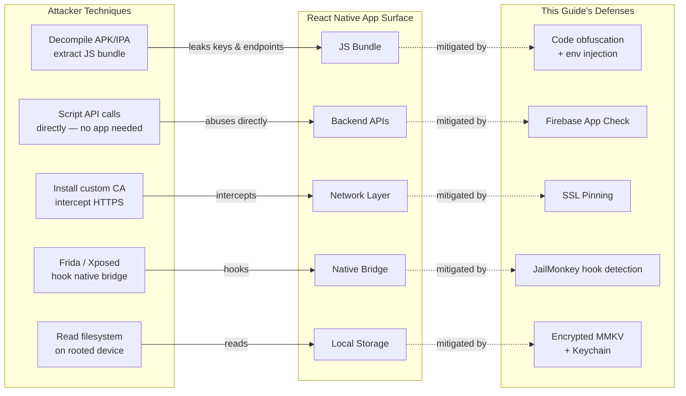

# Enhancing Mobile App Security in React Native: A Practical Guide Using JailMonkey, Firebase App Check, and Sardine SDK

---

## 1. Introduction

Any React Native app that handles user accounts, sensitive data, or real-money transactions is a target. Whether you're building a banking app, a healthcare platform, an e-commerce experience, or a productivity tool with user authentication — the same vulnerabilities apply, and the consequences of a breach scale with how much your users trust you with.

### Why Mobile App Security Matters

A compromised app exposes your users and your business simultaneously. Attackers can intercept API calls, reverse-engineer business logic, bypass authentication flows, and exploit backend services at scale. In regulated industries the stakes are even higher — compliance violations, forced audits, and permanent reputational damage. But even outside regulated verticals, a single publicly disclosed breach erodes the trust that took years to build.

### What Makes React Native Apps Vulnerable

React Native apps have a few structural characteristics that attackers exploit:

- **JavaScript bundle exposure**: The JS bundle can be extracted from the APK/IPA and reverse-engineered, leaking API keys, business logic, or endpoints.
- **Native bridge attack surface**: The bridge between JS and native code can be hooked using tools like Frida or Xposed.
- **Rooted/jailbroken devices**: These bypass OS-level sandboxing, giving attackers full control over app memory, files, and network traffic.
- **No built-in backend validation**: React Native apps talk to APIs directly — nothing stops an attacker from replaying those requests outside the app.
- **Debug mode left enabled**: Apps shipped in debug mode expose internal state and disable security protections.

The diagram below maps each attack technique to the app component it targets, and the defense that mitigates it:



### The Security Layer Model

No single tool solves mobile security. A robust solution is layered:

| Layer | Tool | Threat Addressed |
|---|---|---|
| Device Integrity | JailMonkey | Rooted/jailbroken devices, emulators, debug mode |
| Backend Abuse Protection | Firebase App Check | Unauthorized API/database access, bot traffic |
| Transaction Fraud Prevention | Sardine SDK *(fintech)* | Fraud, account takeover, risky onboarding |
| Data at Rest & Authentication | MMKV + Keychain + Biometrics | Credential theft, storage extraction, unattended access |
| Network Transport | SSL Pinning + Payload Encryption | MITM attacks, TLS interception, in-transit data exposure |

Each layer addresses a different vector. Together, they form a defense-in-depth strategy that significantly raises the cost and complexity of attacks against your app.

---

## 2. JailMonkey — Device Integrity Checks

>  JailMonkey runs native checks at app startup to detect rooted/jailbroken devices, emulators, and runtime hooks. The result is a single boolean you gate your app on. It is a **client-side risk signal, not a guarantee** — a sophisticated attacker can bypass it, which is why you send the signal to your backend and combine it with server-side enforcement.

### What JailMonkey Does

[JailMonkey](https://github.com/GantMan/jail-monkey) is a React Native library that performs runtime device integrity checks. It detects whether a device is **rooted (Android)**, **jailbroken (iOS)**, running on an **emulator**, in **debug mode**, has **ADB enabled**, uses **mock location**, or shows signs of **runtime hooking or code injection** (e.g., Frida, Xposed).

All checks are performed **client-side** using native code bridges. There is no network activity, no data collection, and no sensitive permissions required — the source code is fully auditable on GitHub.

### How It Works Internally

**On Android**, JailMonkey integrates [RootBeer](https://github.com/scottyab/rootbeer), which performs multiple low-level checks:

- Presence of root management apps (SuperSU, Magisk)
- Existence of the `su` binary
- Dangerous system properties and writable system paths
- Build tag test-keys (common in custom ROMs)
- Magisk binary detection
- ADB enabled status
- App installed on external storage
- Mock location enabled
- Emulator signatures (device IDs, files, properties)
- Runtime hooking indicators

**On iOS**, JailMonkey checks:

- Existence of jailbreak artifacts (`/Applications/Cydia.app`, `apt`, etc.)
- Ability to write outside the app sandbox
- Presence of jailbreak tools loaded at runtime
- Simulator detection
- Debug mode and hooking/injection frameworks

### Why Device Integrity Checks Matter

On a rooted or jailbroken device, the OS security model breaks down entirely. An attacker can:

- Read your app's private keychain/keystore data
- Intercept and modify network traffic even over HTTPS (SSL pinning bypass)
- Hook your app's functions at runtime using tools like Frida
- Dump memory to extract tokens or secrets
- Bypass biometric and PIN checks

JailMonkey lets you detect these conditions before your app does anything sensitive.


### Installation

```bash
npm install jail-monkey
# or
yarn add jail-monkey
```

For iOS, run pod install:

```bash
cd ios && pod install
```

### Code Example

A clean pattern is to encapsulate all checks in a single `useDeviceSecurity` hook that returns a boolean. Everything in the app keys off that one value.

```ts
import { useEffect, useState } from "react";
import JailMonkey from "jail-monkey";

const useDeviceSecurity = (): boolean => {
 const [isDeviceSecure, setIsDeviceSecure] = useState(true);

 useEffect(() => {
   if (__DEV__) return; // skip checks in development

   const checkSecurity = async () => {
     const rootedDetection = JailMonkey.androidRootedDetectionMethods;
     const isRootedByRootBeer = rootedDetection?.rootBeer
       ? Object.values(rootedDetection.rootBeer).some(Boolean)
       : false;

     const isCompromised =
       JailMonkey.isJailBroken()      ||
       JailMonkey.trustFall()         ||
       JailMonkey.hookDetected()      ||
       JailMonkey.AdbEnabled?.()      ||
       (await JailMonkey.isDebuggedMode?.()) ||
       isRootedByRootBeer             ||
       rootedDetection?.jailMonkey;

     setIsDeviceSecure(!isCompromised);
   };

   checkSecurity();
 }, []);

 return isDeviceSecure;
};
```

A few points worth noting:

- **`__DEV__` bypass**: Checks are skipped in development so you're never blocked on a simulator.
- **`trustFall()`**: A convenience aggregator covering several checks in one call.
- **`androidRootedDetectionMethods`**: Gives access to both RootBeer's granular flags and JailMonkey's own detector — checking both improves Android coverage.
- **Optional chaining (`?.`)**: Some APIs are Android-only; the optional chaining prevents crashes on iOS.

At startup, consume the hook and route accordingly:

```tsx
const isDeviceSecure = useDeviceSecurity();

// In your startup navigation logic:
if (!isDeviceSecure && !__DEV__) navigate('ApplicationUnavailable');
```