# React Native Security: A Defense-in-Depth Architecture Guide

---

## 1. Introduction

Any React Native app that handles user accounts, sensitive data, or real-money transactions is a target. Whether you're building a banking app, a healthcare platform, an e-commerce experience, or a productivity tool with user authentication — the same vulnerabilities apply, and the consequences of a breach scale with how much your users trust you with.

### Why Mobile App Security Matters

A compromised app exposes your users and your business simultaneously. Attackers can intercept API calls, reverse-engineer business logic, bypass authentication flows, and exploit backend services at scale. In regulated industries the stakes are even higher — compliance violations, forced audits, and permanent reputational damage. But even outside regulated verticals, a single publicly disclosed breach erodes the trust that took years to build.

### What Makes React Native Apps Vulnerable

React Native apps have a few structural characteristics that attackers exploit:

- **JavaScript bundle exposure**: The JS bundle can be extracted from the APK/IPA and reverse-engineered, leaking API keys, business logic, or endpoints.
- **Native bridge attack surface**: The bridge between JS and native code can be hooked using tools like Frida or Xposed.
- **Rooted/jailbroken devices**: These bypass OS-level sandboxing, giving attackers full control over app memory, files, and network traffic.
- **No built-in backend validation**: React Native apps talk to APIs directly — nothing stops an attacker from replaying those requests outside the app.
- **Debug mode left enabled**: Apps shipped in debug mode expose internal state and disable security protections.

The diagram below maps each attack technique to the app component it targets, and the defense that mitigates it:

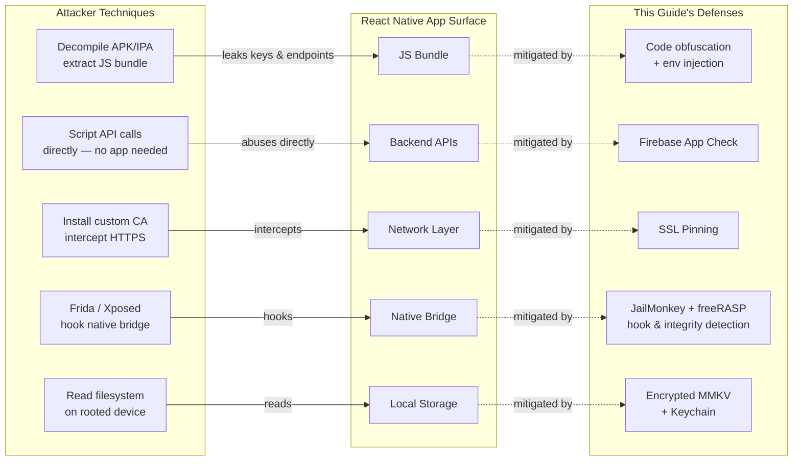

### The Security Layer Model

No single tool solves mobile security. A robust solution is layered:

| Layer | Tool | Threat Addressed |
|---|---|---|
| Device Integrity | JailMonkey | Rooted/jailbroken devices, emulators, debug mode |
| Runtime Application Self-Protection | freeRASP *(free tier: 100k download cap — see Section 3)* | App tampering detection, hook detection, unofficial stores, screen capture blocking, obfuscation bypass, VPN / time / location spoofing |
| Backend Abuse Protection | Firebase App Check | Unauthorized API/database access, bot traffic |
| Transaction Fraud Prevention | Sardine SDK *(fintech)* | Fraud, account takeover, risky onboarding |
| Data at Rest & Authentication | MMKV + Keychain + Biometrics | Credential theft, storage extraction, unattended access |
| Network Transport | SSL Pinning + Payload Encryption | MITM attacks, TLS interception, in-transit data exposure |

Each layer addresses a different vector. Together, they form a defense-in-depth strategy that significantly raises the cost and complexity of attacks against your app.

### OWASP Mobile Top 10 Coverage

This guide's tooling directly addresses six of the [OWASP Mobile Top 10 (2024)](https://owasp.org/www-project-mobile-top-10/) risk categories. Understanding the mapping clarifies *why* each tool exists, not just *what* it does:

| OWASP Category | Risk | This Guide's Defense |
|---|---|---|
| M1 — Improper Credential Usage | Hardcoded secrets, insecure credential storage in plaintext | Keychain + Biometrics (Section 6); env-var injection at build time (Section 8) |
| M2 — Inadequate Supply Chain Security | Tampered dependencies, repackaged or resigned binaries | freeRASP `appIntegrity` callback (Section 3) |
| M3 — Insecure Authentication / Authorization | Weak or bypassable authentication flows | Biometrics + Keychain `BIOMETRY_ANY` access control (Section 6) |
| M5 — Insecure Communication | MITM attacks, plaintext traffic, TLS misconfiguration | SSL Pinning + Payload Encryption (Section 7) |
| M8 — Security Misconfiguration | Debug mode in production builds, exposed API keys in JS bundle | JailMonkey `isDebuggedMode`; ProGuard/Hermes obfuscation; `__DEV__` guards |
| M9 — Insecure Data Storage | Unencrypted tokens, plaintext credentials in AsyncStorage | Encrypted MMKV + Keychain (Section 6) |

M4 (Insufficient Input/Output Validation), M6 (Inadequate Privacy Controls), M7 (Insufficient Binary Protections), and M10 (Insufficient Cryptography) fall outside this guide's scope but remain equally important for a complete production security posture. M7 is partially mitigated by freeRASP's obfuscation detection callback, which flags when your Android release build was shipped without ProGuard.

---

## 2. JailMonkey — Device Integrity Checks

>  JailMonkey runs native checks at app startup to detect rooted/jailbroken devices, emulators, and runtime hooks. The result is a single boolean you gate your app on. It is a **client-side risk signal, not a guarantee** — a sophisticated attacker can bypass it, which is why you send the signal to your backend and combine it with server-side enforcement.

### What JailMonkey Does

[JailMonkey](https://github.com/GantMan/jail-monkey) is a React Native library that performs runtime device integrity checks. It detects whether a device is **rooted (Android)**, **jailbroken (iOS)**, running on an **emulator**, in **debug mode**, has **ADB enabled**, uses **mock location**, or shows signs of **runtime hooking or code injection** (e.g., Frida, Xposed).

All checks are performed **client-side** using native code bridges. There is no network activity, no data collection, and no sensitive permissions required — the source code is fully auditable on GitHub.

### How It Works Internally

**On Android**, JailMonkey integrates [RootBeer](https://github.com/scottyab/rootbeer), which performs multiple low-level checks:

- Presence of root management apps (SuperSU, Magisk)
- Existence of the `su` binary
- Dangerous system properties and writable system paths
- Build tag test-keys (common in custom ROMs)
- Magisk binary detection
- ADB enabled status
- App installed on external storage
- Mock location enabled
- Emulator signatures (device IDs, files, properties)
- Runtime hooking indicators

**On iOS**, JailMonkey checks:

- Existence of jailbreak artifacts (`/Applications/Cydia.app`, `apt`, etc.)
- Ability to write outside the app sandbox
- Presence of jailbreak tools loaded at runtime
- Simulator detection
- Debug mode and hooking/injection frameworks

### Why Device Integrity Checks Matter

On a rooted or jailbroken device, the OS security model breaks down entirely. An attacker can:

- Read your app's private keychain/keystore data
- Intercept and modify network traffic even over HTTPS (SSL pinning bypass)
- Hook your app's functions at runtime using tools like Frida
- Dump memory to extract tokens or secrets
- Bypass biometric and PIN checks

JailMonkey lets you detect these conditions before your app does anything sensitive.


### Installation

```bash
npm install jail-monkey
# or
yarn add jail-monkey
```

For iOS, run pod install:

```bash
cd ios && pod install
```

### Code Example

A clean pattern is to encapsulate all checks in a single `useDeviceSecurity` hook that returns a boolean. Everything in the app keys off that one value.

```ts
import { useEffect, useState } from "react";
import JailMonkey from "jail-monkey";

const useDeviceSecurity = (): boolean => {
 const [isDeviceSecure, setIsDeviceSecure] = useState(true);

 useEffect(() => {
   if (__DEV__) return; // skip checks in development

   const checkSecurity = async () => {
     const rootedDetection = JailMonkey.androidRootedDetectionMethods;
     const isRootedByRootBeer = rootedDetection?.rootBeer
       ? Object.values(rootedDetection.rootBeer).some(Boolean)
       : false;

     const isCompromised =
       JailMonkey.isJailBroken()      ||
       JailMonkey.trustFall()         ||
       JailMonkey.hookDetected()      ||
       JailMonkey.AdbEnabled?.()      ||
       (await JailMonkey.isDebuggedMode?.()) ||
       isRootedByRootBeer             ||
       rootedDetection?.jailMonkey;

     setIsDeviceSecure(!isCompromised);
   };

   checkSecurity();
 }, []);

 return isDeviceSecure;
};
```

A few points worth noting:

- **`__DEV__` bypass**: Checks are skipped in development so you're never blocked on a simulator.
- **`trustFall()`**: A convenience aggregator covering several checks in one call.
- **`androidRootedDetectionMethods`**: Gives access to both RootBeer's granular flags and JailMonkey's own detector — checking both improves Android coverage.
- **Optional chaining (`?.`)**: Some APIs are Android-only; the optional chaining prevents crashes on iOS.

At startup, consume the hook and route accordingly:

```tsx
const isDeviceSecure = useDeviceSecurity();

// In your startup navigation logic:
if (!isDeviceSecure && !__DEV__) navigate('ApplicationUnavailable');
```

### Important Caveat: Client-Side Limitations

JailMonkey's checks run entirely on the device. A sufficiently advanced attacker can patch or bypass them. This is a **first line of defense**, not a complete solution. Its real value is:

- Blocking unsophisticated attacks and casual jailbreakers
- Sending device integrity signals to your backend for risk scoring
- Satisfying compliance requirements around device posture

Treat the results as **risk signals**, not absolute truth. Combine them with server-side enforcement (which is where Firebase App Check comes in).

The diagram below shows how JailMonkey fits into a layered trust decision — the client-side block stops casual attackers, but backend enforcement is the authoritative layer:


> **Key principle**: The client block (left path) stops unsophisticated attackers immediately. But your backend receiving `device_integrity=false` as a signal is what gives you audit trails, rate limits, and risk-based authentication — regardless of what the client claims.

### Practical Scenarios

| Scenario | JailMonkey Response | Backend Signal |
|---|---|---|
| Banking app on rooted device | Block account access UI | `device_integrity=false` sent for audit log |
| Crypto wallet with Frida hook detected | Refuse to show seed phrase | `hook_detected=true` flags session as high-risk |
| KYC identity verification | Warn user before initiating | Integrity status forwarded to fraud backend |
| Emulator detected in production | Block registration flow | Emulator flag triggers manual review queue |

### Structuring Device Signals for Your Backend

When JailMonkey detects a compromised state, don't just block the user client-side — propagate structured signals to your backend so your risk engine can make authoritative decisions. This is what transforms a client-side boolean into an auditable, enforceable record.

A well-structured payload captures all relevant flags atomically with a timestamp:

```ts
import { Platform } from 'react-native';
import JailMonkey from 'jail-monkey';

interface DeviceIntegrityPayload {
 timestamp: string;          // ISO 8601
 platform: 'ios' | 'android';
 signals: {
   isJailBroken: boolean;
   trustFall: boolean;
   hookDetected: boolean;
   adbEnabled: boolean | null;           // Android only
   isDebuggedMode: boolean;
   isOnExternalStorage: boolean | null;  // Android only
   mockLocation: boolean | null;         // Android only
   rootBeerFlags?: Record<string, boolean>;
 };
 isCompromised: boolean; // aggregate: any signal truthy
}

const buildDeviceIntegrityPayload = async (): Promise<DeviceIntegrityPayload> => {
 const rootedDetection = JailMonkey.androidRootedDetectionMethods;

 const signals = {
   isJailBroken:         JailMonkey.isJailBroken(),
   trustFall:            JailMonkey.trustFall(),
   hookDetected:         JailMonkey.hookDetected(),
   adbEnabled:           JailMonkey.AdbEnabled?.() ?? null,
   isDebuggedMode:       (await JailMonkey.isDebuggedMode?.()) ?? false,
   isOnExternalStorage:  JailMonkey.isOnExternalStorage?.() ?? null,
   mockLocation:         JailMonkey.isMockingLocation?.() ?? null,
   rootBeerFlags:        rootedDetection?.rootBeer ?? undefined,
 };

 return {
   timestamp:    new Date().toISOString(),
   platform:     Platform.OS as 'ios' | 'android',
   signals,
   isCompromised: Object.values(signals).some(v => v === true),
 };
};
```

Send this payload on every authenticated request — not just at startup. A device can be rooted while the app is running, or root-hiding tools can fail mid-session. Attaching the integrity payload as a signed header claim gives your backend continuous visibility and an audit trail per request.

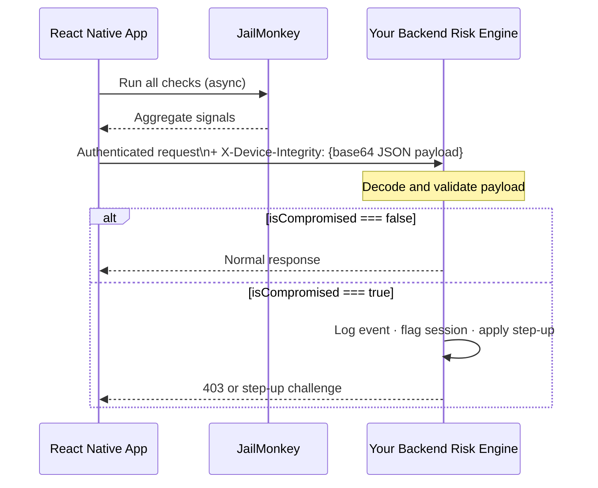

---

## 3. freeRASP — Full Runtime Application Self-Protection

> freeRASP is a **Runtime Application Self-Protection (RASP)** library by [Talsec](https://www.talsec.app) that significantly extends beyond JailMonkey's device integrity checks. It detects rooted/jailbroken devices, runtime hooks (Frida/Xposed), debugger attachment, emulators, unofficial app stores, **app integrity tampering** (repackaged or modified builds), obfuscation bypass, screen capture, VPN usage, time/location spoofing, and more — all through a single React Native hook with a unified callback API and a kill-on-bypass enforcement mode.

> ⚠️ **Pricing caveat — read before integrating**: freeRASP is **freemium** software governed by a [Fair Usage Policy (FUP)](https://docs.talsec.app/freerasp/fair-usage-policy-fup). The free tier is **capped at 100,000 app downloads**. Beyond that threshold, you must upgrade to the paid **RASP+** plan. RASP+ also removes Talsec data collection, replaces the universal free binary with an **app-specific hardened binary** (significantly harder to bypass), and adds the **AppiCrypt®** API integrity cryptogram. For a banking or fintech app with a real user base, treat RASP+ as the realistic production target and budget for it accordingly.

### freeRASP vs JailMonkey

freeRASP is a strict superset of what JailMonkey provides. Both detect rooting, jailbreaking, emulators, and hook frameworks. freeRASP also adds:

| Capability | JailMonkey | freeRASP |
|---|---|---|
| Root / Jailbreak detection | ✅ | ✅ |
| Emulator detection | ✅ | ✅ |
| Hook framework detection (Frida, Xposed) | ✅ | ✅ |
| Debug mode detection | ✅ | ✅ |
| ADB enabled detection | ✅ | ✅ |
| **App integrity verification** (tamper detection) | ❌ | ✅ |
| **Unofficial store detection** | ❌ | ✅ |
| **Obfuscation issue detection** | ❌ | ✅ |
| **Screen capture / screen recording detection + blocking** | ❌ | ✅ |
| **System VPN detection** | ❌ | ✅ |
| **Time spoofing detection** | ❌ | ✅ |
| **Location spoofing detection** (Android) | ❌ | ✅ |
| Unsecure Wi-Fi detection (Android) | ❌ | ✅ |
| Automation framework detection (Android) | ❌ | ✅ |
| Multi-instance detection (Android) | ❌ | ✅ |
| **Kill-on-bypass enforcement** | ❌ | ✅ |
| Malware detection (add-on module) | ❌ | ✅ |
| Security dashboard portal (Talsec Portal) | ❌ | ✅ |

The two critical additions over JailMonkey are **app integrity verification** — detecting whether your APK/IPA has been repackaged, resigned, or tampered with before reaching the user — and **kill-on-bypass**, which terminates the app process automatically if it detects an attacker manipulating or hooking the RASP threat callback mechanism itself.

If your app already uses JailMonkey, freeRASP can replace it entirely — the root/jailbreak coverage is equivalent, and you gain the broader threat surface at the cost of the download cap.

### Installation

```bash
npm install freerasp-react-native
# or
yarn add freerasp-react-native
```

For iOS, run pod install:

```bash
cd ios && pod install
```

**Android prerequisites** — freeRASP requires `minSdkVersion` ≥ 23 (Android 6.0) and Kotlin ≥ 2.0.0. In `android/build.gradle`:

```groovy
buildscript {
   ext {
       minSdkVersion = 23        // required minimum
       kotlinVersion = '2.0.0'   // required since freeRASP 4.0.0
   }
   dependencies {
       classpath("org.jetbrains.kotlin:kotlin-gradle-plugin:2.0.0")
   }
}
```

**Android — screen capture detection** (optional, requires Android 14+ / 15+):

Add to `AndroidManifest.xml` inside the `<manifest>` root tag:

```xml
<uses-permission android:name="android.permission.DETECT_SCREEN_CAPTURE" />
<uses-permission android:name="android.permission.DETECT_SCREEN_RECORDING" />
```

### Configuration

Initialize freeRASP at your app entry point using the `useFreeRasp` hook. Get your Android signing certificate hash by following Talsec's [signing certificate guide](https://docs.talsec.app/freerasp/wiki/getting-signing-certificate-hash).

```ts
import { useFreeRasp } from 'freerasp-react-native';

const config = {
 androidConfig: {
   packageName: 'com.yourapp',
   certificateHashes: ['YOUR_BASE64_SIGNING_CERT_HASH='], // release signing cert hash(es)
   supportedAlternativeStores: ['com.sec.android.app.samsungapps'],
 },
 iosConfig: {
   appBundleId: 'com.yourapp',
   appTeamId: 'YOUR_APPLE_TEAM_ID',
 },
 watcherMail: 'security@yourcompany.com', // receives Talsec Portal reports and SDK updates
 isProd: !__DEV__,    // false in development — skips production checks on simulator
 killOnBypass: true,  // terminate the app if RASP callbacks are hooked or tampered with
};
```

Key configuration notes:

- **`isProd`**: Set to `false` in development so you are not blocked on a simulator. In production, all checks run. See [Talsec's `isProd` documentation](https://docs.talsec.app/freerasp/wiki/isprod-flag).
- **`killOnBypass: true`**: The SDK will terminate the process if it detects an attacker manipulating the threat callback mechanism. This is the anti-tamper enforcement layer on top of detection.
- **`watcherMail`**: Required. Used for Talsec Portal access and security report delivery.

### Threat Detection and Reactions

Define a callback object mapping each detected threat to a response. At minimum, log the event and send a risk signal to your backend. For the highest-severity threats in a financial app, block or terminate:

```ts
const actions = {
 // ── High severity: block app access and signal backend ─────────────────────
 privilegedAccess: () => {
   // Rooted (Android) or jailbroken (iOS)
   sendRiskSignalToBackend('privileged_access');
   setIsDeviceSecure(false);
 },
 hooks: () => {
   // Frida, Xposed, or other hook framework detected
   sendRiskSignalToBackend('hook_detected');
   setIsDeviceSecure(false);
 },
 appIntegrity: () => {
   // APK/IPA has been tampered with or repackaged
   sendRiskSignalToBackend('app_integrity_fail');
   setIsDeviceSecure(false);
 },
 debug: () => {
   // Debugger attached or debug mode active
   sendRiskSignalToBackend('debug_mode');
   setIsDeviceSecure(false);
 },

 // ── Medium severity: flag session, send backend signal ──────────────────────
 simulator: () => {
   sendRiskSignalToBackend('simulator');
   if (!__DEV__) setIsDeviceSecure(false);
 },
 unofficialStore: () => {
   // App was not installed from an official store — possible repackaging
   sendRiskSignalToBackend('unofficial_store');
 },
 obfuscationIssues: () => {
   // Android only — app was shipped without obfuscation, leaking business logic
   sendRiskSignalToBackend('obfuscation_issues');
 },

 // ── Runtime environment signals ─────────────────────────────────────────────
 systemVPN: () => sendRiskSignalToBackend('vpn_active'),
 devMode: () => sendRiskSignalToBackend('dev_mode'),         // Android
 adbEnabled: () => sendRiskSignalToBackend('adb_enabled'),   // Android
 timeSpoofing: () => sendRiskSignalToBackend('time_spoofing'),
 locationSpoofing: () => sendRiskSignalToBackend('location_spoofing'), // Android

 // ── Screen capture — block for sensitive screens (account details, KYC) ─────
 screenshot: () => console.warn('Screenshot taken on sensitive screen'),
 screenRecording: () => console.warn('Screen recording active on sensitive screen'),

 // ── Device state signals ────────────────────────────────────────────────────
 passcode: () => sendRiskSignalToBackend('no_passcode_set'),
 secureHardwareNotAvailable: () => sendRiskSignalToBackend('no_secure_hardware'),
 deviceBinding: () => sendRiskSignalToBackend('device_binding_fail'),
 deviceID: () => sendRiskSignalToBackend('device_id_fail'), // iOS only

 // ── Android-only signals ────────────────────────────────────────────────────
 unsecureWifi: () => sendRiskSignalToBackend('unsecure_wifi'),
 automation: () => sendRiskSignalToBackend('automation_detected'),
 multiInstance: () => sendRiskSignalToBackend('multi_instance'),
};

// Optional: callback when all initial startup checks are complete
const raspExecutionStateActions = {
 allChecksFinished: () => {
   console.log('freeRASP initial checks complete');
 },
};

// Start freeRASP — call outside useEffect, at component top level
// freeRASP runs continuous periodic checks throughout the app lifecycle
useFreeRasp(config, actions, raspExecutionStateActions);
```

> **Important**: `useFreeRasp` must be called at the component top level, **not** inside `useEffect`. freeRASP performs continuous checks throughout the session — not just at startup.

### Proactive Screen Capture Blocking

Beyond detecting screenshots, freeRASP can **actively prevent** screen capture on sensitive screens such as account numbers, card details, KYC documents, and transaction confirmations:

```ts
import { blockScreenCapture, isScreenCaptureBlocked } from 'freerasp-react-native';

// Block screen capture when a sensitive screen mounts, restore on unmount
useEffect(() => {
 blockScreenCapture(true);
 return () => blockScreenCapture(false);
}, []);
```

### Detection Flow

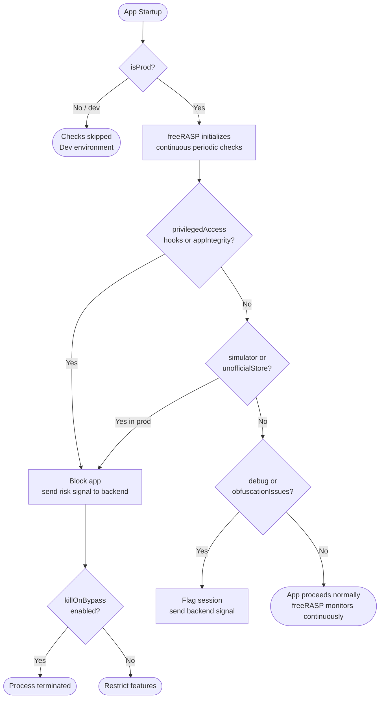

### Pricing and Free Tier Limitations

| | freeRASP (Free) | RASP+ (Paid) |
|---|---|---|
| Download limit | **100,000** | Unlimited |
| Data collection | Sent to Talsec database | Your infrastructure (or fully disabled) |
| SDK binary | Universal — bypass scripts are more reusable | App-specific hardened binary |
| AppiCrypt® API protection | ❌ | ✅ |
| Enterprise SLA / support | Community | Enterprise SLA |
| Fintech compliance features | Limited | Full |

**Recommendation for production fintech apps**:

- **Development and early testing**: the free tier is fine.
- **Production at scale (> 100k downloads)**: budget for **RASP+** upfront. The free binary is also a universal binary — the same build is shared across all free-tier integrators, making community-developed bypass scripts more broadly applicable. RASP+ generates app-specific hardened binaries, raising the effort required to reverse-engineer or bypass significantly.
- **If RASP+ cost is not yet justified**: JailMonkey has no download cap, no data collection, and covers the core device integrity signals. Keep JailMonkey as a baseline until you are ready to commit to freeRASP RASP+.

### Migrating from JailMonkey to freeRASP

If your app already uses JailMonkey, the migration is straightforward — freeRASP is a functional superset and every JailMonkey check maps directly to a freeRASP callback.

| JailMonkey check | freeRASP callback | Notes |
|---|---|---|
| `isJailBroken()` / `trustFall()` | `privilegedAccess` | Equivalent coverage |
| `hookDetected()` | `hooks` | Equivalent coverage |
| `isDebuggedMode()` | `debug` | Equivalent coverage |
| `AdbEnabled()` | `adbEnabled` | Android only |
| `isMockingLocation()` | `locationSpoofing` | Android only |
| *(no equivalent)* | `appIntegrity` | **New** — detects tampered or repackaged builds |
| *(no equivalent)* | `unofficialStore` | **New** — detects sideloaded installs |
| *(no equivalent)* | `killOnBypass` | **New** — process termination if RASP is bypassed |

**Migration steps**:

1. Remove `jail-monkey` from your dependencies.
2. Install `freerasp-react-native` and run `pod install`.
3. Replace the `useDeviceSecurity` hook body with `useFreeRasp` initialization.
4. Map each previous `JailMonkey` check to the corresponding `actions` callback (table above).
5. Add `appIntegrity` and `unofficialStore` callbacks with appropriate backend signals.
6. Confirm `isProd: !__DEV__` and `killOnBypass: true` for production builds.
7. Submit your signing certificate hash and bundle details per Talsec's [setup guide](https://docs.talsec.app/freerasp/wiki/getting-signing-certificate-hash).

> Your `sendRiskSignalToBackend` utility function remains unchanged — it is called identically from both JailMonkey and freeRASP callbacks.

---

## 4. Firebase App Check — Backend Abuse Protection

>  App Check issues cryptographically signed **attestation tokens** proving a request came from your real, unmodified app on a real device. Your backend middleware rejects everything without a valid token — bots and scripts cannot obtain one from outside the app, so they never reach your business logic.

### The Problem It Solves

Even if your app is secure, your **backend APIs are exposed to the internet**. Nothing stops an attacker from extracting your API endpoints from the JS bundle and calling them directly — bypassing the app entirely. This enables:

- Credential stuffing attacks against your auth endpoints
- Scraping your database through your own API
- Abusing Cloud Functions for spam or DDoS
- Creating fake accounts at scale via automation

Firebase App Check solves this by ensuring **only your legitimate app** can call your backend resources.

### How App Check Works

App Check issues a short-lived **attestation token** that your app must send with every request. Your backend verifies this token with Firebase before processing the request. Tokens are generated using platform-specific attestation providers:

| Platform | Provider | What It Verifies |
|---|---|---|
| iOS | App Attest (DeviceCheck fallback) | Cryptographic proof from Apple that request comes from a genuine, unmodified app |
| Android | Play Integrity (SafetyNet fallback) | Google's verdict on app integrity and device safety |
| Web | reCAPTCHA Enterprise / v3 | Bot detection |
| Debug | Debug provider | Local development only — never ship to production |

The attestation token is opaque to your app — Firebase handles the validation. Your backend simply enforces that valid tokens must be present.

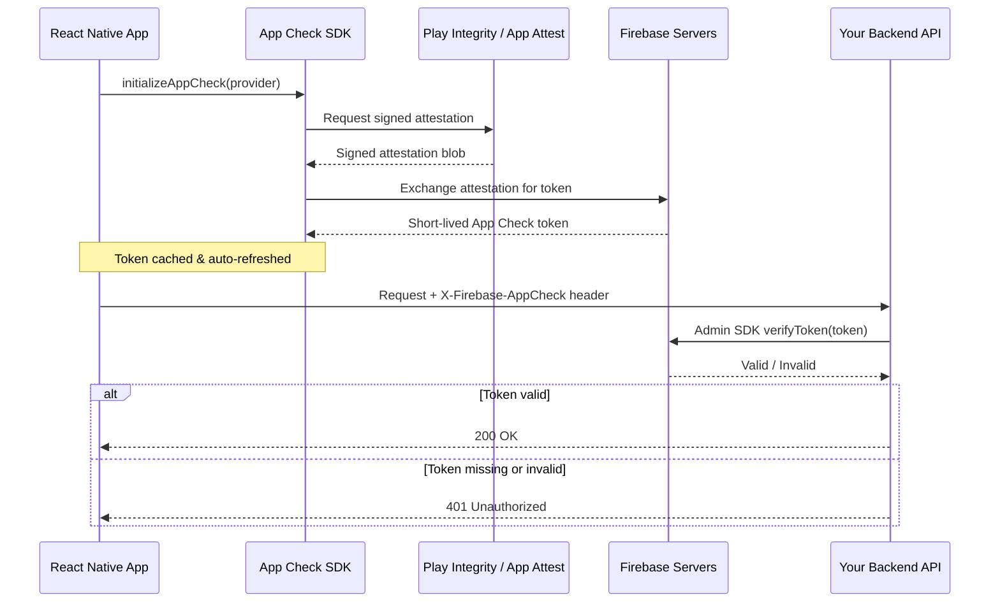

### What It Protects

- **Firebase Realtime Database** and **Firestore** — enforce App Check in security rules
- **Cloud Functions** — check tokens in function middleware
- **Cloud Storage** — restrict read/write to attested apps
- **Custom backends** — verify tokens manually using the Firebase Admin SDK

### Setup in React Native

Install the required packages:

```bash
npm install @react-native-firebase/app @react-native-firebase/app-check
# or
yarn add @react-native-firebase/app @react-native-firebase/app-check
```

For iOS, install pods:

```bash
cd ios && pod install
```

**iOS — Enable App Attest in your Apple Developer account**:

In your `AppDelegate.swift`, no changes are needed beyond standard Firebase setup. App Attest capability must be enabled in Xcode under **Signing & Capabilities**.

**Android — Configure Play Integrity**:

Ensure your app is published (even as an internal test track) in the Google Play Console. Play Integrity requires a real Google Play-distributed app to issue valid tokens.

### Initialization Code

Configure the provider once at module load — not inside a component or hook body. Use platform-specific debug tokens so each environment can be registered separately in the Firebase Console.

```ts
import { ReactNativeFirebaseAppCheckProvider, initializeAppCheck } from "@react-native-firebase/app-check";
import { getApp } from "@react-native-firebase/app";

const rnfbProvider = new ReactNativeFirebaseAppCheckProvider();

rnfbProvider.configure({
 android: {
   provider: __DEV__ ? "debug" : "playIntegrity",
   debugToken: process.env.FIREBASE_DEBUG_TOKEN_ANDROID,
 },
 apple: {
   provider: __DEV__ ? "debug" : "appAttest",
   debugToken: process.env.FIREBASE_DEBUG_TOKEN_IOS,
 },
});

export const initAppCheck = async () =>
 initializeAppCheck(getApp(), {
   provider: rnfbProvider,
   isTokenAutoRefreshEnabled: true,
 });
```

From here, call `initAppCheck()` before your first authenticated request, then retrieve the token and set it as the `X-Firebase-AppCheck` header on your shared API client. Wrap the retrieval in a retry loop with a short delay — Play Integrity token requests can transiently fail on Android cold starts.

### Attaching the App Check Token to API Requests

After initializing App Check, attach the token automatically to every outbound request via an Axios interceptor. This centralizes token management — token refresh, retry logic, and error handling — in one place rather than at every call site.

```ts
import appCheck from '@react-native-firebase/app-check';

// Retry helper for Play Integrity cold-start failures (Android only)
const getAppCheckTokenWithRetry = async (maxAttempts = 3): Promise<string> => {
 for (let attempt = 1; attempt <= maxAttempts; attempt++) {
   try {
     const { token } = await appCheck().getToken(/* forceRefresh */ false);
     return token;
   } catch (err) {
     if (attempt === maxAttempts) throw err;
     await new Promise(resolve => setTimeout(resolve, 1000 * attempt)); // 1s, 2s backoff
   }
 }
 throw new Error('App Check token unavailable after retries');
};

// Register once at app startup — before any authenticated requests
apiClient.interceptors.request.use(async (config) => {
 try {
   const token = await getAppCheckTokenWithRetry();
   config.headers['X-Firebase-AppCheck'] = token;
 } catch (err) {
   // Token unavailable — let the request proceed; backend will reject with 401
   // This avoids blocking legitimate requests during transient provider outages
   console.warn('[AppCheck] Token retrieval failed — request will be rejected by backend', err);
 }
 return config;
});
```

**Token lifecycle notes**:

- `isTokenAutoRefreshEnabled: true` (set during `initializeAppCheck`) causes the SDK to proactively refresh before expiry — you do not need to call `getToken(true)` on every request in normal operation.
- `getToken(false)` returns the cached token or waits for an in-progress refresh — it does not make a network call on each request.
- Only force-refresh (`getToken(true)`) after receiving a 401 that signals an expired token, or during explicit session renewal.

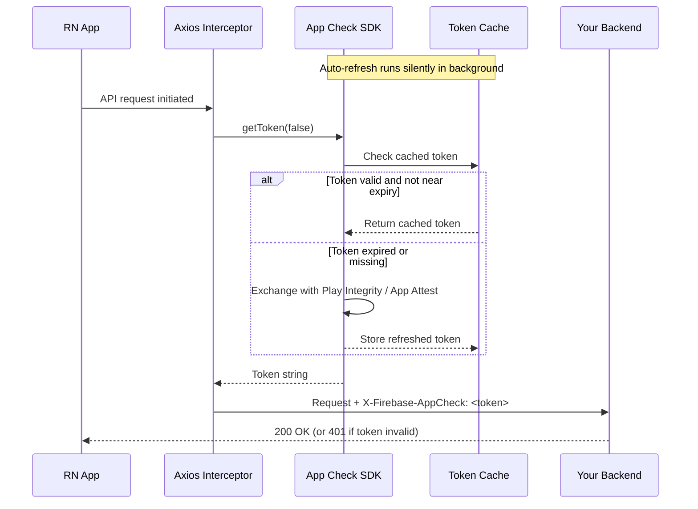

### Enforcing App Check on Your Backend

For a custom Node.js/Express backend, verify the token in middleware before any route handler runs:

```ts
export const appCheckMiddleware = async (req, res, next) => {
 const token = req.headers['x-firebase-appcheck'];
 if (!token) return res.status(401).json({ error: 'Missing App Check token' });
 try {
   await getAppCheck().verifyToken(token);
   next();
 } catch {
   res.status(401).json({ error: 'Invalid App Check token' });
 }
};

app.use(appCheckMiddleware); // apply globally
```

For Firestore and Realtime Database, toggle enforcement directly in the Firebase Console — no code changes needed.

### Real-World Impact

The difference is stark. Consider a `/register` endpoint before and after App Check enforcement:

**Without App Check** — a bot operator decompiles your APK, extracts the API URL, and writes a script. There is nothing stopping automated request floods:

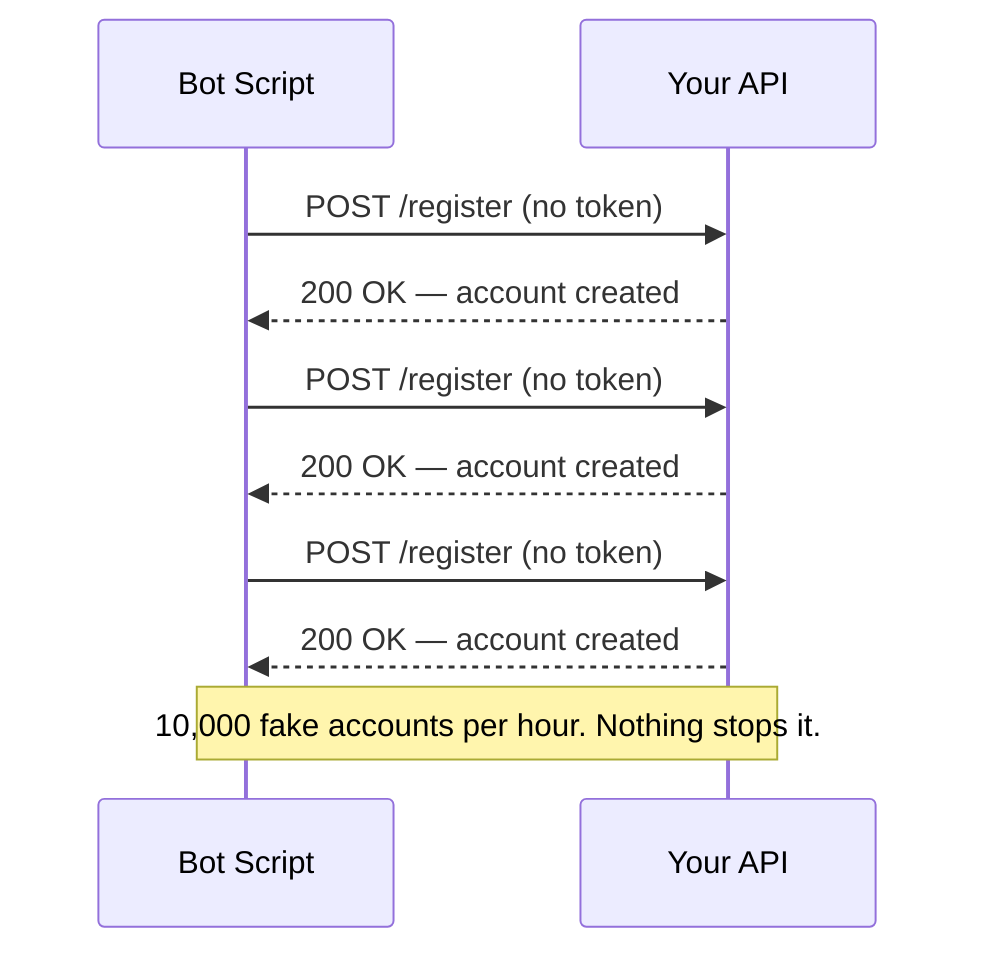

**With App Check enforced** — the middleware rejects any request without a valid attestation token. Bots cannot produce one:

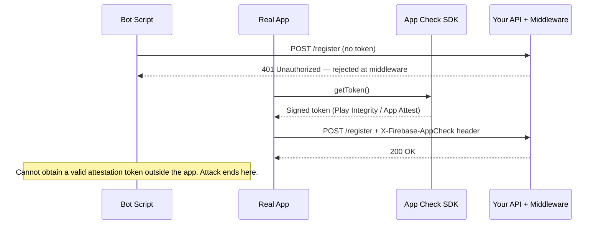

Tokens are short-lived, rate-limited by the platform provider (Google Play Integrity, Apple App Attest), and tied to real device attestations. A bot running outside the app cannot obtain one.

### Development Workflow

Never ship the debug provider to production. Use environment-based configuration (as shown above) and store platform-specific debug tokens (`FIREBASE_DEBUG_TOKEN_ANDROID`, `FIREBASE_DEBUG_TOKEN_IOS`) in `.env` files that are gitignored. Register each token in the Firebase Console under **App Check > Apps > Manage debug tokens** — one entry per platform per environment.

---

## 5. Sardine SDK — Transaction Fraud Prevention

>  Sardine collects behavioral signals (keystroke timing, swipe patterns, device fingerprint) during user flows and streams them to its risk engine. Your backend queries a risk score using the session key before approving a transaction. It closes the gap that device integrity and request attestation cannot address: *is this user behaving like a real human?*

> **Who this section is for**: Sardine is purpose-built for **fintech and financial services** applications — payments, lending, KYC, account opening, and money movement. If your app doesn't operate in a financial context, JailMonkey and App Check are likely sufficient. For fintechs, Sardine fills the gap neither of those tools can address: *behavioral* risk at the user level.

### What Sardine Provides

[Sardine](https://www.sardine.ai) is a fraud and compliance platform built for financial products. Its React Native SDK provides **device intelligence and behavioral biometrics** that power real-time risk scoring for transactions and onboarding events.

Unlike JailMonkey (device posture) and App Check (request legitimacy), Sardine operates at the **behavioral and transactional layer** — it understands *who* is doing something, not just *what device* they're on. Its capabilities include:

- **Device fingerprinting**: Persistent, privacy-safe device identification across sessions
- **Behavioral biometrics**: Keystroke dynamics, swipe patterns, interaction timing — detecting bots and account takeover attempts
- **Risk scoring**: Real-time scores for onboarding, login, and payment events
- **AML/KYC signals**: Behavioral signals that complement identity verification
- **Network intelligence**: Detection of VPNs, proxies, Tor, and data center traffic
- **Session context**: Aggregated device and behavioral data sent to Sardine's backend for risk decisioning

### Installation

```bash
npm install @sardine-ai/react-native-sardine-sdk
# or
yarn add @sardine-ai/react-native-sardine-sdk
```

For iOS:

```bash
cd ios && pod install
```

### Initialization

The SDK is set up through a `useSardine` custom hook. A UUID session key is generated client-side at startup and stored in React Context so it can be injected automatically as `X-Sardine-Session-Key` on every subsequent API request. The SDK is also **feature-flagged** — meaning you can roll it out gradually or turn it off instantly without a new app release, which is important for a production fraud tool.

```ts
import { Sardinesdk } from "@sardine-ai/react-native-sardine-sdk";
import { v4 as uuidv4 } from 'uuid';

const setupSardineSDK = async () => {
 if (!sardineEnabled) return; // feature-flag kill-switch

 const clientId = process.env.SARDINE_CLIENT_ID!;
 const environment = process.env.SARDINE_ENVIRONMENT as 'sandbox' | 'production';
 const sessionKey = uuidv4();

 setSardineSessionKey(sessionKey); // stored in context → auto-injected as request header

 await Sardinesdk.setupSDK({
   clientId,
   sessionKey,
   environment,              // 'sandbox' | 'production'
   enableBehaviorBiometrics: true,
   enableClipboardTracking:  true,
   enableFieldTracking:      true,
 });
};
```

Call this once at app startup. The session key is then automatically attached to every API call via a Context provider, so your backend can correlate the device/behavioral signals with any incoming request.

### Session Key Propagation

The session key is what connects client-side behavioral signals to server-side risk decisioning. Store it in a React Context and inject it as a header on your API client:

```tsx
// In your API request init override
return async (requestContext) => ({
 ...requestContext.init,
 headers: {
   ...(requestContext.init.headers || {}),
   "X-Sardine-Session-Key": sessionKey,
 },
});
```

Your backend receives this header on every request and uses it to query Sardine for the current session's risk score.

### Behavioral Tracking

Once the SDK is set up, instrument your screens and inputs to feed Sardine continuous behavioral signals:

```ts
const { trackPage, trackTextChange, trackFocusChange, updateOptions, submitData } = useSardine();

await trackPage('OnboardingScreen');               // on screen mount
await trackTextChange('email', value);             // on input change
await trackFocusChange('email', isFocused);        // on focus/blur
await updateOptions({ userIdHash: id, flow: 'onboarding' }); // after identity is known
await submitData();                                // before the backend decision call
```

On the backend, use the `X-Sardine-Session-Key` header to retrieve the session's risk score before approving the transaction or onboarding step:

```ts
const res = await sardineApi.get('/v1/devices/session', {
 params: { session_key: req.headers['x-sardine-session-key'] },
});
const { level } = res.data; // 'low' | 'medium' | 'high' | 'very_high'
```

### Why Sardine Complements the Other Layers

JailMonkey tells you the device is clean. App Check tells you the request came from your app. But neither tells you whether the *person* behind the request is a fraudster posing as a legitimate user. Sardine closes this gap by continuously analyzing behavioral signals — a human typing naturally vs. a script filling fields instantly, a real user's swipe velocity vs. an automated flow, a known device vs. a freshly provisioned emulator farm.

This is especially valuable for:

- **Account creation fraud**: Detecting fake signups before they consume KYC credits
- **Account takeover**: Flagging login attempts that look automated or show abnormal timing
- **Payment fraud**: Scoring transactions before they are submitted for processing
- **Identity fraud**: Correlating device signals with identity data to surface synthetic identities

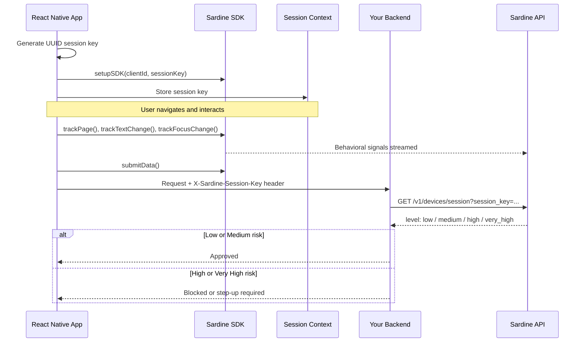

### Backend Risk Decision Logic

Your backend receives the Sardine risk level alongside every transaction or onboarding request. Map each level to a distinct business action — a binary allow/block is too coarse. `medium` risk should trigger step-up authentication rather than outright rejection; `high` should queue for human review rather than silently failing.


This decision tree gives your risk team actionable signal at every level:

| Risk Level | Recommended Action | Rationale |
|---|---|---|
| `low` | Approve directly | Normal user behavior, known device |
| `medium` | Step-up authentication | Unusual signals but likely legitimate — add friction, preserve UX |
| `high` | Manual review queue | Borderline — preserve human judgment, do not auto-reject |
| `very_high` | Automatic rejection | High confidence of fraud or bot — reject immediately |

---

## 6. Securing Data at Rest and Authentication

>  Use **encrypted MMKV** for session metadata and security flags, **Keychain** for passwords and tokens, and **Biometrics** as the physical presence gate before Keychain releases credentials. Never store passwords in plain MMKV or AsyncStorage — on a rooted device, those files are readable by any process.

JailMonkey, App Check, and Sardine all operate at the network or runtime level. But what about data that is **already stored on the device**? If a user's credentials, tokens, or flags are written to unencrypted local storage, a rooted device makes that data trivially readable — regardless of how well you secured the network traffic that delivered it.

Three libraries close this gap, each protecting a different sensitivity tier:

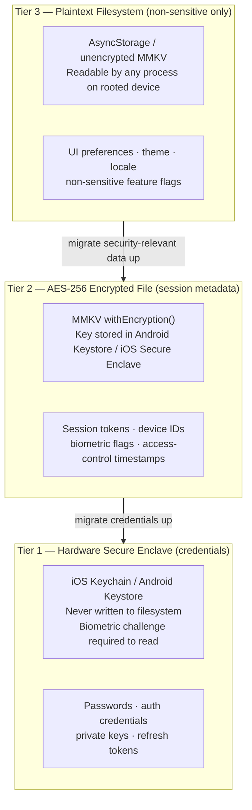

---

### MMKV Storage — Encrypted Local Storage

[`react-native-mmkv-storage`](https://github.com/ammarahm-ed/react-native-mmkv-storage) is a fast, persistent key-value store backed by Tencent's MMKV framework. Out of the box it is **not encrypted** — but it supports hardware-backed encryption that must be opted into explicitly.

#### Why it matters

Apps routinely store flags, user preferences, session metadata, and even partial credentials in local storage. On a rooted Android device or a jailbroken iPhone, any unencrypted storage file can be read directly from the filesystem. Encryption at rest ensures that even if storage is extracted, the contents are unreadable without the key.

#### Default vs. encrypted initialization

```ts
import { MMKVLoader } from 'react-native-mmkv-storage';

// ❌ Default — unencrypted, fine for non-sensitive data
const storage = new MMKVLoader().initialize();

// ✅ Encrypted — recommended for anything security-relevant
const secureStorage = new MMKVLoader().withEncryption().initialize();

// ✅ Custom key — useful when you derive the key from a user secret or device ID
const secureStorage = new MMKVLoader().encryptWithCustomKey('your-derived-key').initialize();
```

When `withEncryption()` is used, MMKV generates and stores the encryption key in the platform's secure enclave (Android Keystore / iOS Secure Enclave). With `encryptWithCustomKey`, you supply the key yourself — useful if you derive it from a user credential or a value from Keychain.

#### What to store where

| Data | Storage |
|---|---|
| UI preferences, feature flags, locale | Unencrypted MMKV |
| Session metadata, device IDs, security flags | Encrypted MMKV |
| Passwords, auth tokens, biometric-protected secrets | Keychain (see below) |

> **Note**: The default `new MMKVLoader().initialize()` creates an unencrypted store. For any data that is security-relevant — session tokens, device identifiers, biometric enrollment flags, or access-control timestamps — use the encrypted instance in production.

#### Migrating from AsyncStorage to Encrypted MMKV

If your app currently stores data in `@react-native-async-storage/async-storage`, a one-time migration at the next app version is the cleanest path to encrypted-at-rest storage. The migration is **idempotent** — it is safe to run on every startup until the flag confirms completion:

```ts
import AsyncStorage from '@react-native-async-storage/async-storage';
import { MMKVLoader } from 'react-native-mmkv-storage';

const MIGRATION_KEY = 'ASYNC_STORAGE_MIGRATED_V1';

export const migrateAsyncStorageToMMKV = async (
 secureStorage: ReturnType<MMKVLoader['initialize']>,
): Promise<void> => {
 if (secureStorage.getBool(MIGRATION_KEY)) return; // already done

 const keys = await AsyncStorage.getAllKeys();
 const entries = await AsyncStorage.multiGet(keys);

 for (const [key, value] of entries) {
   if (value !== null) secureStorage.setString(key, value);
 }

 // Write the flag BEFORE clearing — if clearing fails on retry, writes are idempotent
 secureStorage.setBool(MIGRATION_KEY, true);
 await AsyncStorage.multiRemove(keys);
};
```

Run this once at app startup, before any reads from the new store. After the migration is confirmed stable across app versions, you can remove the AsyncStorage dependency entirely.

> After migrating, add an ESLint rule (`no-restricted-imports`) to ban direct `@react-native-async-storage/async-storage` imports and prevent accidental regressions.

---

### react-native-keychain — Hardware-Backed Credential Storage

[`react-native-keychain`](https://github.com/oblador/react-native-keychain) stores credentials in the platform's **hardware-backed secure storage** — iOS Keychain and Android Keystore. Unlike MMKV, Keychain data is never written to the regular filesystem and is protected by the device's secure hardware even on rooted devices.

#### Why it matters

Passwords and auth credentials should never live in MMKV, AsyncStorage, or any file-based store. Keychain entries can be bound to:

- **Device availability** (`ACCESSIBLE.WHEN_UNLOCKED`) — data unreadable when device is locked
- **Biometric authentication** (`ACCESS_CONTROL.BIOMETRY_ANY`) — data retrieval requires FaceID/fingerprint
- **Hardware attestation** — prevents extraction even on compromised devices

#### Implementation

```ts
import * as Keychain from 'react-native-keychain';

// Store credentials — only accessible after biometric authentication
await Keychain.setGenericPassword(email, password, {
 service: 'com.yourapp.credentials',
 accessControl: Keychain.ACCESS_CONTROL.BIOMETRY_ANY,
 authenticationType: Keychain.AUTHENTICATION_TYPE.BIOMETRICS,
 accessible: Keychain.ACCESSIBLE.WHEN_UNLOCKED,
});

// Retrieve credentials — triggers biometric prompt automatically
const credentials = await Keychain.getGenericPassword({
 authenticationPrompt: { title: 'Confirm your identity' },
 service: 'com.yourapp.credentials',
});

// Clear credentials on logout
await Keychain.resetGenericPassword({ service: 'com.yourapp.credentials' });
```

The combination of `BIOMETRY_ANY` + `WHEN_UNLOCKED` means the OS will **not release the credential** unless the device is unlocked and the biometric challenge is passed. This is the highest practical protection level for stored credentials in a React Native app.

---

### react-native-biometrics — Biometric Authentication Gate

[`react-native-biometrics`](https://github.com/SelfLearningIO/react-native-biometrics) provides a clean interface over Face ID, Touch ID, and Android biometrics. Used alongside Keychain, it forms the **authentication gate** that controls when stored credentials can be accessed.

#### Why it matters

Without a biometric gate, credentials stored in Keychain could be accessed programmatically by any process running as that app's user on a rooted device. With biometrics enforced, accessing credentials requires physical user presence — the attacker would need to hold the device to the user's face or finger.

#### Setup and usage

```ts
import ReactNativeBiometrics from 'react-native-biometrics';

// Initialize once at your app root — allowDeviceCredentials falls back
// to PIN/password if biometrics aren't enrolled
export const rnBiometrics = new ReactNativeBiometrics({
 allowDeviceCredentials: true,
});

// Check what biometric hardware is available
const { biometryType, available } = await rnBiometrics.isSensorAvailable();
// biometryType: 'FaceID' | 'TouchID' | 'Biometrics' | undefined

// Trigger a simple biometric prompt (no signature)
const { success } = await rnBiometrics.simplePrompt({
 promptMessage: 'Confirm your identity',
});

// Check whether biometric keys have been created for this app
const { keysExist } = await rnBiometrics.biometricKeysExist();
```

#### How it connects to Keychain

Biometrics and Keychain work together — they are not alternatives:

1. **On login**: after a successful username/password auth, call `saveCredentials` to store credentials in Keychain with `BIOMETRY_ANY` access control.
2. **On app resume / startup**: call `Keychain.getGenericPassword()` — the OS automatically presents the biometric prompt before releasing the stored credential.
3. **On failure or cancellation**: fall through to the password login screen.

```ts
// useBiometrics.ts — access credentials using biometric gate
const accessCredentials = async () => {
 // This call internally triggers the biometric prompt
 // because the Keychain entry was saved with BIOMETRY_ANY
 const credentials = await Keychain.getGenericPassword({
   authenticationPrompt: { title: 'Confirm your identity' },
   service: KEYCHAIN_SERVICE,
 });
 return credentials || undefined;
};
```

You don't call `rnBiometrics.simplePrompt()` and then separately call Keychain — the biometric challenge is **embedded in the Keychain retrieval** when the entry was stored with the right access control flags. `simplePrompt()` is used separately when you need a biometric gate without credential retrieval (e.g., authorizing a payment action).

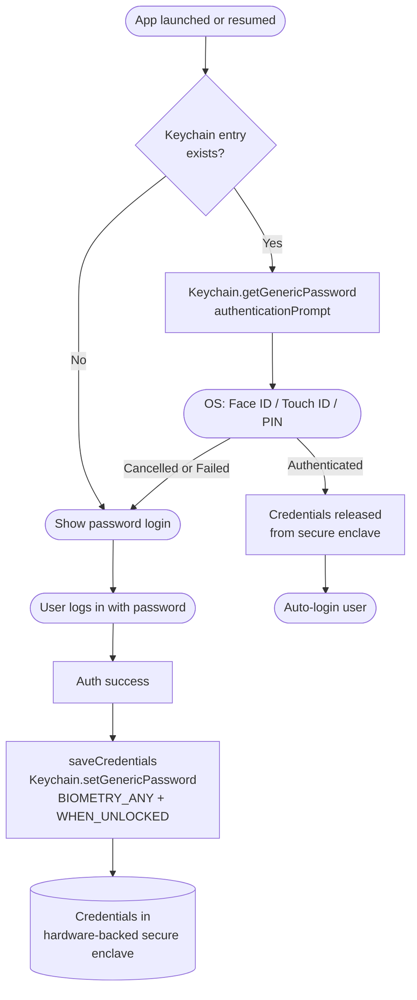

---

## 7. Network Security: SSL Pinning and API Payload Encryption

>  **SSL pinning** locks your app to your server's specific certificate fingerprint, blocking MITM proxies even when a custom CA is installed on a rooted device. **Payload encryption** protects the request body end-to-end past the TLS termination point — through load balancers, CDN edges, and internal service hops — using AES-256-GCM with an RSA-wrapped session key.

### SSL Pinning

HTTPS encrypts traffic in transit, but it does not guarantee you are talking to **your** server. Any trusted Certificate Authority (CA) on the device can issue a certificate for your domain — and on rooted/jailbroken devices, users can install custom CAs, allowing intercepting proxies (Burp Suite, Charles Proxy, mitmproxy) to silently decrypt your traffic even over HTTPS.

**SSL pinning** (certificate pinning) fixes this by embedding your server's expected certificate or public key hash directly in the app, and rejecting any connection that does not match — regardless of what the system's CA store says.

> **Why it matters specifically in React Native**: RN apps communicate over a standard HTTP stack. Once a custom CA is trusted on a rooted device, all API traffic is exposed in plaintext to intercepting proxies — even if the user passed JailMonkey checks. Pinning closes this gap.

There are two approaches:

| Approach | Library | Notes |
|---|---|---|
| JS-level | `react-native-ssl-pinning` | Fetch wrapper; quick to set up |
| Native-level | OkHttp (Android), TrustKit (iOS) | Build-time config; harder to bypass |

**JS-level pinning with `react-native-ssl-pinning`:**

```bash
npm install react-native-ssl-pinning
```

```typescript
import { fetch } from 'react-native-ssl-pinning';

const response = await fetch('https://api.example.com/v1/accounts', {
 method: 'POST',
 headers: { 'Content-Type': 'application/json' },
 body: JSON.stringify(payload),
 sslPinning: {
   certs: ['api_cert'], // filename (without extension) in assets folder
 },
});
```

Place the `.cer` file in `android/app/src/main/assets/` (Android) and your Xcode project bundle (iOS). The library validates the server's leaf certificate against the embedded copy on every request.

**Certificate rotation is the main operational challenge.** Plan for it before you ship:

- Embed both your active certificate **and** your next certificate (backup pin) so rotations don't break the app
- Prefer **public key pinning** (hashing the SubjectPublicKeyInfo) over leaf cert pinning — keys change less often than certificates
- Implement a remote config flag (protected by App Check) to disable pinning during emergency rotations
- Always disable pinning in `__DEV__` to allow local development with proxy tools

```typescript
import { fetch } from 'react-native-ssl-pinning';

const secureFetch = __DEV__
 ? globalThis.fetch  // standard fetch in dev — allows Charles/mitmproxy
 : (url: string, options: object) =>
     fetch(url, { ...options, sslPinning: { certs: ['api_cert', 'api_cert_backup'] } });
```

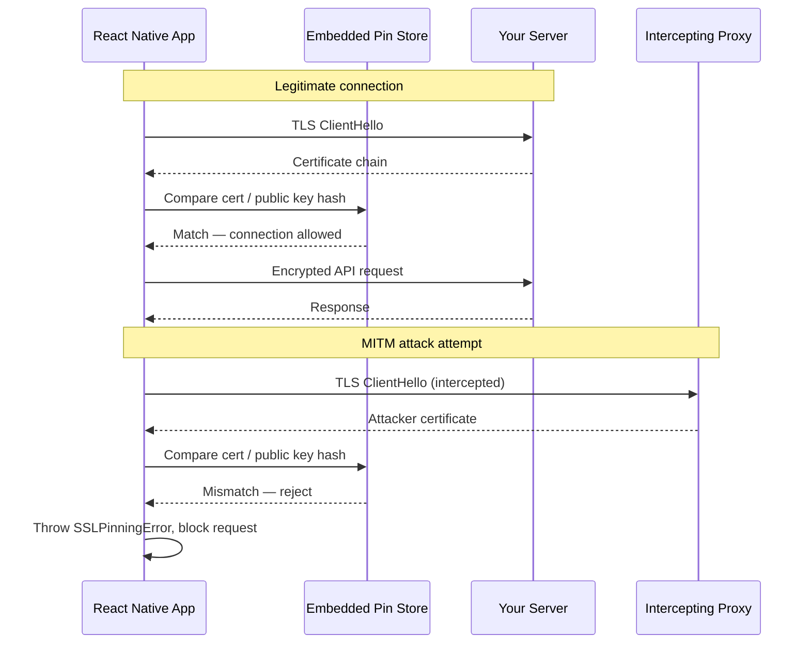

### Native-Level SSL Pinning (Recommended for High-Security Apps)

JS-level pinning with `react-native-ssl-pinning` is quick to set up but runs in the JavaScript layer — a capable attacker with Frida can hook the JS fetch wrapper and bypass it without touching native code. For higher-assurance implementations, configure pinning at the native HTTP client level, where it cannot be overridden from JavaScript.

**Android — OkHttp `CertificatePinner`**

Override the OkHttp client used by React Native's network layer. In a native module or `MainApplication.kt`:

```kotlin
import okhttp3.CertificatePinner
import okhttp3.OkHttpClient

fun buildSecureOkHttpClient(): OkHttpClient {
   val pinner = CertificatePinner.Builder()
       // Pin SubjectPublicKeyInfo (SPKI) hash — survives cert renewal if the key pair is retained
       .add("api.example.com", "sha256/AAAAAAAAAAAAAAAAAAAAAAAAAAAAAAAAAAAAAAAAAAA=") // active
       .add("api.example.com", "sha256/BBBBBBBBBBBBBBBBBBBBBBBBBBBBBBBBBBBBBBBBBBB=") // backup
       .build()

   return OkHttpClient.Builder()
       .certificatePinner(pinner)
       .build()
}
```

Wire this into React Native's `OkHttpClientProvider` so all JS `fetch()` calls use the pinned client:

```kotlin
// In MainApplication.kt onCreate()
OkHttpClientProvider.setOkHttpClientFactory { buildSecureOkHttpClient() }
```

**iOS — TrustKit**

Add TrustKit via CocoaPods:

```ruby
pod 'TrustKit'
```

Configure in `AppDelegate.swift` before any network activity, ideally as the first statement in `application(_:didFinishLaunchingWithOptions:)`:

```swift
import TrustKit

TrustKit.initSharedInstance(withConfiguration: [
   kTSKSwizzleNetworkDelegates: false,
   kTSKPinnedDomains: [
       "api.example.com": [
           kTSKIncludeSubdomains: true,
           kTSKEnforcePinning:    true,
           kTSKPublicKeyHashes: [
               "AAAAAAAAAAAAAAAAAAAAAAAAAAAAAAAAAAAAAAAAAAA=",  // active SPKI hash
               "BBBBBBBBBBBBBBBBBBBBBBBBBBBBBBBBBBBBBBBBBBB=",  // backup SPKI hash
           ],
       ],
   ],
])
```

**Computing the SPKI hash** (SubjectPublicKeyInfo — recommended over leaf cert hash):

```bash
openssl x509 -in api_cert.pem -pubkey -noout \
 | openssl pkey -pubin -outform DER \
 | openssl dgst -sha256 -binary \
 | openssl base64
```

> Pin the SubjectPublicKeyInfo (public key hash) rather than the full leaf certificate. Certificates change at renewal; if you retain the same key pair, the SPKI hash remains stable — giving you significantly more operational flexibility than leaf-cert pinning.

Native-level pinning is enforced by the OS network stack and applies to all connections made by the app, including connections from native modules — not just calls routed through the JS `fetch()` API.

---

### API Payload Encryption

TLS protects data between the client and the TLS termination point (typically your load balancer or CDN edge). Beyond that point — across internal service hops, logging pipelines, or CDN nodes — the payload may travel unencrypted. For highly sensitive data (financial credentials, PII, identity documents), end-to-end payload encryption provides a defense-in-depth layer beyond transport security.

**When to consider it:**
- Transmitting credentials, tokens, or secrets in request bodies
- Sending financial account numbers, card data, or identity documents
- Compliance requirements mandating end-to-end encryption (certain PCI DSS, HIPAA contexts)
- Protecting against TLS inspection by enterprise MDM proxies on managed devices

**Pattern: AES-256-GCM symmetric encryption with asymmetric key exchange**

Why two algorithms? RSA is too slow to encrypt large payloads directly. The hybrid approach uses RSA only to securely wrap a small AES key. AES-256-GCM then does the actual payload encryption at hardware speed, with an authentication tag that detects any tampering in transit.

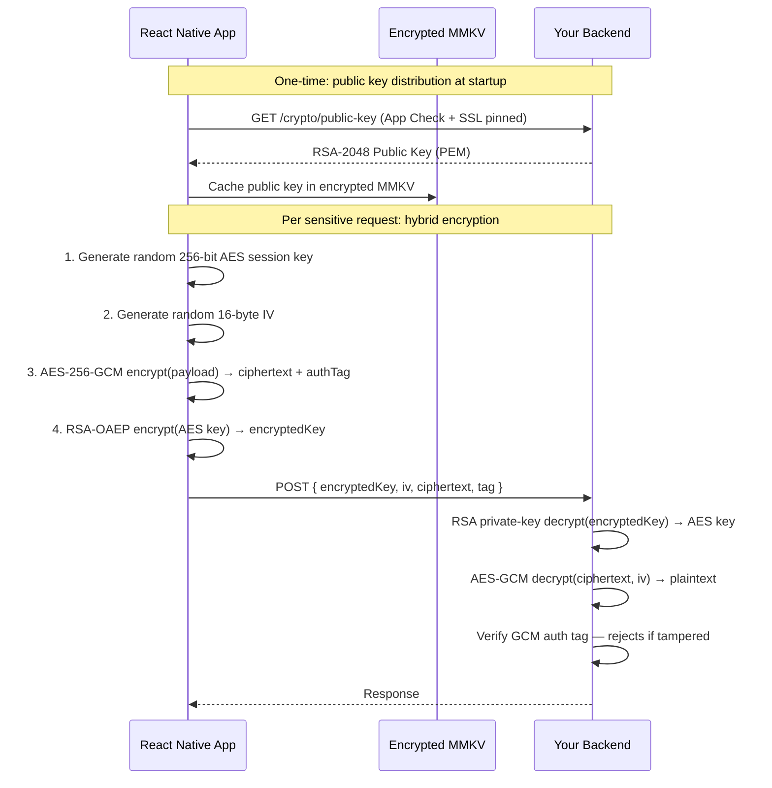

> **Why GCM (Galois/Counter Mode)?** AES-GCM is *authenticated* encryption — it produces a 16-byte `authTag` that covers every byte of ciphertext. If anything is modified in transit (even one bit), the tag check fails on the server and the payload is rejected before decoding. This gives you confidentiality **and** integrity in a single operation.

1. Server exposes a public key (RSA-OAEP or ECDH)
2. Client generates a random AES-256 session key and encrypts it with the server public key
3. Client encrypts the payload body using AES-256-GCM (authenticated encryption)
4. Both the encrypted key and encrypted payload are sent together
5. Server decrypts the session key with its private key, then decrypts the payload

Use [`react-native-quick-crypto`](https://github.com/margelo/react-native-quick-crypto) — a native crypto module backed by the device's hardware crypto engine, significantly faster than pure-JS alternatives:

```bash
npm install react-native-quick-crypto
```

```typescript
import {
 randomBytes,
 createCipheriv,
 publicEncrypt,
 constants,
} from 'react-native-quick-crypto';

async function encryptPayload(payload: object, serverPublicKeyPem: string) {
 const sessionKey = randomBytes(32); // 256-bit AES key
 const iv = randomBytes(16);

 const cipher = createCipheriv('aes-256-gcm', sessionKey, iv);
 const encrypted = Buffer.concat([
   cipher.update(JSON.stringify(payload), 'utf8'),
   cipher.final(),
 ]);
 const authTag = cipher.getAuthTag(); // GCM authentication tag

 // Wrap the session key with the server's RSA public key
 const encryptedKey = publicEncrypt(
   { key: serverPublicKeyPem, padding: constants.RSA_PKCS1_OAEP_PADDING },
   sessionKey,
 );

 return {
   encryptedKey: encryptedKey.toString('base64'),
   iv: iv.toString('base64'),
   ciphertext: encrypted.toString('base64'),
   tag: authTag.toString('base64'),
 };
}
```

Apply it selectively via an Axios interceptor on sensitive endpoints:

```typescript
apiClient.interceptors.request.use(async (config) => {
 if ((config as any).encryptPayload && config.data) {
   config.data = await encryptPayload(config.data, SERVER_PUBLIC_KEY);
   config.headers['X-Payload-Encrypted'] = '1';
 }
 return config;
});
```

> **Note**: Payload encryption adds complexity and latency. Apply it selectively to your highest-sensitivity endpoints rather than globally. Measure the round-trip overhead under production load conditions before rolling it out broadly.

**Key distribution**: Never hardcode the server public key in your JS bundle. Fetch it from a secured key distribution endpoint (protected by App Check + SSL pinning) at app startup and cache it in encrypted MMKV storage.

---

### Firebase App Check vs SSL Pinning

These are often confused or treated as alternatives. They are not — they protect against **completely different attack vectors** and address **opposite sides of the trust problem**. You need both.

| | Firebase App Check | SSL Pinning |
|---|---|---|
| **Trust direction** | Server trusts the **client** | Client trusts the **server** |
| **Core question** | "Did this request come from my legitimate app?" | "Am I connected to my real server?" |
| **Enforced at** | Backend (server rejects requests without valid tokens) | Client (app rejects the TLS connection) |
| **Attack stopped** | Bots and scripts calling your API directly, without your app | MITM proxies intercepting traffic between your app and server |
| **Attacker's position** | Outside your app entirely — hitting your API endpoint directly | Between your app and the server — intercepting an in-app request |
| **Bypassed by** | Extracting a valid token from a running app session (difficult; tokens are short-lived) | Rooting the device and hooking the SSL stack with Frida |
| **Does NOT protect against** | Traffic that IS from your app but being intercepted in transit | Requests that aren't from your app at all |
| **State of a "passing" request** | Request has a cryptographically valid attestation token | Connection terminated TLS handshake with the expected certificate |

The critical insight is the direction of trust:

- **App Check**: your *backend* decides whether to trust the *client*
- **SSL Pinning**: your *app* decides whether to trust the *server*

A request can satisfy one while failing the other:

- A bot fires requests with a spoofed or missing App Check token → **App Check blocks it, SSL pinning is irrelevant** (the attacker isn't inside your app)
- A MITM proxy intercepts a legitimate in-app request with a valid App Check token → **SSL pinning blocks it, App Check is irrelevant** (the token is valid — it came from the real app)

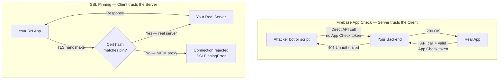

**Where they overlap**: On a rooted device, both can be defeated by a sufficiently capable attacker — Frida can hook the SSL validation code (bypassing pinning) and can also intercept the App Check token from memory to replay it. This is why JailMonkey + rooted device detection is part of the stack: the first line of defense is refusing to operate on a device where these bypasses are possible.

---

## 8. Code Obfuscation and Secret Management

> **Short answer**: With Hermes enabled (the default since React Native 0.64 on Android and 0.70 on iOS), your JavaScript bundle is compiled to **binary bytecode** at build time — it is not human-readable source code. This gives you meaningful partial protection out of the box. It does not eliminate the need for ProGuard/R8 on the native layer, and it is not a substitute for keeping secrets out of the bundle entirely.

### Why This Question Comes Up

In older React Native versions, the JS bundle shipped as a plain-text `.bundle` file inside the APK or IPA. Anyone who extracted the archive with `apktool` or `unzip` could read your entire application logic — API endpoints, business rules, and (if carelessly included) secrets — as readable JavaScript. This created a genuine and exploited attack surface.

The introduction of **Hermes** as the default JS engine changed this significantly. Hermes pre-compiles JavaScript to its own bytecode format (`.hbc`) at bundle time. What ends up inside the APK/IPA is a binary blob, not JavaScript source.

### What Hermes Gives You

Hermes bytecode is:

- **Binary** — not readable as JavaScript text
- **Compact** — optimized for parse speed, not for human readability
- **Stripped of source maps** in release builds — source maps are omitted unless you explicitly include them

This means the most common low-effort attack — decompile the APK, open the bundle in a text editor, read your API URLs and logic — no longer works against a Hermes-compiled release build.

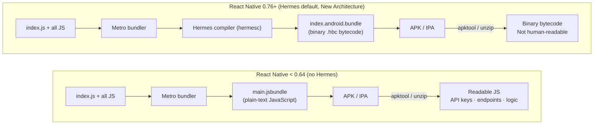

### What Hermes Does NOT Protect Against

Hermes bytecode is **not cryptographically protected**. Dedicated decompilation tools exist:

- **`hermes-dec`** (open source) — decompiles Hermes bytecode back to approximate JavaScript. The output is less clean than the original source but recovers function names, string constants, and API endpoints.
- **`hbctool`** — reads and patches Hermes bytecode at the instruction level.

A motivated attacker with a few hours can still recover meaningful information from a Hermes-compiled bundle. What Hermes removes is the **zero-effort, zero-skill** attack path — extracting your bundle with `unzip` and opening it in a text editor.

> **The architectural conclusion**: Hermes significantly raises the cost of JS bundle extraction, but the *only fully reliable protection for sensitive values is not putting them in the bundle at all.*

### The Two Obfuscation Layers Explained

React Native apps have two distinct code layers that require separate obfuscation strategies:

| Layer | What It Contains | Obfuscation Mechanism | Status in Modern RN |
|---|---|---|---|
| **JS bundle** | Application logic, UI, API calls | Hermes bytecode compilation | **Automatic** — enabled by default since RN 0.64 (Android) / 0.70 (iOS) |
| **Native layer** (Java / Kotlin / ObjC / Swift) | Native modules, bridges, platform bindings | ProGuard / R8 (Android); Swift compiler optimizations (iOS) | **Android: must be explicitly enabled.** iOS: compiler strips symbols in release builds. |

freeRASP's `obfuscationIssues` callback (Section 3) fires specifically when it detects that your Android release APK was compiled **without ProGuard/R8**. This is the check that enforces native-layer obfuscation — not JS bundle obfuscation.

### Enabling ProGuard / R8 on Android (Required)

ProGuard (replaced by R8 in modern Gradle) obfuscates and shrinks the Java/Kotlin native layer of your app. It must be explicitly enabled in your release build configuration:

```groovy
// android/app/build.gradle
android {
   buildTypes {
       release {
           minifyEnabled true          // enables R8 (successor to ProGuard)
           shrinkResources true         // removes unused resources
           proguardFiles getDefaultProguardFile('proguard-android-optimize.txt'),
                        'proguard-rules.pro'
       }
   }
}
```

React Native ships a default `proguard-rules.pro` in the template. Ensure it is not empty and that your custom native modules have matching keep rules to avoid stripping classes that are called via reflection:

```pro
# proguard-rules.pro — React Native baseline
-keep class com.facebook.hermes.unicode.** { *; }
-keep class com.facebook.jni.** { *; }

# Keep your app's native modules
-keep class com.yourapp.modules.** { *; }
```

With `minifyEnabled true`, freeRASP's `obfuscationIssues` callback will no longer fire in release builds — confirming that native-layer obfuscation is active.

### New Architecture (RN 0.76+) — Additional Native Protection

With the New Architecture (default since RN 0.76), much of the performance-critical integration code moves from the JS thread into **C++ JSI (JavaScript Interface) modules** compiled as native libraries (`.so` on Android, `.dylib`/`.a` on iOS). Compiled native code is substantially harder to reverse-engineer than Java bytecode — it requires a disassembler (IDA Pro, Ghidra, Binary Ninja) and architecture-level reverse engineering.

This does not change the JS bundle story, but it does mean that apps on RN 0.76+ with TurboModules have a naturally stronger native-layer posture than the old bridge-based architecture.

### The Only Reliable Defense for Secrets: Keep Them Out of the Bundle

No level of obfuscation is a substitute for architectural hygiene. A Hermes-compiled bundle with ProGuard-obfuscated native code can still be decompiled by a sufficiently motivated attacker. The correct approach is:

**1. Build-time environment variable injection**

Use `react-native-config` or `babel-plugin-transform-inline-environment-variables` to inject non-secret build-time constants (API base URLs, feature toggle names, environment identifiers). These become inlined string literals in the bundle — they are visible to a decompiler, so never inject secrets this way.

```ts
import Config from 'react-native-config';

// ✅ Safe: non-secret base URL injected at build time
const API_BASE = Config.API_BASE_URL;

// ❌ Never inject actual secrets (API keys, signing keys, passwords)
// const API_SECRET = Config.STRIPE_SECRET_KEY; // visible in bundle
```

**2. Backend-for-Frontend (BFF) pattern for secrets**

Any value that must remain secret belongs on the server. Your app calls a BFF endpoint that holds the secret and makes the downstream call on behalf of the app:

```mermaid
flowchart LR
   APP["React Native App"] -- "POST /payments/initiate\n(App Check token + idempotency key)" --> BFF["Your BFF / API Gateway"]
   BFF -- "POST /charges\nAuthorization: Bearer STRIPE_SECRET_KEY" --> STRIPE["Stripe API"]
   STRIPE -- "Payment intent" --> BFF
   BFF -- "client_secret (one-time use)" --> APP
   NOTE["Stripe secret key\nnever leaves your server"] -. .-> BFF
```

**3. Runtime key fetching (for public keys, config)**

For values that must be fetched dynamically (e.g., the server public key for payload encryption), fetch them from a secured endpoint at startup and cache them in encrypted MMKV, as described in Section 7. Never hardcode them in the bundle.

---

### API Key and Secret Lifecycle Management

The question of *where* secrets live is distinct from the question of *how* your app code accesses them. Secrets exist across three environments — local development, CI/CD pipelines, and production runtime — and each needs a different management strategy.

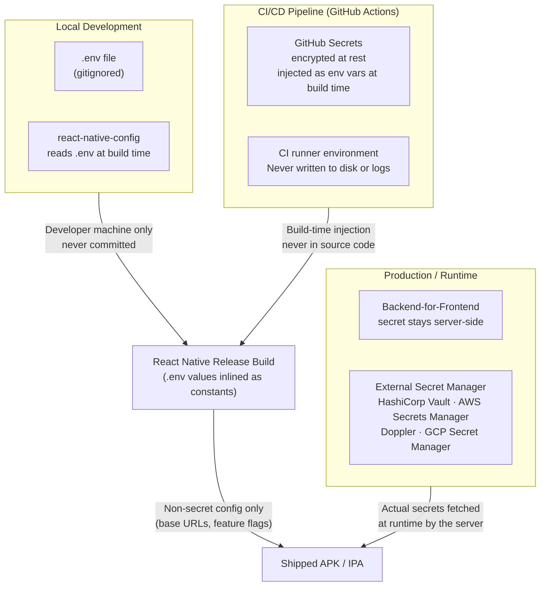

#### Local Development — `.env` Files with `react-native-config`

[`react-native-config`](https://github.com/luggit/react-native-config) bridges `.env` files into your React Native app at build time, making values available via `Config.*` in JS and through native build configs in Gradle and Xcode.

**Setup:**

```bash
npm install react-native-config
cd ios && pod install
```

Create per-environment `.env` files at the project root:

```
.env                  # default / local development
.env.staging          # staging build
.env.production       # production build
```

Example `.env`:
```bash
# .env — NEVER commit this file, never put real secrets here
API_BASE_URL=https://api.dev.example.com
SARDINE_ENVIRONMENT=sandbox
SARDINE_CLIENT_ID=sardine_dev_client_id

# These are non-secret identifiers, safe to inject at build time
FIREBASE_DEBUG_TOKEN_ANDROID=xxxxxxxx-xxxx-xxxx-xxxx-xxxxxxxxxxxx
```

Add all `.env*` variants to `.gitignore`:

```gitignore
# .gitignore
.env
.env.*
!.env.example      # commit only a documented example with no real values
```

Always commit a `.env.example` documenting every required variable with placeholder values. This serves as the contract for what must be populated in CI and by new developers:

```bash
# .env.example — commit this, fill in values locally and in CI
API_BASE_URL=
SARDINE_ENVIRONMENT=
SARDINE_CLIENT_ID=
FIREBASE_DEBUG_TOKEN_ANDROID=
FIREBASE_DEBUG_TOKEN_IOS=
```

#### CI/CD — GitHub Secrets

GitHub Secrets are the correct mechanism for injecting secrets into GitHub Actions builds. They are:

- Encrypted at rest and in transit by GitHub
- Never printed in workflow logs (masked automatically)
- Not accessible to forked repositories in pull request workflows
- Scoped to repository, environment, or organization level

**Adding secrets to a repository:**

Go to **Repository → Settings → Secrets and variables → Actions → New repository secret**.

For multi-environment setups (staging, production), use [GitHub Environments](https://docs.github.com/en/actions/deployment/targeting-different-environments/using-environments-for-deployment) to scope secrets per deployment target — this enforces that production secrets are only accessible during production deploys, and staging secrets are only accessible during staging deploys.

**Injecting secrets into a React Native build workflow:**

```yaml
# .github/workflows/build-android.yml
name: Android Release Build

on:
 push:
   branches: [main]

jobs:
 build:
   runs-on: ubuntu-latest
   environment: production   # uses the "production" GitHub Environment secrets

   steps:
     - uses: actions/checkout@v4

     - name: Write .env from GitHub Secrets
       run: |
         echo "API_BASE_URL=${{ secrets.API_BASE_URL }}" >> .env
         echo "SARDINE_CLIENT_ID=${{ secrets.SARDINE_CLIENT_ID }}" >> .env
         echo "SARDINE_ENVIRONMENT=production" >> .env
         echo "FIREBASE_DEBUG_TOKEN_ANDROID=${{ secrets.FIREBASE_DEBUG_TOKEN_ANDROID }}" >> .env

     - name: Build Android release
       run: cd android && ./gradlew assembleRelease

     # The .env file is never committed — it exists only for the duration
     # of this runner's job and is deleted when the runner shuts down
```

**iOS (Xcode / Fastlane):**

```yaml
     - name: Write iOS .env from GitHub Secrets
       run: |
         echo "API_BASE_URL=${{ secrets.API_BASE_URL }}" >> .env
         echo "FIREBASE_DEBUG_TOKEN_IOS=${{ secrets.FIREBASE_DEBUG_TOKEN_IOS }}" >> .env

     - name: Build iOS release
       run: bundle exec fastlane ios build
       env:
         MATCH_PASSWORD: ${{ secrets.MATCH_PASSWORD }}
         APP_STORE_CONNECT_API_KEY: ${{ secrets.APP_STORE_CONNECT_API_KEY }}
```

> **Key principle**: GitHub Secrets are write-only from the perspective of workflow runs — you cannot `echo` them to logs (GitHub will mask them) and they cannot be read back via the API. They are injected to the runner environment exactly once per job, and the runner is discarded afterward.

#### Alternatives to GitHub Secrets

GitHub Secrets covers the CI/CD injection use case well. For more advanced enterprise requirements, the following tools extend the model:

| Tool | Best For | Key Advantage |
|---|---|---|
| **GitHub Secrets** | Most teams using GitHub Actions | Built-in, zero cost, tightly integrated with GitHub environments |
| **[Doppler](https://www.doppler.com)** | Teams managing many secrets across many apps/services | Central dashboard, sync to GitHub/Vercel/AWS, automatic secret rotation, audit log |
| **[HashiCorp Vault](https://www.vaultproject.io)** | Enterprise / regulated environments | Dynamic secrets, fine-grained ACL, on-premises or cloud, PKI and SSH cert issuance |
| **[AWS Secrets Manager](https://aws.amazon.com/secrets-manager/)** | Teams on AWS | Native IAM integration, automatic rotation, KMS encryption, free for 30 days then $0.40/secret/month |
| **[GCP Secret Manager](https://cloud.google.com/secret-manager)** | Teams on GCP | IAM-native, low cost ($0.06/10k access ops), regional replication |
| **[Azure Key Vault](https://azure.microsoft.com/en-us/products/key-vault/)** | Teams on Azure | Native RBAC, HSM-backed, integrates with Azure DevOps |
| **[1Password Secrets Automation](https://developer.1password.com/docs/ci-cd/)** | Teams already using 1Password | Zero-knowledge architecture, rotate without code changes |

**AWS Secrets Manager** is worth highlighting for teams already on AWS infrastructure — secrets are stored centrally, access is controlled via IAM roles, and values are never written to disk or source control. Your CI runner fetches them at build time using the AWS CLI, and your backend fetches them at runtime using the SDK.

**Storing a secret:**

```bash
# Store each secret as a key/value pair in a single versioned secret
aws secretsmanager create-secret \
 --name "myapp/production" \
 --secret-string '{
   "API_BASE_URL": "https://api.example.com",
   "SARDINE_CLIENT_ID": "sardine_prod_id",
   "STRIPE_SECRET_KEY": "sk_live_..."
 }'

# Update a single field without touching others
aws secretsmanager put-secret-value \
 --secret-id "myapp/production" \
 --secret-string '{"SARDINE_CLIENT_ID": "sardine_prod_id_v2"}'
```

**Fetching secrets in a GitHub Actions build and writing them to `.env`:**

```yaml
# .github/workflows/build-android.yml
jobs:
 build:
   runs-on: ubuntu-latest
   permissions:
     id-token: write   # required for OIDC → AWS role assumption (no long-lived AWS keys)
     contents: read

   steps:
     - uses: actions/checkout@v4

     - name: Configure AWS credentials (OIDC — no stored AWS keys)
       uses: aws-actions/configure-aws-credentials@v4
       with:
         role-to-assume: arn:aws:iam::123456789012:role/github-actions-rn-build
         aws-region: us-east-1

     - name: Fetch secrets from AWS Secrets Manager → .env
       run: |
         aws secretsmanager get-secret-value \
           --secret-id "myapp/production" \
           --query SecretString \
           --output text \
         | jq -r 'to_entries[] | "\(.key)=\(.value)"' >> .env

     - name: Build Android release
       run: cd android && ./gradlew assembleRelease
```

> **Note on OIDC**: The `aws-actions/configure-aws-credentials` action with `role-to-assume` uses OpenID Connect to obtain short-lived AWS credentials — no long-lived `AWS_ACCESS_KEY_ID` secret needs to be stored in GitHub. This is the recommended pattern for GitHub Actions → AWS.

**Fetching secrets at runtime on your backend (Node.js):**

```ts
import { SecretsManagerClient, GetSecretValueCommand } from '@aws-sdk/client-secrets-manager';

const client = new SecretsManagerClient({ region: 'us-east-1' });

export const getSecrets = async (): Promise<Record<string, string>> => {
 const response = await client.send(
   new GetSecretValueCommand({ SecretId: 'myapp/production' }),
 );
 return JSON.parse(response.SecretString!);
};

// Call once at server startup, then reuse the cached values
const secrets = await getSecrets();
const stripeClient = new Stripe(secrets.STRIPE_SECRET_KEY);
```

The React Native app never sees `STRIPE_SECRET_KEY` — only the backend fetches it at runtime from Secrets Manager using its IAM instance role.

#### What Should and Should Not Be a Secret

A common mistake is over-classifying values as secrets, adding unnecessary workflow complexity, or — more dangerously — under-classifying and leaking actual secrets into source control or bundle files.

| Value Type | Examples | Should Be a Secret? | Correct Location |
|---|---|---|---|
| API base URL | `https://api.example.com` | No | `.env` → `react-native-config` → bundle |
| Firebase App ID | `1:123456789:android:abc` | No | `google-services.json` (committed) |
| Firebase debug token | `xxxxxxxx-xxxx-xxxx-xxxx` | Yes (dev/CI only) | GitHub Secret → `.env` |
| Signing keystore password | — | **Yes** | GitHub Secret → used by Gradle, never bundled |
| Stripe publishable key | `pk_live_...` | No (public by design) | `.env` → bundle |
| Stripe secret key | `sk_live_...` | **Yes** | Server-side only — never in app |
| Sardine client ID | — | Yes | GitHub Secret → `.env` |
| Internal API key | — | **Yes** | Server-side BFF only — never in app |
| App Store Connect API key | — | **Yes** | GitHub Secret → Fastlane only |

> **The decisive test**: If this value were to appear in your app's binary, could an attacker extract it and make calls to a paid API, access user data, or impersonate your server? If yes — it is a secret, it belongs on the server, and it should never be injected into the client bundle regardless of obfuscation.

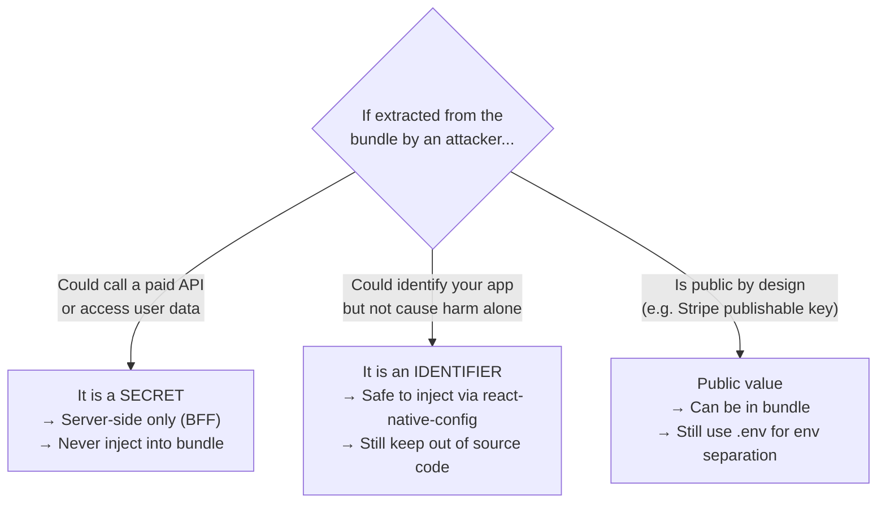

### Optional: JavaScript Obfuscation with `javascript-obfuscator`

If Hermes bytecode is insufficient for your threat model (e.g., you are building a DRM client, a white-label SDK, or working under specific compliance requirements), you can add a dedicated JavaScript obfuscation step via Metro's transformer API:

```bash
npm install --save-dev javascript-obfuscator metro-react-native-babel-obfuscator
```

```js
// metro.config.js (apply only to release builds)
const { getDefaultConfig } = require('@react-native/metro-config');

const config = getDefaultConfig(__dirname);

if (process.env.NODE_ENV === 'production') {
 config.transformer.minifierPath = require.resolve('metro-react-native-babel-obfuscator');
 config.transformer.minifierConfig = {
   compact:             true,
   stringArray:         true,
   rotateStringArray:   true,
   stringArrayEncoding: ['rc4'],
   identifierNamesGenerator: 'hexadecimal',
 };
}

module.exports = config;
```

**When JS obfuscation is worth the cost**:

| Scenario | Justification |
|---|---||
| DRM / content protection logic in JS | Delays reverse-engineering of license validation |
| Proprietary algorithm embedded in bundle | Raises cost of IP theft |
| White-label SDK distributed to third parties | You don't control what tools they run |
| PCI DSS in-scope payment logic in JS layer | Compliance may mandate additional controls |

**When it is not worth the cost**:

| Scenario | Reason |
|---|---|
| Standard consumer app with Hermes enabled | Bytecode compilation already handles casual attackers |
| App where secrets are properly kept server-side | Nothing worth protecting in the bundle |
| Performance-sensitive apps | JS obfuscation adds build time and can inflate bundle size |

> **Rule of thumb**: If your threat model requires that a motivated, well-funded attacker cannot reverse-engineer your app, no client-side obfuscation will stop them. Obfuscation raises cost and buys time — it does not provide confidentiality guarantees. Architect your system so that compromising the client does not compromise your users or your infrastructure.

---

## 9. Security Testing and Validation

> Deploying security controls without testing them is equivalent to installing a deadbolt without checking that the lock actually engages. This section covers how to validate that each layer of your security stack behaves correctly before and after shipping.

### Testing JailMonkey and freeRASP

**Simulator / emulator baseline**: Both libraries detect standard Android emulators and iOS simulators. Set `isProd: false` (freeRASP) or guard with `__DEV__` (JailMonkey) during development. To validate the *detection path*, you must use a production or release-candidate build on a physical device.

**Rooted / jailbroken test device**: Maintain at least one dedicated rooted Android device and one jailbroken iOS device in your QA lab. Install a production build and verify:

- JailMonkey returns `true` for `isJailBroken()` and `trustFall()`
- freeRASP fires the `privilegedAccess` callback
- The app blocks or restricts sensitive features as configured
- The backend receives the `device_integrity=false` signal in your risk log

**Hook detection testing**: Use [Frida](https://frida.re) from a terminal session on the rooted device:

```bash
frida -U -l test-hook.js -f com.yourapp
```

Confirm that freeRASP's `hooks` callback fires and — if `killOnBypass: true` — the process terminates.

**App integrity testing**: Repackage your release APK with `apktool`, resign with a different key, and sideload it. Confirm that freeRASP's `appIntegrity` callback fires because the signing certificate hash no longer matches your configured hash.

### Testing Firebase App Check

**Debug token flow**: Use the `debug` provider with a registered debug token during local development and CI. Verify:

- Authenticated requests with a valid debug token succeed
- Requests without the `X-Firebase-AppCheck` header return 401
- Requests with a malformed or expired token return 401

**Play Integrity cold-start test (Android)**: Install a fresh build and make an authenticated request immediately on first launch. Confirm the retry logic in your interceptor handles transient Play Integrity failures gracefully without blocking the user.

### Testing SSL Pinning

**MITM proxy test**: Configure Charles Proxy or mitmproxy on the same network as your test device. Install the proxy's CA certificate on the device. Make an API request and verify:

1. **Without pinning active**: request succeeds through the proxy — confirms your traffic was interceptable
2. **With pinning active**: request throws an `SSLPinningError` — confirms the pin is enforced

**Certificate rotation test**: Temporarily embed only the backup pin (simulating a primary cert rotation). Confirm that API calls continue to succeed with the backup pin in place before the active pin is updated.

### Testing Sardine Integration

**Signal verification (sandbox)**: After completing a fully instrumented flow, query the Sardine sandbox API with your session key:

```bash
curl -X GET "https://api.sardine.ai/v1/devices/session?session_key=<SESSION_KEY>" \
 -H "Authorization: Bearer <SARDINE_API_KEY>"
```

Verify that `trackPage`, `trackTextChange`, and `trackFocusChange` events appear in the response payload.

**Risk level simulation**: Sardine's sandbox environment supports simulated risk scores via test account configurations. Use these to confirm your backend correctly routes all four risk levels (`low`, `medium`, `high`, `very_high`) to their expected business actions.

### Automated Security Regression Tests

Add behavioral assertions to your test suite to catch regressions when libraries are updated:

```ts
// __tests__/security/deviceIntegrity.test.ts
import JailMonkey from 'jail-monkey';

describe('useDeviceSecurity hook', () => {
 it('returns secure in Jest environment (all checks mocked to false)', () => {
   expect(JailMonkey.isJailBroken()).toBe(false);
   expect(JailMonkey.trustFall()).toBe(false);
   expect(JailMonkey.hookDetected()).toBe(false);
 });

 it('returns isDeviceSecure=false when any JailMonkey check is truthy', async () => {
   jest.spyOn(JailMonkey, 'isJailBroken').mockReturnValue(true);
   // Render the hook and assert navigation to ApplicationUnavailable
   // ... render hook with renderHook(), assert result.current === false
 });
});
```

```mermaid
flowchart LR
   subgraph CI["CI Pipeline — Automated Gates"]
       UNIT["Unit tests\nMocked security hooks"]
       LINT["ESLint rules\nno AsyncStorage · no hardcoded secrets"]
       BUILD["Release build\nProGuard · Hermes enabled"]
       SCAN["Static analysis\nMobSF or Semgrep mobile rules"]
   end

   subgraph QA["QA Lab — Manual Device Validation"]
       ROOTED["Rooted device\nJailMonkey + freeRASP trigger test"]
       MITM["MITM proxy\nSSL pinning enforcement test"]
       FRIDA["Frida hook test\nfreeRASP hooks callback"]
       REPACK["Repackaged APK\nfreeRASP appIntegrity callback"]
   end

   subgraph PROD["Production Monitoring"]
       METRICS["App Check token\nvalidation rate"]
       RASP["freeRASP callback\ntelemetry trends"]
       SARDINE["Sardine risk\ndistribution dashboard"]
   end

   CI --> QA --> PROD
```

---

## 10. Bringing It All Together

### The Layered Security Model

Each tool operates at a different layer of your security stack:

```mermaid
flowchart TD
   START([User opens app])

   START --> LAYER1

   subgraph LAYER1["Layer 1 — Data at Rest & Authentication"]
       direction LR
       L1A[MMKV encrypted storage]
       L1B[Keychain — hardware-backed credentials]
       L1C[Biometrics — physical presence gate]
   end

   LAYER1 -->|User authenticated| LAYER2

   subgraph LAYER2["Layer 2 — Device Integrity & Runtime Protection"]
       direction LR
       L2A[JailMonkey — rooted / jailbroken / hooked?]
       L2B["freeRASP — app integrity + full RASP\n★ 100k free download cap on free tier"]
   end

   LAYER2 -->|Device trusted| LAYER3
   LAYER2 -->|Compromised| BLOCKED

   subgraph LAYER3["Layer 3 — Network Transport"]
       direction LR
       L3A[SSL Pinning — verified server connection]
       L3B[Payload Encryption — end-to-end for sensitive data]
   end

   LAYER3 -->|Channel secured| LAYER4

   subgraph LAYER4["Layer 4 — Request Attestation"]
       L4[Firebase App Check — Play Integrity / App Attest]
   end

   LAYER4 -->|Token verified by backend| LAYER5
   LAYER4 -->|Invalid token| BLOCKED

   subgraph LAYER5["Layer 5 — Behavioral Risk  fintech "]
       L5[Sardine SDK — device fingerprint + behavioral biometrics]
   end

   LAYER5 -->|Low or Medium risk| SUCCESS
   LAYER5 -->|High risk| BLOCKED

   SUCCESS([Request Processed])
   BLOCKED([Blocked or Restricted])
```

Each layer independently reduces a category of attack. Bypassing all six simultaneously requires decrypting hardware-backed storage, passing device integrity checks, bypassing app integrity verification and continuous RASP monitoring, bypassing certificate pinning, forging a valid attestation token, AND producing convincing behavioral biometrics — a dramatically higher bar for any attacker.
