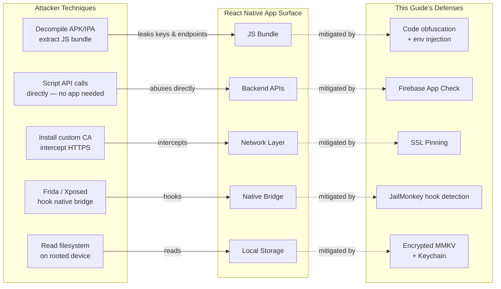
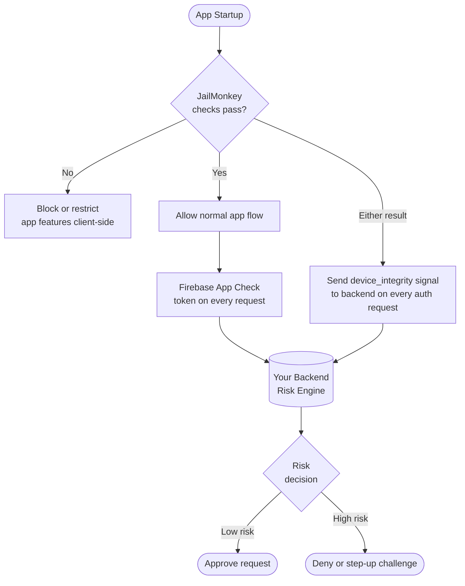
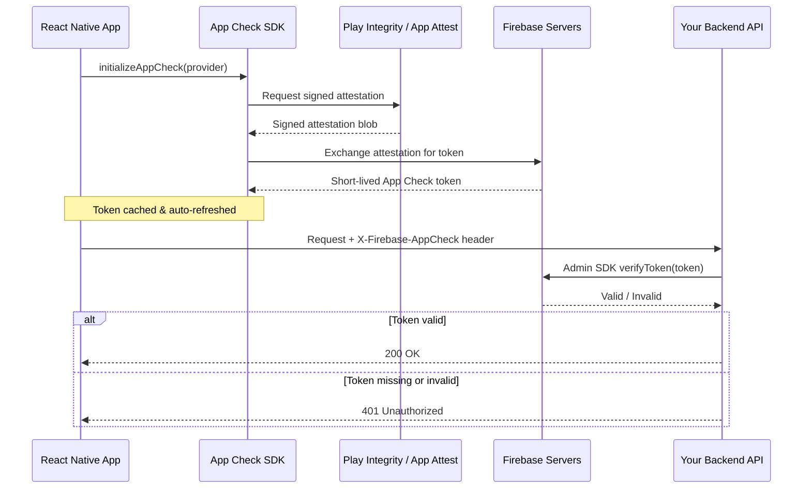
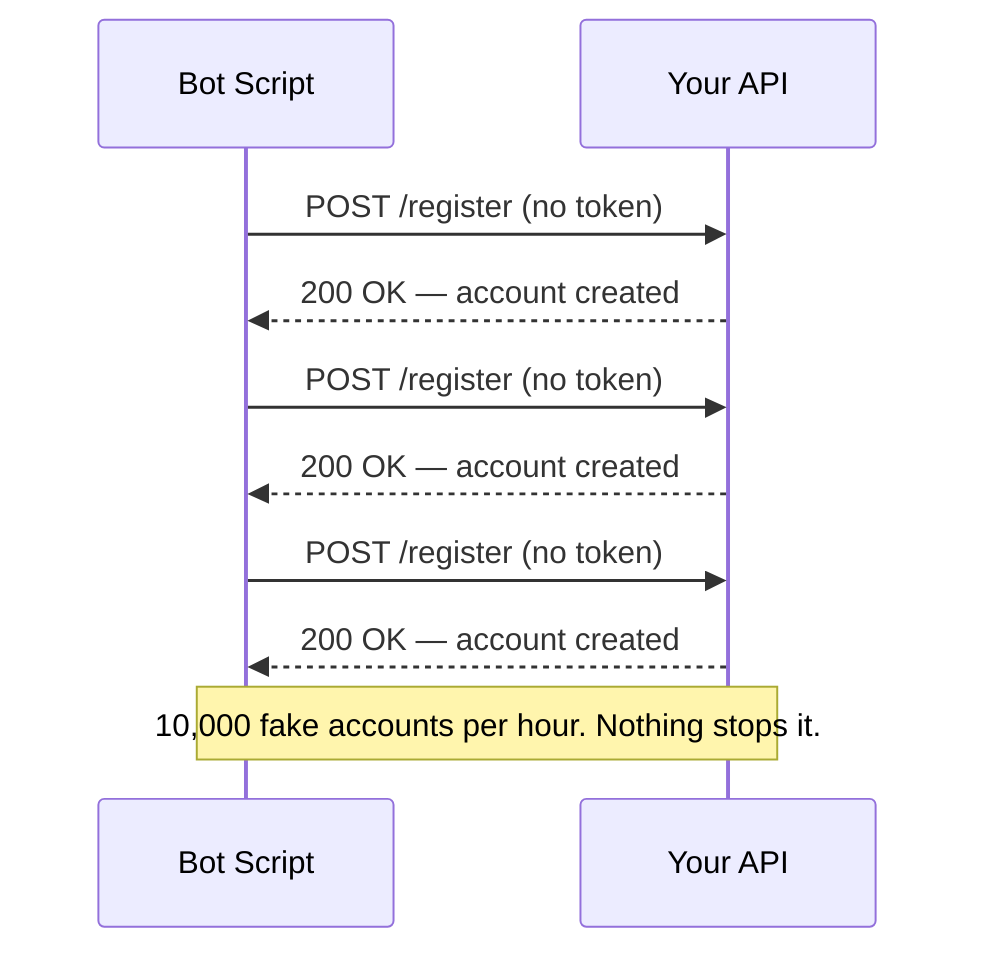
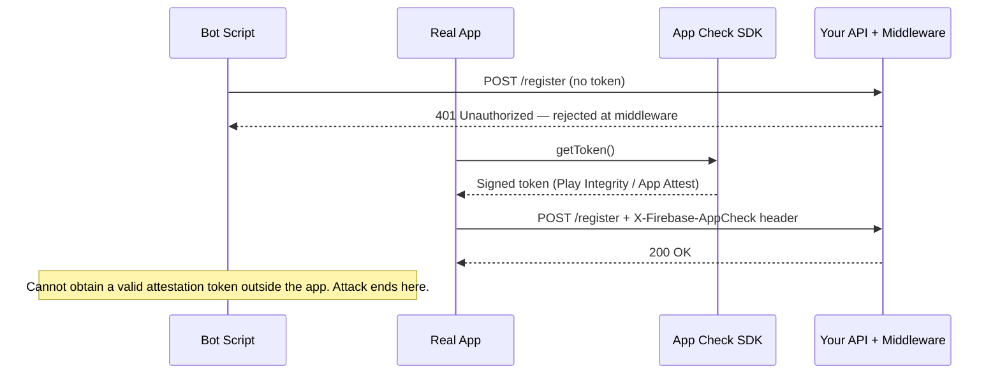

# Enhancing Mobile App Security in React Native: A Practical Guide Using JailMonkey, Firebase App Check, and Sardine SDK

---

## 1. Introduction

Any React Native app that handles user accounts, sensitive data, or real-money transactions is a target. Whether you're building a banking app, a healthcare platform, an e-commerce experience, or a productivity tool with user authentication — the same vulnerabilities apply, and the consequences of a breach scale with how much your users trust you with.

### Why Mobile App Security Matters

A compromised app exposes your users and your business simultaneously. Attackers can intercept API calls, reverse-engineer business logic, bypass authentication flows, and exploit backend services at scale. In regulated industries the stakes are even higher — compliance violations, forced audits, and permanent reputational damage. But even outside regulated verticals, a single publicly disclosed breach erodes the trust that took years to build.

### What Makes React Native Apps Vulnerable

React Native apps have a few structural characteristics that attackers exploit:

- **JavaScript bundle exposure**: The JS bundle can be extracted from the APK/IPA and reverse-engineered, leaking API keys, business logic, or endpoints.
- **Native bridge attack surface**: The bridge between JS and native code can be hooked using tools like Frida or Xposed.
- **Rooted/jailbroken devices**: These bypass OS-level sandboxing, giving attackers full control over app memory, files, and network traffic.
- **No built-in backend validation**: React Native apps talk to APIs directly — nothing stops an attacker from replaying those requests outside the app.
- **Debug mode left enabled**: Apps shipped in debug mode expose internal state and disable security protections.

The diagram below maps each attack technique to the app component it targets, and the defense that mitigates it:



### The Security Layer Model

No single tool solves mobile security. A robust solution is layered:

| Layer | Tool | Threat Addressed |
|---|---|---|
| Device Integrity | JailMonkey | Rooted/jailbroken devices, emulators, debug mode |
| Backend Abuse Protection | Firebase App Check | Unauthorized API/database access, bot traffic |
| Transaction Fraud Prevention | Sardine SDK *(fintech)* | Fraud, account takeover, risky onboarding |
| Data at Rest & Authentication | MMKV + Keychain + Biometrics | Credential theft, storage extraction, unattended access |
| Network Transport | SSL Pinning + Payload Encryption | MITM attacks, TLS interception, in-transit data exposure |

Each layer addresses a different vector. Together, they form a defense-in-depth strategy that significantly raises the cost and complexity of attacks against your app.

---

## 2. JailMonkey — Device Integrity Checks

>  JailMonkey runs native checks at app startup to detect rooted/jailbroken devices, emulators, and runtime hooks. The result is a single boolean you gate your app on. It is a **client-side risk signal, not a guarantee** — a sophisticated attacker can bypass it, which is why you send the signal to your backend and combine it with server-side enforcement.

### What JailMonkey Does

[JailMonkey](https://github.com/GantMan/jail-monkey) is a React Native library that performs runtime device integrity checks. It detects whether a device is **rooted (Android)**, **jailbroken (iOS)**, running on an **emulator**, in **debug mode**, has **ADB enabled**, uses **mock location**, or shows signs of **runtime hooking or code injection** (e.g., Frida, Xposed).

All checks are performed **client-side** using native code bridges. There is no network activity, no data collection, and no sensitive permissions required — the source code is fully auditable on GitHub.

### How It Works Internally

**On Android**, JailMonkey integrates [RootBeer](https://github.com/scottyab/rootbeer), which performs multiple low-level checks:

- Presence of root management apps (SuperSU, Magisk)
- Existence of the `su` binary
- Dangerous system properties and writable system paths
- Build tag test-keys (common in custom ROMs)
- Magisk binary detection
- ADB enabled status
- App installed on external storage
- Mock location enabled
- Emulator signatures (device IDs, files, properties)
- Runtime hooking indicators

**On iOS**, JailMonkey checks:

- Existence of jailbreak artifacts (`/Applications/Cydia.app`, `apt`, etc.)
- Ability to write outside the app sandbox
- Presence of jailbreak tools loaded at runtime
- Simulator detection
- Debug mode and hooking/injection frameworks

### Why Device Integrity Checks Matter

On a rooted or jailbroken device, the OS security model breaks down entirely. An attacker can:

- Read your app's private keychain/keystore data
- Intercept and modify network traffic even over HTTPS (SSL pinning bypass)
- Hook your app's functions at runtime using tools like Frida
- Dump memory to extract tokens or secrets
- Bypass biometric and PIN checks

JailMonkey lets you detect these conditions before your app does anything sensitive.


### Installation

```bash
npm install jail-monkey
# or
yarn add jail-monkey
```

For iOS, run pod install:

```bash
cd ios && pod install
```

### Code Example

A clean pattern is to encapsulate all checks in a single `useDeviceSecurity` hook that returns a boolean. Everything in the app keys off that one value.

```ts
import { useEffect, useState } from "react";
import JailMonkey from "jail-monkey";

const useDeviceSecurity = (): boolean => {
 const [isDeviceSecure, setIsDeviceSecure] = useState(true);

 useEffect(() => {
   if (__DEV__) return; // skip checks in development

   const checkSecurity = async () => {
     const rootedDetection = JailMonkey.androidRootedDetectionMethods;
     const isRootedByRootBeer = rootedDetection?.rootBeer
       ? Object.values(rootedDetection.rootBeer).some(Boolean)
       : false;

     const isCompromised =
       JailMonkey.isJailBroken()      ||
       JailMonkey.trustFall()         ||
       JailMonkey.hookDetected()      ||
       JailMonkey.AdbEnabled?.()      ||
       (await JailMonkey.isDebuggedMode?.()) ||
       isRootedByRootBeer             ||
       rootedDetection?.jailMonkey;

     setIsDeviceSecure(!isCompromised);
   };

   checkSecurity();
 }, []);

 return isDeviceSecure;
};
```

A few points worth noting:

- **`__DEV__` bypass**: Checks are skipped in development so you're never blocked on a simulator.
- **`trustFall()`**: A convenience aggregator covering several checks in one call.
- **`androidRootedDetectionMethods`**: Gives access to both RootBeer's granular flags and JailMonkey's own detector — checking both improves Android coverage.
- **Optional chaining (`?.`)**: Some APIs are Android-only; the optional chaining prevents crashes on iOS.

At startup, consume the hook and route accordingly:

```tsx
const isDeviceSecure = useDeviceSecurity();

// In your startup navigation logic:
if (!isDeviceSecure && !__DEV__) navigate('ApplicationUnavailable');
```

### Important Caveat: Client-Side Limitations

JailMonkey's checks run entirely on the device. A sufficiently advanced attacker can patch or bypass them. This is a **first line of defense**, not a complete solution. Its real value is:

- Blocking unsophisticated attacks and casual jailbreakers
- Sending device integrity signals to your backend for risk scoring
- Satisfying compliance requirements around device posture

Treat the results as **risk signals**, not absolute truth. Combine them with server-side enforcement (which is where Firebase App Check comes in).

The diagram below shows how JailMonkey fits into a layered trust decision — the client-side block stops casual attackers, but backend enforcement is the authoritative layer:



> **Key principle**: The client block (left path) stops unsophisticated attackers immediately. But your backend receiving `device_integrity=false` as a signal is what gives you audit trails, rate limits, and risk-based authentication — regardless of what the client claims.

### Practical Scenarios

| Scenario | JailMonkey Response | Backend Signal |
|---|---|---|
| Banking app on rooted device | Block account access UI | `device_integrity=false` sent for audit log |
| Crypto wallet with Frida hook detected | Refuse to show seed phrase | `hook_detected=true` flags session as high-risk |
| KYC identity verification | Warn user before initiating | Integrity status forwarded to fraud backend |
| Emulator detected in production | Block registration flow | Emulator flag triggers manual review queue |

---

## 3. Firebase App Check — Backend Abuse Protection

>  App Check issues cryptographically signed **attestation tokens** proving a request came from your real, unmodified app on a real device. Your backend middleware rejects everything without a valid token — bots and scripts cannot obtain one from outside the app, so they never reach your business logic.

### The Problem It Solves

Even if your app is secure, your **backend APIs are exposed to the internet**. Nothing stops an attacker from extracting your API endpoints from the JS bundle and calling them directly — bypassing the app entirely. This enables:

- Credential stuffing attacks against your auth endpoints
- Scraping your database through your own API
- Abusing Cloud Functions for spam or DDoS
- Creating fake accounts at scale via automation

Firebase App Check solves this by ensuring **only your legitimate app** can call your backend resources.

### How App Check Works

App Check issues a short-lived **attestation token** that your app must send with every request. Your backend verifies this token with Firebase before processing the request. Tokens are generated using platform-specific attestation providers:

| Platform | Provider | What It Verifies |
|---|---|---|
| iOS | App Attest (DeviceCheck fallback) | Cryptographic proof from Apple that request comes from a genuine, unmodified app |
| Android | Play Integrity (SafetyNet fallback) | Google's verdict on app integrity and device safety |
| Web | reCAPTCHA Enterprise / v3 | Bot detection |
| Debug | Debug provider | Local development only — never ship to production |

The attestation token is opaque to your app — Firebase handles the validation. Your backend simply enforces that valid tokens must be present.



### What It Protects

- **Firebase Realtime Database** and **Firestore** — enforce App Check in security rules
- **Cloud Functions** — check tokens in function middleware
- **Cloud Storage** — restrict read/write to attested apps
- **Custom backends** — verify tokens manually using the Firebase Admin SDK

### Setup in React Native

Install the required packages:

```bash
npm install @react-native-firebase/app @react-native-firebase/app-check
# or
yarn add @react-native-firebase/app @react-native-firebase/app-check
```

For iOS, install pods:

```bash
cd ios && pod install
```

**iOS — Enable App Attest in your Apple Developer account**:

In your `AppDelegate.swift`, no changes are needed beyond standard Firebase setup. App Attest capability must be enabled in Xcode under **Signing & Capabilities**.

**Android — Configure Play Integrity**:

Ensure your app is published (even as an internal test track) in the Google Play Console. Play Integrity requires a real Google Play-distributed app to issue valid tokens.

### Initialization Code

Configure the provider once at module load — not inside a component or hook body. Use platform-specific debug tokens so each environment can be registered separately in the Firebase Console.

```ts
import { ReactNativeFirebaseAppCheckProvider, initializeAppCheck } from "@react-native-firebase/app-check";
import { getApp } from "@react-native-firebase/app";

const rnfbProvider = new ReactNativeFirebaseAppCheckProvider();

rnfbProvider.configure({
 android: {
   provider: __DEV__ ? "debug" : "playIntegrity",
   debugToken: process.env.FIREBASE_DEBUG_TOKEN_ANDROID,
 },
 apple: {
   provider: __DEV__ ? "debug" : "appAttest",
   debugToken: process.env.FIREBASE_DEBUG_TOKEN_IOS,
 },
});

export const initAppCheck = async () =>
 initializeAppCheck(getApp(), {
   provider: rnfbProvider,
   isTokenAutoRefreshEnabled: true,
 });
```

From here, call `initAppCheck()` before your first authenticated request, then retrieve the token and set it as the `X-Firebase-AppCheck` header on your shared API client. Wrap the retrieval in a retry loop with a short delay — Play Integrity token requests can transiently fail on Android cold starts.

### Enforcing App Check on Your Backend

For a custom Node.js/Express backend, verify the token in middleware before any route handler runs:

```ts
export const appCheckMiddleware = async (req, res, next) => {
 const token = req.headers['x-firebase-appcheck'];
 if (!token) return res.status(401).json({ error: 'Missing App Check token' });
 try {
   await getAppCheck().verifyToken(token);
   next();
 } catch {
   res.status(401).json({ error: 'Invalid App Check token' });
 }
};

app.use(appCheckMiddleware); // apply globally
```

For Firestore and Realtime Database, toggle enforcement directly in the Firebase Console — no code changes needed.

### Real-World Impact

The difference is stark. Consider a `/register` endpoint before and after App Check enforcement:

**Without App Check** — a bot operator decompiles your APK, extracts the API URL, and writes a script. There is nothing stopping automated request floods:



**With App Check enforced** — the middleware rejects any request without a valid attestation token. Bots cannot produce one:



Tokens are short-lived, rate-limited by the platform provider (Google Play Integrity, Apple App Attest), and tied to real device attestations. A bot running outside the app cannot obtain one.

### Development Workflow

Never ship the debug provider to production. Use environment-based configuration (as shown above) and store platform-specific debug tokens (`FIREBASE_DEBUG_TOKEN_ANDROID`, `FIREBASE_DEBUG_TOKEN_IOS`) in `.env` files that are gitignored. Register each token in the Firebase Console under **App Check > Apps > Manage debug tokens** — one entry per platform per environment.

---

## 4. Sardine SDK — Transaction Fraud Prevention

>  Sardine collects behavioral signals (keystroke timing, swipe patterns, device fingerprint) during user flows and streams them to its risk engine. Your backend queries a risk score using the session key before approving a transaction. It closes the gap that device integrity and request attestation cannot address: *is this user behaving like a real human?*

> **Who this section is for**: Sardine is purpose-built for **fintech and financial services** applications — payments, lending, KYC, account opening, and money movement. If your app doesn't operate in a financial context, JailMonkey and App Check are likely sufficient. For fintechs, Sardine fills the gap neither of those tools can address: *behavioral* risk at the user level.

### What Sardine Provides

[Sardine](https://www.sardine.ai) is a fraud and compliance platform built for financial products. Its React Native SDK provides **device intelligence and behavioral biometrics** that power real-time risk scoring for transactions and onboarding events.

Unlike JailMonkey (device posture) and App Check (request legitimacy), Sardine operates at the **behavioral and transactional layer** — it understands *who* is doing something, not just *what device* they're on. Its capabilities include:

- **Device fingerprinting**: Persistent, privacy-safe device identification across sessions
- **Behavioral biometrics**: Keystroke dynamics, swipe patterns, interaction timing — detecting bots and account takeover attempts
- **Risk scoring**: Real-time scores for onboarding, login, and payment events
- **AML/KYC signals**: Behavioral signals that complement identity verification
- **Network intelligence**: Detection of VPNs, proxies, Tor, and data center traffic
- **Session context**: Aggregated device and behavioral data sent to Sardine's backend for risk decisioning

### Installation

```bash
npm install @sardine-ai/react-native-sardine-sdk
# or
yarn add @sardine-ai/react-native-sardine-sdk
```

For iOS:

```bash
cd ios && pod install
```

### Initialization

The SDK is set up through a `useSardine` custom hook. A UUID session key is generated client-side at startup and stored in React Context so it can be injected automatically as `X-Sardine-Session-Key` on every subsequent API request. The SDK is also **feature-flagged** — meaning you can roll it out gradually or turn it off instantly without a new app release, which is important for a production fraud tool.

```ts
import { Sardinesdk } from "@sardine-ai/react-native-sardine-sdk";
import { v4 as uuidv4 } from 'uuid';

const setupSardineSDK = async () => {
 if (!sardineEnabled) return; // feature-flag kill-switch

 const clientId = process.env.SARDINE_CLIENT_ID!;
 const environment = process.env.SARDINE_ENVIRONMENT as 'sandbox' | 'production';
 const sessionKey = uuidv4();

 setSardineSessionKey(sessionKey); // stored in context → auto-injected as request header

 await Sardinesdk.setupSDK({
   clientId,
   sessionKey,
   environment,              // 'sandbox' | 'production'
   enableBehaviorBiometrics: true,
   enableClipboardTracking:  true,
   enableFieldTracking:      true,
 });
};
```

Call this once at app startup. The session key is then automatically attached to every API call via a Context provider, so your backend can correlate the device/behavioral signals with any incoming request.

