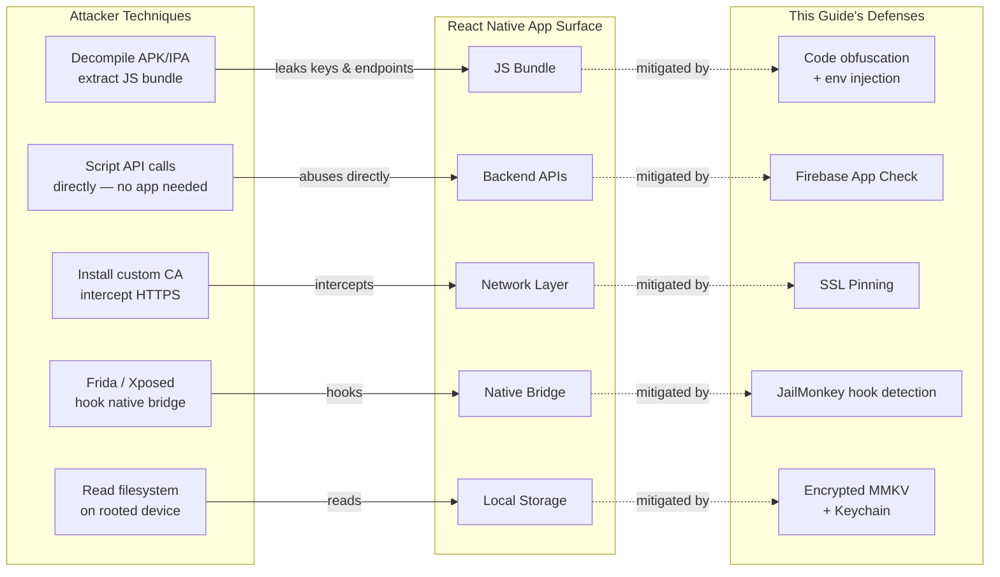

# Enhancing Mobile App Security in React Native: A Practical Guide Using JailMonkey, Firebase App Check, and Sardine SDK

---

## 1. Introduction

Any React Native app that handles user accounts, sensitive data, or real-money transactions is a target. Whether you're building a banking app, a healthcare platform, an e-commerce experience, or a productivity tool with user authentication — the same vulnerabilities apply, and the consequences of a breach scale with how much your users trust you with.

### Why Mobile App Security Matters

A compromised app exposes your users and your business simultaneously. Attackers can intercept API calls, reverse-engineer business logic, bypass authentication flows, and exploit backend services at scale. In regulated industries the stakes are even higher — compliance violations, forced audits, and permanent reputational damage. But even outside regulated verticals, a single publicly disclosed breach erodes the trust that took years to build.

### What Makes React Native Apps Vulnerable

React Native apps have a few structural characteristics that attackers exploit:

- **JavaScript bundle exposure**: The JS bundle can be extracted from the APK/IPA and reverse-engineered, leaking API keys, business logic, or endpoints.
- **Native bridge attack surface**: The bridge between JS and native code can be hooked using tools like Frida or Xposed.
- **Rooted/jailbroken devices**: These bypass OS-level sandboxing, giving attackers full control over app memory, files, and network traffic.
- **No built-in backend validation**: React Native apps talk to APIs directly — nothing stops an attacker from replaying those requests outside the app.
- **Debug mode left enabled**: Apps shipped in debug mode expose internal state and disable security protections.

The diagram below maps each attack technique to the app component it targets, and the defense that mitigates it:

### The Security Layer Model

No single tool solves mobile security. A robust solution is layered:

| Layer | Tool | Threat Addressed |
|---|---|---|
| Device Integrity | JailMonkey | Rooted/jailbroken devices, emulators, debug mode |
| Backend Abuse Protection | Firebase App Check | Unauthorized API/database access, bot traffic |
| Transaction Fraud Prevention | Sardine SDK *(fintech)* | Fraud, account takeover, risky onboarding |
| Data at Rest & Authentication | MMKV + Keychain + Biometrics | Credential theft, storage extraction, unattended access |
| Network Transport | SSL Pinning + Payload Encryption | MITM attacks, TLS interception, in-transit data exposure |

Each layer addresses a different vector. Together, they form a defense-in-depth strategy that significantly raises the cost and complexity of attacks against your app.

---