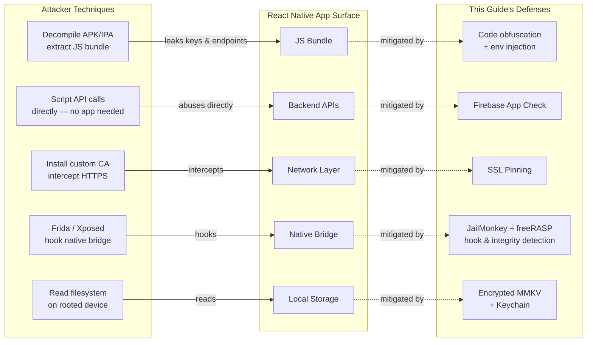
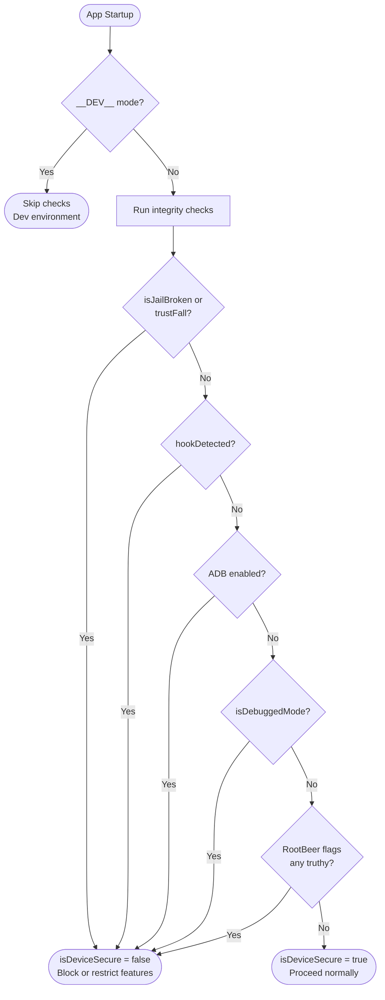
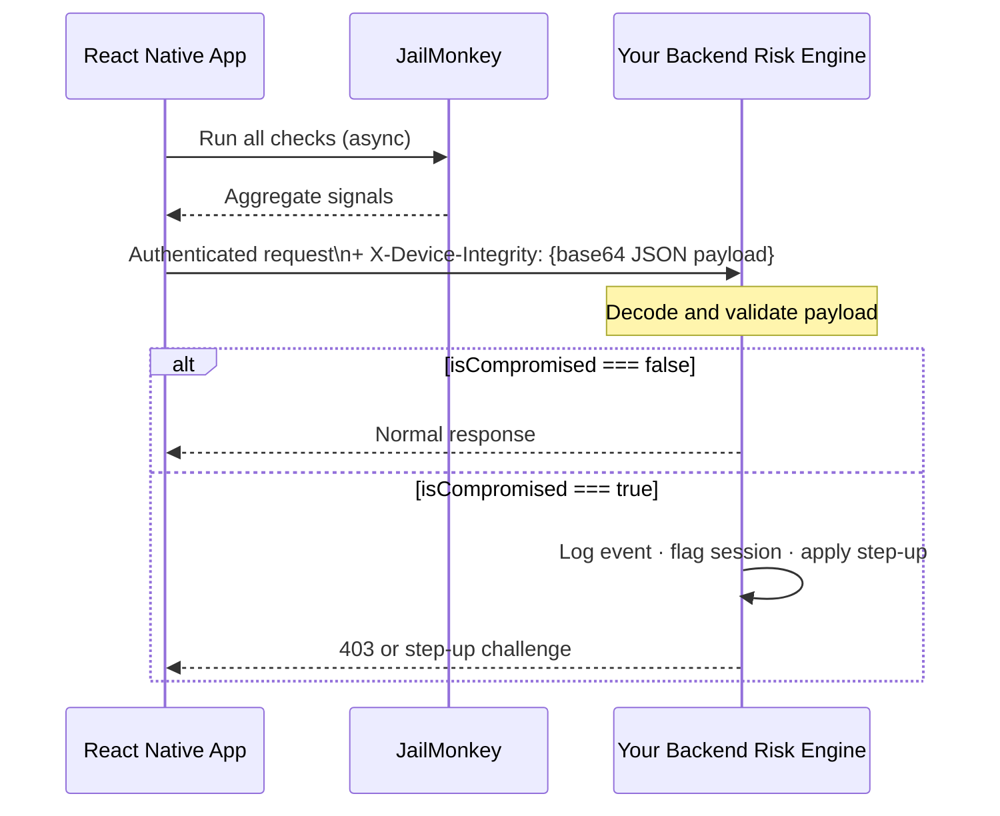
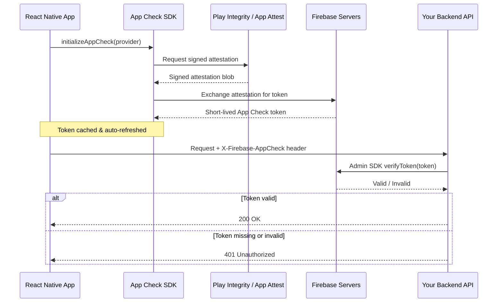
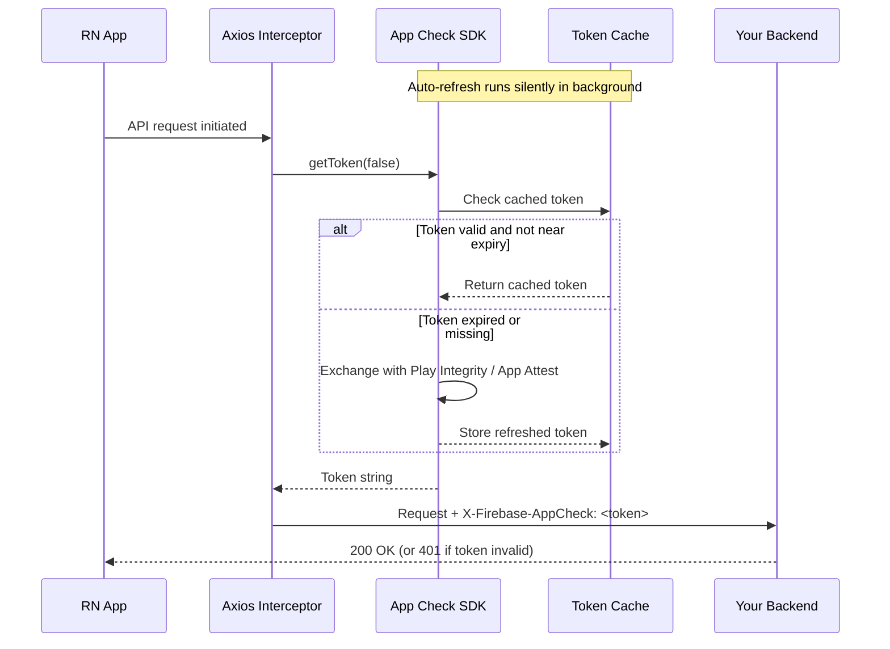
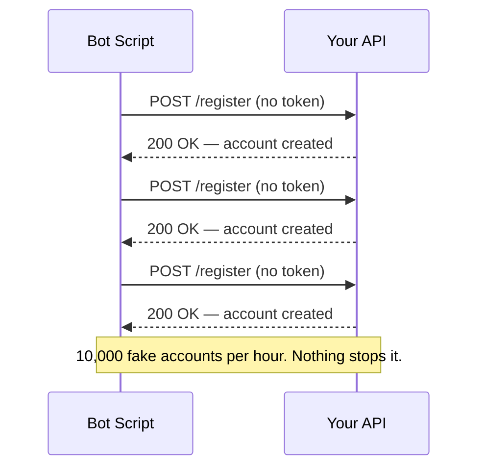
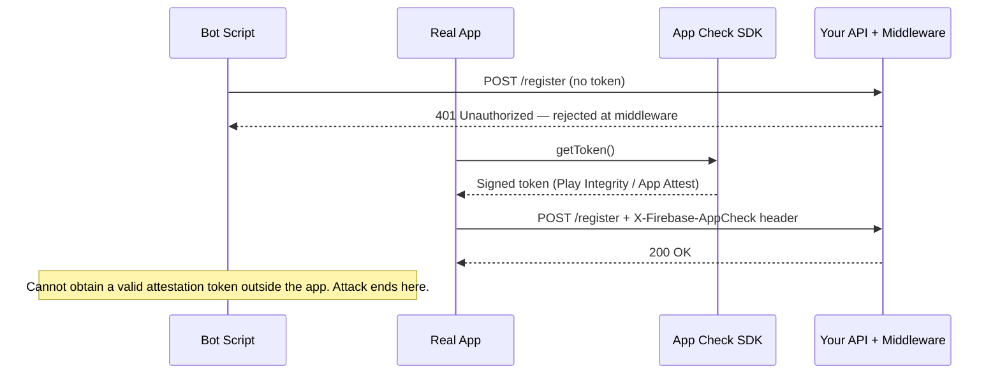
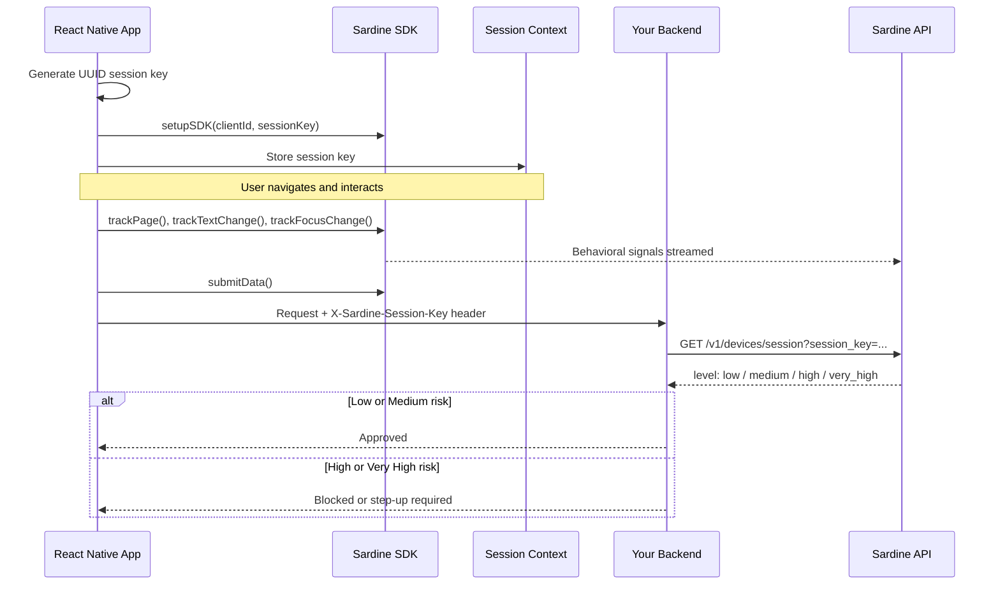
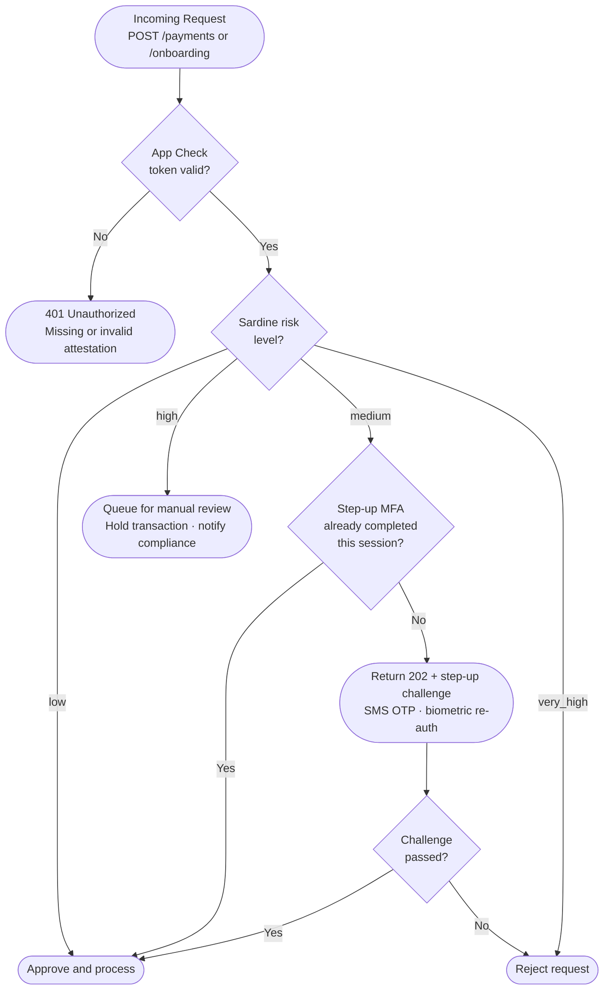
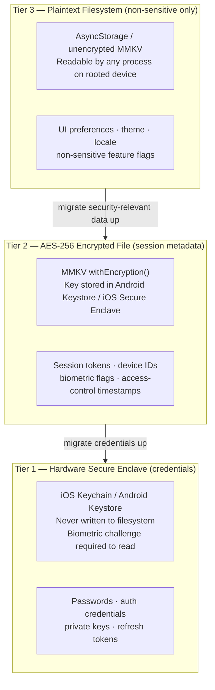

# React Native Security: A Defense-in-Depth Architecture Guide

---

## 1. Introduction

Any React Native app that handles user accounts, sensitive data, or real-money transactions is a target. Whether you're building a banking app, a healthcare platform, an e-commerce experience, or a productivity tool with user authentication — the same vulnerabilities apply, and the consequences of a breach scale with how much your users trust you with.

### Why Mobile App Security Matters

A compromised app exposes your users and your business simultaneously. Attackers can intercept API calls, reverse-engineer business logic, bypass authentication flows, and exploit backend services at scale. In regulated industries the stakes are even higher — compliance violations, forced audits, and permanent reputational damage. But even outside regulated verticals, a single publicly disclosed breach erodes the trust that took years to build.

### What Makes React Native Apps Vulnerable

React Native apps have a few structural characteristics that attackers exploit:

- **JavaScript bundle exposure**: The JS bundle can be extracted from the APK/IPA and reverse-engineered, leaking API keys, business logic, or endpoints.
- **Native bridge attack surface**: The bridge between JS and native code can be hooked using tools like Frida or Xposed.
- **Rooted/jailbroken devices**: These bypass OS-level sandboxing, giving attackers full control over app memory, files, and network traffic.
- **No built-in backend validation**: React Native apps talk to APIs directly — nothing stops an attacker from replaying those requests outside the app.
- **Debug mode left enabled**: Apps shipped in debug mode expose internal state and disable security protections.

The diagram below maps each attack technique to the app component it targets, and the defense that mitigates it:



### The Security Layer Model

No single tool solves mobile security. A robust solution is layered:

| Layer | Tool | Threat Addressed |
|---|---|---|
| Device Integrity | JailMonkey | Rooted/jailbroken devices, emulators, debug mode |
| Runtime Application Self-Protection | freeRASP *(free tier: 100k download cap — see Section 3)* | App tampering detection, hook detection, unofficial stores, screen capture blocking, obfuscation bypass, VPN / time / location spoofing |
| Backend Abuse Protection | Firebase App Check | Unauthorized API/database access, bot traffic |
| Transaction Fraud Prevention | Sardine SDK *(fintech)* | Fraud, account takeover, risky onboarding |
| Data at Rest & Authentication | MMKV + Keychain + Biometrics | Credential theft, storage extraction, unattended access |
| Network Transport | SSL Pinning + Payload Encryption | MITM attacks, TLS interception, in-transit data exposure |

Each layer addresses a different vector. Together, they form a defense-in-depth strategy that significantly raises the cost and complexity of attacks against your app.

### OWASP Mobile Top 10 Coverage

This guide's tooling directly addresses six of the [OWASP Mobile Top 10 (2024)](https://owasp.org/www-project-mobile-top-10/) risk categories. Understanding the mapping clarifies *why* each tool exists, not just *what* it does:

| OWASP Category | Risk | This Guide's Defense |
|---|---|---|
| M1 — Improper Credential Usage | Hardcoded secrets, insecure credential storage in plaintext | Keychain + Biometrics (Section 6); env-var injection at build time (Section 8) |
| M2 — Inadequate Supply Chain Security | Tampered dependencies, repackaged or resigned binaries | freeRASP `appIntegrity` callback (Section 3) |
| M3 — Insecure Authentication / Authorization | Weak or bypassable authentication flows | Biometrics + Keychain `BIOMETRY_ANY` access control (Section 6) |
| M5 — Insecure Communication | MITM attacks, plaintext traffic, TLS misconfiguration | SSL Pinning + Payload Encryption (Section 7) |
| M8 — Security Misconfiguration | Debug mode in production builds, exposed API keys in JS bundle | JailMonkey `isDebuggedMode`; ProGuard/Hermes obfuscation; `__DEV__` guards |
| M9 — Insecure Data Storage | Unencrypted tokens, plaintext credentials in AsyncStorage | Encrypted MMKV + Keychain (Section 6) |

M4 (Insufficient Input/Output Validation), M6 (Inadequate Privacy Controls), M7 (Insufficient Binary Protections), and M10 (Insufficient Cryptography) fall outside this guide's scope but remain equally important for a complete production security posture. M7 is partially mitigated by freeRASP's obfuscation detection callback, which flags when your Android release build was shipped without ProGuard.

---

## 2. JailMonkey — Device Integrity Checks

>  JailMonkey runs native checks at app startup to detect rooted/jailbroken devices, emulators, and runtime hooks. The result is a single boolean you gate your app on. It is a **client-side risk signal, not a guarantee** — a sophisticated attacker can bypass it, which is why you send the signal to your backend and combine it with server-side enforcement.

### What JailMonkey Does

[JailMonkey](https://github.com/GantMan/jail-monkey) is a React Native library that performs runtime device integrity checks. It detects whether a device is **rooted (Android)**, **jailbroken (iOS)**, running on an **emulator**, in **debug mode**, has **ADB enabled**, uses **mock location**, or shows signs of **runtime hooking or code injection** (e.g., Frida, Xposed).

All checks are performed **client-side** using native code bridges. There is no network activity, no data collection, and no sensitive permissions required — the source code is fully auditable on GitHub.

### How It Works Internally

**On Android**, JailMonkey integrates [RootBeer](https://github.com/scottyab/rootbeer), which performs multiple low-level checks:

- Presence of root management apps (SuperSU, Magisk)
- Existence of the `su` binary
- Dangerous system properties and writable system paths
- Build tag test-keys (common in custom ROMs)
- Magisk binary detection
- ADB enabled status
- App installed on external storage
- Mock location enabled
- Emulator signatures (device IDs, files, properties)
- Runtime hooking indicators

**On iOS**, JailMonkey checks:

- Existence of jailbreak artifacts (`/Applications/Cydia.app`, `apt`, etc.)
- Ability to write outside the app sandbox
- Presence of jailbreak tools loaded at runtime
- Simulator detection
- Debug mode and hooking/injection frameworks

### Why Device Integrity Checks Matter

On a rooted or jailbroken device, the OS security model breaks down entirely. An attacker can:

- Read your app's private keychain/keystore data
- Intercept and modify network traffic even over HTTPS (SSL pinning bypass)
- Hook your app's functions at runtime using tools like Frida
- Dump memory to extract tokens or secrets
- Bypass biometric and PIN checks

JailMonkey lets you detect these conditions before your app does anything sensitive.



### Installation

```bash
npm install jail-monkey
# or
yarn add jail-monkey
```

For iOS, run pod install:

```bash
cd ios && pod install
```

### Code Example

A clean pattern is to encapsulate all checks in a single `useDeviceSecurity` hook that returns a boolean. Everything in the app keys off that one value.

```ts
import { useEffect, useState } from "react";
import JailMonkey from "jail-monkey";

const useDeviceSecurity = (): boolean => {
 const [isDeviceSecure, setIsDeviceSecure] = useState(true);

 useEffect(() => {
   if (__DEV__) return; // skip checks in development

   const checkSecurity = async () => {
     const rootedDetection = JailMonkey.androidRootedDetectionMethods;
     const isRootedByRootBeer = rootedDetection?.rootBeer
       ? Object.values(rootedDetection.rootBeer).some(Boolean)
       : false;

     const isCompromised =
       JailMonkey.isJailBroken()      ||
       JailMonkey.trustFall()         ||
       JailMonkey.hookDetected()      ||
       JailMonkey.AdbEnabled?.()      ||
       (await JailMonkey.isDebuggedMode?.()) ||
       isRootedByRootBeer             ||
       rootedDetection?.jailMonkey;

     setIsDeviceSecure(!isCompromised);
   };

   checkSecurity();
 }, []);

 return isDeviceSecure;
};
```

A few points worth noting:

- **`__DEV__` bypass**: Checks are skipped in development so you're never blocked on a simulator.
- **`trustFall()`**: A convenience aggregator covering several checks in one call.
- **`androidRootedDetectionMethods`**: Gives access to both RootBeer's granular flags and JailMonkey's own detector — checking both improves Android coverage.
- **Optional chaining (`?.`)**: Some APIs are Android-only; the optional chaining prevents crashes on iOS.

At startup, consume the hook and route accordingly:

```tsx
const isDeviceSecure = useDeviceSecurity();

// In your startup navigation logic:
if (!isDeviceSecure && !__DEV__) navigate('ApplicationUnavailable');
```

### Important Caveat: Client-Side Limitations

JailMonkey's checks run entirely on the device. A sufficiently advanced attacker can patch or bypass them. This is a **first line of defense**, not a complete solution. Its real value is:

- Blocking unsophisticated attacks and casual jailbreakers
- Sending device integrity signals to your backend for risk scoring
- Satisfying compliance requirements around device posture

Treat the results as **risk signals**, not absolute truth. Combine them with server-side enforcement (which is where Firebase App Check comes in).

The diagram below shows how JailMonkey fits into a layered trust decision — the client-side block stops casual attackers, but backend enforcement is the authoritative layer:


> **Key principle**: The client block (left path) stops unsophisticated attackers immediately. But your backend receiving `device_integrity=false` as a signal is what gives you audit trails, rate limits, and risk-based authentication — regardless of what the client claims.

### Practical Scenarios

| Scenario | JailMonkey Response | Backend Signal |
|---|---|---|
| Banking app on rooted device | Block account access UI | `device_integrity=false` sent for audit log |
| Crypto wallet with Frida hook detected | Refuse to show seed phrase | `hook_detected=true` flags session as high-risk |
| KYC identity verification | Warn user before initiating | Integrity status forwarded to fraud backend |
| Emulator detected in production | Block registration flow | Emulator flag triggers manual review queue |

### Structuring Device Signals for Your Backend

When JailMonkey detects a compromised state, don't just block the user client-side — propagate structured signals to your backend so your risk engine can make authoritative decisions. This is what transforms a client-side boolean into an auditable, enforceable record.

A well-structured payload captures all relevant flags atomically with a timestamp:

```ts
import { Platform } from 'react-native';
import JailMonkey from 'jail-monkey';

interface DeviceIntegrityPayload {
 timestamp: string;          // ISO 8601
 platform: 'ios' | 'android';
 signals: {
   isJailBroken: boolean;
   trustFall: boolean;
   hookDetected: boolean;
   adbEnabled: boolean | null;           // Android only
   isDebuggedMode: boolean;
   isOnExternalStorage: boolean | null;  // Android only
   mockLocation: boolean | null;         // Android only
   rootBeerFlags?: Record<string, boolean>;
 };
 isCompromised: boolean; // aggregate: any signal truthy
}

const buildDeviceIntegrityPayload = async (): Promise<DeviceIntegrityPayload> => {
 const rootedDetection = JailMonkey.androidRootedDetectionMethods;

 const signals = {
   isJailBroken:         JailMonkey.isJailBroken(),
   trustFall:            JailMonkey.trustFall(),
   hookDetected:         JailMonkey.hookDetected(),
   adbEnabled:           JailMonkey.AdbEnabled?.() ?? null,
   isDebuggedMode:       (await JailMonkey.isDebuggedMode?.()) ?? false,
   isOnExternalStorage:  JailMonkey.isOnExternalStorage?.() ?? null,
   mockLocation:         JailMonkey.isMockingLocation?.() ?? null,
   rootBeerFlags:        rootedDetection?.rootBeer ?? undefined,
 };

 return {
   timestamp:    new Date().toISOString(),
   platform:     Platform.OS as 'ios' | 'android',
   signals,
   isCompromised: Object.values(signals).some(v => v === true),
 };
};
```

Send this payload on every authenticated request — not just at startup. A device can be rooted while the app is running, or root-hiding tools can fail mid-session. Attaching the integrity payload as a signed header claim gives your backend continuous visibility and an audit trail per request.



---

## 3. freeRASP — Full Runtime Application Self-Protection

> freeRASP is a **Runtime Application Self-Protection (RASP)** library by [Talsec](https://www.talsec.app) that significantly extends beyond JailMonkey's device integrity checks. It detects rooted/jailbroken devices, runtime hooks (Frida/Xposed), debugger attachment, emulators, unofficial app stores, **app integrity tampering** (repackaged or modified builds), obfuscation bypass, screen capture, VPN usage, time/location spoofing, and more — all through a single React Native hook with a unified callback API and a kill-on-bypass enforcement mode.

> ⚠️ **Pricing caveat — read before integrating**: freeRASP is **freemium** software governed by a [Fair Usage Policy (FUP)](https://docs.talsec.app/freerasp/fair-usage-policy-fup). The free tier is **capped at 100,000 app downloads**. Beyond that threshold, you must upgrade to the paid **RASP+** plan. RASP+ also removes Talsec data collection, replaces the universal free binary with an **app-specific hardened binary** (significantly harder to bypass), and adds the **AppiCrypt®** API integrity cryptogram. For a banking or fintech app with a real user base, treat RASP+ as the realistic production target and budget for it accordingly.

### freeRASP vs JailMonkey

freeRASP is a strict superset of what JailMonkey provides. Both detect rooting, jailbreaking, emulators, and hook frameworks. freeRASP also adds:

| Capability | JailMonkey | freeRASP |
|---|---|---|
| Root / Jailbreak detection | ✅ | ✅ |
| Emulator detection | ✅ | ✅ |
| Hook framework detection (Frida, Xposed) | ✅ | ✅ |
| Debug mode detection | ✅ | ✅ |
| ADB enabled detection | ✅ | ✅ |
| **App integrity verification** (tamper detection) | ❌ | ✅ |
| **Unofficial store detection** | ❌ | ✅ |
| **Obfuscation issue detection** | ❌ | ✅ |
| **Screen capture / screen recording detection + blocking** | ❌ | ✅ |
| **System VPN detection** | ❌ | ✅ |
| **Time spoofing detection** | ❌ | ✅ |
| **Location spoofing detection** (Android) | ❌ | ✅ |
| Unsecure Wi-Fi detection (Android) | ❌ | ✅ |
| Automation framework detection (Android) | ❌ | ✅ |
| Multi-instance detection (Android) | ❌ | ✅ |
| **Kill-on-bypass enforcement** | ❌ | ✅ |
| Malware detection (add-on module) | ❌ | ✅ |
| Security dashboard portal (Talsec Portal) | ❌ | ✅ |

The two critical additions over JailMonkey are **app integrity verification** — detecting whether your APK/IPA has been repackaged, resigned, or tampered with before reaching the user — and **kill-on-bypass**, which terminates the app process automatically if it detects an attacker manipulating or hooking the RASP threat callback mechanism itself.

If your app already uses JailMonkey, freeRASP can replace it entirely — the root/jailbreak coverage is equivalent, and you gain the broader threat surface at the cost of the download cap.

### Installation

```bash
npm install freerasp-react-native
# or
yarn add freerasp-react-native
```

For iOS, run pod install:

```bash
cd ios && pod install
```

**Android prerequisites** — freeRASP requires `minSdkVersion` ≥ 23 (Android 6.0) and Kotlin ≥ 2.0.0. In `android/build.gradle`:

```groovy
buildscript {
   ext {
       minSdkVersion = 23        // required minimum
       kotlinVersion = '2.0.0'   // required since freeRASP 4.0.0
   }
   dependencies {
       classpath("org.jetbrains.kotlin:kotlin-gradle-plugin:2.0.0")
   }
}
```

**Android — screen capture detection** (optional, requires Android 14+ / 15+):

Add to `AndroidManifest.xml` inside the `<manifest>` root tag:

```xml
<uses-permission android:name="android.permission.DETECT_SCREEN_CAPTURE" />
<uses-permission android:name="android.permission.DETECT_SCREEN_RECORDING" />
```

### Configuration

Initialize freeRASP at your app entry point using the `useFreeRasp` hook. Get your Android signing certificate hash by following Talsec's [signing certificate guide](https://docs.talsec.app/freerasp/wiki/getting-signing-certificate-hash).

```ts
import { useFreeRasp } from 'freerasp-react-native';

const config = {
 androidConfig: {
   packageName: 'com.yourapp',
   certificateHashes: ['YOUR_BASE64_SIGNING_CERT_HASH='], // release signing cert hash(es)
   supportedAlternativeStores: ['com.sec.android.app.samsungapps'],
 },
 iosConfig: {
   appBundleId: 'com.yourapp',
   appTeamId: 'YOUR_APPLE_TEAM_ID',
 },
 watcherMail: 'security@yourcompany.com', // receives Talsec Portal reports and SDK updates
 isProd: !__DEV__,    // false in development — skips production checks on simulator
 killOnBypass: true,  // terminate the app if RASP callbacks are hooked or tampered with
};
```

Key configuration notes:

- **`isProd`**: Set to `false` in development so you are not blocked on a simulator. In production, all checks run. See [Talsec's `isProd` documentation](https://docs.talsec.app/freerasp/wiki/isprod-flag).
- **`killOnBypass: true`**: The SDK will terminate the process if it detects an attacker manipulating the threat callback mechanism. This is the anti-tamper enforcement layer on top of detection.
- **`watcherMail`**: Required. Used for Talsec Portal access and security report delivery.

### Threat Detection and Reactions

Define a callback object mapping each detected threat to a response. At minimum, log the event and send a risk signal to your backend. For the highest-severity threats in a financial app, block or terminate:

```ts
const actions = {
 // ── High severity: block app access and signal backend ─────────────────────
 privilegedAccess: () => {
   // Rooted (Android) or jailbroken (iOS)
   sendRiskSignalToBackend('privileged_access');
   setIsDeviceSecure(false);
 },
 hooks: () => {
   // Frida, Xposed, or other hook framework detected
   sendRiskSignalToBackend('hook_detected');
   setIsDeviceSecure(false);
 },
 appIntegrity: () => {
   // APK/IPA has been tampered with or repackaged
   sendRiskSignalToBackend('app_integrity_fail');
   setIsDeviceSecure(false);
 },
 debug: () => {
   // Debugger attached or debug mode active
   sendRiskSignalToBackend('debug_mode');
   setIsDeviceSecure(false);
 },

 // ── Medium severity: flag session, send backend signal ──────────────────────
 simulator: () => {
   sendRiskSignalToBackend('simulator');
   if (!__DEV__) setIsDeviceSecure(false);
 },
 unofficialStore: () => {
   // App was not installed from an official store — possible repackaging
   sendRiskSignalToBackend('unofficial_store');
 },
 obfuscationIssues: () => {
   // Android only — app was shipped without obfuscation, leaking business logic
   sendRiskSignalToBackend('obfuscation_issues');
 },

 // ── Runtime environment signals ─────────────────────────────────────────────
 systemVPN: () => sendRiskSignalToBackend('vpn_active'),
 devMode: () => sendRiskSignalToBackend('dev_mode'),         // Android
 adbEnabled: () => sendRiskSignalToBackend('adb_enabled'),   // Android
 timeSpoofing: () => sendRiskSignalToBackend('time_spoofing'),
 locationSpoofing: () => sendRiskSignalToBackend('location_spoofing'), // Android

 // ── Screen capture — block for sensitive screens (account details, KYC) ─────
 screenshot: () => console.warn('Screenshot taken on sensitive screen'),
 screenRecording: () => console.warn('Screen recording active on sensitive screen'),

 // ── Device state signals ────────────────────────────────────────────────────
 passcode: () => sendRiskSignalToBackend('no_passcode_set'),
 secureHardwareNotAvailable: () => sendRiskSignalToBackend('no_secure_hardware'),
 deviceBinding: () => sendRiskSignalToBackend('device_binding_fail'),
 deviceID: () => sendRiskSignalToBackend('device_id_fail'), // iOS only

 // ── Android-only signals ────────────────────────────────────────────────────
 unsecureWifi: () => sendRiskSignalToBackend('unsecure_wifi'),
 automation: () => sendRiskSignalToBackend('automation_detected'),
 multiInstance: () => sendRiskSignalToBackend('multi_instance'),
};

// Optional: callback when all initial startup checks are complete
const raspExecutionStateActions = {
 allChecksFinished: () => {
   console.log('freeRASP initial checks complete');
 },
};

// Start freeRASP — call outside useEffect, at component top level
// freeRASP runs continuous periodic checks throughout the app lifecycle
useFreeRasp(config, actions, raspExecutionStateActions);
```

> **Important**: `useFreeRasp` must be called at the component top level, **not** inside `useEffect`. freeRASP performs continuous checks throughout the session — not just at startup.

### Proactive Screen Capture Blocking

Beyond detecting screenshots, freeRASP can **actively prevent** screen capture on sensitive screens such as account numbers, card details, KYC documents, and transaction confirmations:

```ts
import { blockScreenCapture, isScreenCaptureBlocked } from 'freerasp-react-native';

// Block screen capture when a sensitive screen mounts, restore on unmount
useEffect(() => {
 blockScreenCapture(true);
 return () => blockScreenCapture(false);
}, []);
```

### Detection Flow


### Pricing and Free Tier Limitations

| | freeRASP (Free) | RASP+ (Paid) |
|---|---|---|
| Download limit | **100,000** | Unlimited |
| Data collection | Sent to Talsec database | Your infrastructure (or fully disabled) |
| SDK binary | Universal — bypass scripts are more reusable | App-specific hardened binary |
| AppiCrypt® API protection | ❌ | ✅ |
| Enterprise SLA / support | Community | Enterprise SLA |
| Fintech compliance features | Limited | Full |

**Recommendation for production fintech apps**:

- **Development and early testing**: the free tier is fine.
- **Production at scale (> 100k downloads)**: budget for **RASP+** upfront. The free binary is also a universal binary — the same build is shared across all free-tier integrators, making community-developed bypass scripts more broadly applicable. RASP+ generates app-specific hardened binaries, raising the effort required to reverse-engineer or bypass significantly.
- **If RASP+ cost is not yet justified**: JailMonkey has no download cap, no data collection, and covers the core device integrity signals. Keep JailMonkey as a baseline until you are ready to commit to freeRASP RASP+.

### Migrating from JailMonkey to freeRASP

If your app already uses JailMonkey, the migration is straightforward — freeRASP is a functional superset and every JailMonkey check maps directly to a freeRASP callback.

| JailMonkey check | freeRASP callback | Notes |
|---|---|---|
| `isJailBroken()` / `trustFall()` | `privilegedAccess` | Equivalent coverage |
| `hookDetected()` | `hooks` | Equivalent coverage |
| `isDebuggedMode()` | `debug` | Equivalent coverage |
| `AdbEnabled()` | `adbEnabled` | Android only |
| `isMockingLocation()` | `locationSpoofing` | Android only |
| *(no equivalent)* | `appIntegrity` | **New** — detects tampered or repackaged builds |
| *(no equivalent)* | `unofficialStore` | **New** — detects sideloaded installs |
| *(no equivalent)* | `killOnBypass` | **New** — process termination if RASP is bypassed |

**Migration steps**:

1. Remove `jail-monkey` from your dependencies.
2. Install `freerasp-react-native` and run `pod install`.
3. Replace the `useDeviceSecurity` hook body with `useFreeRasp` initialization.
4. Map each previous `JailMonkey` check to the corresponding `actions` callback (table above).
5. Add `appIntegrity` and `unofficialStore` callbacks with appropriate backend signals.
6. Confirm `isProd: !__DEV__` and `killOnBypass: true` for production builds.
7. Submit your signing certificate hash and bundle details per Talsec's [setup guide](https://docs.talsec.app/freerasp/wiki/getting-signing-certificate-hash).

> Your `sendRiskSignalToBackend` utility function remains unchanged — it is called identically from both JailMonkey and freeRASP callbacks.

---

## 4. Firebase App Check — Backend Abuse Protection

>  App Check issues cryptographically signed **attestation tokens** proving a request came from your real, unmodified app on a real device. Your backend middleware rejects everything without a valid token — bots and scripts cannot obtain one from outside the app, so they never reach your business logic.

### The Problem It Solves

Even if your app is secure, your **backend APIs are exposed to the internet**. Nothing stops an attacker from extracting your API endpoints from the JS bundle and calling them directly — bypassing the app entirely. This enables:

- Credential stuffing attacks against your auth endpoints
- Scraping your database through your own API
- Abusing Cloud Functions for spam or DDoS
- Creating fake accounts at scale via automation

Firebase App Check solves this by ensuring **only your legitimate app** can call your backend resources.

### How App Check Works

App Check issues a short-lived **attestation token** that your app must send with every request. Your backend verifies this token with Firebase before processing the request. Tokens are generated using platform-specific attestation providers:

| Platform | Provider | What It Verifies |
|---|---|---|
| iOS | App Attest (DeviceCheck fallback) | Cryptographic proof from Apple that request comes from a genuine, unmodified app |
| Android | Play Integrity (SafetyNet fallback) | Google's verdict on app integrity and device safety |
| Web | reCAPTCHA Enterprise / v3 | Bot detection |
| Debug | Debug provider | Local development only — never ship to production |

The attestation token is opaque to your app — Firebase handles the validation. Your backend simply enforces that valid tokens must be present.



### What It Protects

- **Firebase Realtime Database** and **Firestore** — enforce App Check in security rules
- **Cloud Functions** — check tokens in function middleware
- **Cloud Storage** — restrict read/write to attested apps
- **Custom backends** — verify tokens manually using the Firebase Admin SDK

### Setup in React Native

Install the required packages:

```bash
npm install @react-native-firebase/app @react-native-firebase/app-check
# or
yarn add @react-native-firebase/app @react-native-firebase/app-check
```

For iOS, install pods:

```bash
cd ios && pod install
```

**iOS — Enable App Attest in your Apple Developer account**:

In your `AppDelegate.swift`, no changes are needed beyond standard Firebase setup. App Attest capability must be enabled in Xcode under **Signing & Capabilities**.

**Android — Configure Play Integrity**:

Ensure your app is published (even as an internal test track) in the Google Play Console. Play Integrity requires a real Google Play-distributed app to issue valid tokens.

### Initialization Code

Configure the provider once at module load — not inside a component or hook body. Use platform-specific debug tokens so each environment can be registered separately in the Firebase Console.

```ts
import { ReactNativeFirebaseAppCheckProvider, initializeAppCheck } from "@react-native-firebase/app-check";
import { getApp } from "@react-native-firebase/app";

const rnfbProvider = new ReactNativeFirebaseAppCheckProvider();

rnfbProvider.configure({
 android: {
   provider: __DEV__ ? "debug" : "playIntegrity",
   debugToken: process.env.FIREBASE_DEBUG_TOKEN_ANDROID,
 },
 apple: {
   provider: __DEV__ ? "debug" : "appAttest",
   debugToken: process.env.FIREBASE_DEBUG_TOKEN_IOS,
 },
});

export const initAppCheck = async () =>
 initializeAppCheck(getApp(), {
   provider: rnfbProvider,
   isTokenAutoRefreshEnabled: true,
 });
```

From here, call `initAppCheck()` before your first authenticated request, then retrieve the token and set it as the `X-Firebase-AppCheck` header on your shared API client. Wrap the retrieval in a retry loop with a short delay — Play Integrity token requests can transiently fail on Android cold starts.

### Attaching the App Check Token to API Requests

After initializing App Check, attach the token automatically to every outbound request via an Axios interceptor. This centralizes token management — token refresh, retry logic, and error handling — in one place rather than at every call site.

```ts
import appCheck from '@react-native-firebase/app-check';

// Retry helper for Play Integrity cold-start failures (Android only)
const getAppCheckTokenWithRetry = async (maxAttempts = 3): Promise<string> => {
 for (let attempt = 1; attempt <= maxAttempts; attempt++) {
   try {
     const { token } = await appCheck().getToken(/* forceRefresh */ false);
     return token;
   } catch (err) {
     if (attempt === maxAttempts) throw err;
     await new Promise(resolve => setTimeout(resolve, 1000 * attempt)); // 1s, 2s backoff
   }
 }
 throw new Error('App Check token unavailable after retries');
};

// Register once at app startup — before any authenticated requests
apiClient.interceptors.request.use(async (config) => {
 try {
   const token = await getAppCheckTokenWithRetry();
   config.headers['X-Firebase-AppCheck'] = token;
 } catch (err) {
   // Token unavailable — let the request proceed; backend will reject with 401
   // This avoids blocking legitimate requests during transient provider outages
   console.warn('[AppCheck] Token retrieval failed — request will be rejected by backend', err);
 }
 return config;
});
```

**Token lifecycle notes**:

- `isTokenAutoRefreshEnabled: true` (set during `initializeAppCheck`) causes the SDK to proactively refresh before expiry — you do not need to call `getToken(true)` on every request in normal operation.
- `getToken(false)` returns the cached token or waits for an in-progress refresh — it does not make a network call on each request.
- Only force-refresh (`getToken(true)`) after receiving a 401 that signals an expired token, or during explicit session renewal.



### Enforcing App Check on Your Backend

For a custom Node.js/Express backend, verify the token in middleware before any route handler runs:

```ts
export const appCheckMiddleware = async (req, res, next) => {
 const token = req.headers['x-firebase-appcheck'];
 if (!token) return res.status(401).json({ error: 'Missing App Check token' });
 try {
   await getAppCheck().verifyToken(token);
   next();
 } catch {
   res.status(401).json({ error: 'Invalid App Check token' });
 }
};

app.use(appCheckMiddleware); // apply globally
```

For Firestore and Realtime Database, toggle enforcement directly in the Firebase Console — no code changes needed.

### Real-World Impact

The difference is stark. Consider a `/register` endpoint before and after App Check enforcement:

**Without App Check** — a bot operator decompiles your APK, extracts the API URL, and writes a script. There is nothing stopping automated request floods:



**With App Check enforced** — the middleware rejects any request without a valid attestation token. Bots cannot produce one:



Tokens are short-lived, rate-limited by the platform provider (Google Play Integrity, Apple App Attest), and tied to real device attestations. A bot running outside the app cannot obtain one.

### Development Workflow

Never ship the debug provider to production. Use environment-based configuration (as shown above) and store platform-specific debug tokens (`FIREBASE_DEBUG_TOKEN_ANDROID`, `FIREBASE_DEBUG_TOKEN_IOS`) in `.env` files that are gitignored. Register each token in the Firebase Console under **App Check > Apps > Manage debug tokens** — one entry per platform per environment.

---

## 5. Sardine SDK — Transaction Fraud Prevention

>  Sardine collects behavioral signals (keystroke timing, swipe patterns, device fingerprint) during user flows and streams them to its risk engine. Your backend queries a risk score using the session key before approving a transaction. It closes the gap that device integrity and request attestation cannot address: *is this user behaving like a real human?*

> **Who this section is for**: Sardine is purpose-built for **fintech and financial services** applications — payments, lending, KYC, account opening, and money movement. If your app doesn't operate in a financial context, JailMonkey and App Check are likely sufficient. For fintechs, Sardine fills the gap neither of those tools can address: *behavioral* risk at the user level.

### What Sardine Provides

[Sardine](https://www.sardine.ai) is a fraud and compliance platform built for financial products. Its React Native SDK provides **device intelligence and behavioral biometrics** that power real-time risk scoring for transactions and onboarding events.

Unlike JailMonkey (device posture) and App Check (request legitimacy), Sardine operates at the **behavioral and transactional layer** — it understands *who* is doing something, not just *what device* they're on. Its capabilities include:

- **Device fingerprinting**: Persistent, privacy-safe device identification across sessions
- **Behavioral biometrics**: Keystroke dynamics, swipe patterns, interaction timing — detecting bots and account takeover attempts
- **Risk scoring**: Real-time scores for onboarding, login, and payment events
- **AML/KYC signals**: Behavioral signals that complement identity verification
- **Network intelligence**: Detection of VPNs, proxies, Tor, and data center traffic
- **Session context**: Aggregated device and behavioral data sent to Sardine's backend for risk decisioning

### Installation

```bash
npm install @sardine-ai/react-native-sardine-sdk
# or
yarn add @sardine-ai/react-native-sardine-sdk
```

For iOS:

```bash
cd ios && pod install
```

### Initialization

The SDK is set up through a `useSardine` custom hook. A UUID session key is generated client-side at startup and stored in React Context so it can be injected automatically as `X-Sardine-Session-Key` on every subsequent API request. The SDK is also **feature-flagged** — meaning you can roll it out gradually or turn it off instantly without a new app release, which is important for a production fraud tool.

```ts
import { Sardinesdk } from "@sardine-ai/react-native-sardine-sdk";
import { v4 as uuidv4 } from 'uuid';

const setupSardineSDK = async () => {
 if (!sardineEnabled) return; // feature-flag kill-switch

 const clientId = process.env.SARDINE_CLIENT_ID!;
 const environment = process.env.SARDINE_ENVIRONMENT as 'sandbox' | 'production';
 const sessionKey = uuidv4();

 setSardineSessionKey(sessionKey); // stored in context → auto-injected as request header

 await Sardinesdk.setupSDK({
   clientId,
   sessionKey,
   environment,              // 'sandbox' | 'production'
   enableBehaviorBiometrics: true,
   enableClipboardTracking:  true,
   enableFieldTracking:      true,
 });
};
```

Call this once at app startup. The session key is then automatically attached to every API call via a Context provider, so your backend can correlate the device/behavioral signals with any incoming request.

### Session Key Propagation

The session key is what connects client-side behavioral signals to server-side risk decisioning. Store it in a React Context and inject it as a header on your API client:

```tsx
// In your API request init override
return async (requestContext) => ({
 ...requestContext.init,
 headers: {
   ...(requestContext.init.headers || {}),
   "X-Sardine-Session-Key": sessionKey,
 },
});
```

Your backend receives this header on every request and uses it to query Sardine for the current session's risk score.

### Behavioral Tracking

Once the SDK is set up, instrument your screens and inputs to feed Sardine continuous behavioral signals:

```ts
const { trackPage, trackTextChange, trackFocusChange, updateOptions, submitData } = useSardine();

await trackPage('OnboardingScreen');               // on screen mount
await trackTextChange('email', value);             // on input change
await trackFocusChange('email', isFocused);        // on focus/blur
await updateOptions({ userIdHash: id, flow: 'onboarding' }); // after identity is known
await submitData();                                // before the backend decision call
```

On the backend, use the `X-Sardine-Session-Key` header to retrieve the session's risk score before approving the transaction or onboarding step:

```ts
const res = await sardineApi.get('/v1/devices/session', {
 params: { session_key: req.headers['x-sardine-session-key'] },
});
const { level } = res.data; // 'low' | 'medium' | 'high' | 'very_high'
```

### Why Sardine Complements the Other Layers

JailMonkey tells you the device is clean. App Check tells you the request came from your app. But neither tells you whether the *person* behind the request is a fraudster posing as a legitimate user. Sardine closes this gap by continuously analyzing behavioral signals — a human typing naturally vs. a script filling fields instantly, a real user's swipe velocity vs. an automated flow, a known device vs. a freshly provisioned emulator farm.

This is especially valuable for:

- **Account creation fraud**: Detecting fake signups before they consume KYC credits
- **Account takeover**: Flagging login attempts that look automated or show abnormal timing
- **Payment fraud**: Scoring transactions before they are submitted for processing
- **Identity fraud**: Correlating device signals with identity data to surface synthetic identities



### Backend Risk Decision Logic

Your backend receives the Sardine risk level alongside every transaction or onboarding request. Map each level to a distinct business action — a binary allow/block is too coarse. `medium` risk should trigger step-up authentication rather than outright rejection; `high` should queue for human review rather than silently failing.



This decision tree gives your risk team actionable signal at every level:

| Risk Level | Recommended Action | Rationale |
|---|---|---|
| `low` | Approve directly | Normal user behavior, known device |
| `medium` | Step-up authentication | Unusual signals but likely legitimate — add friction, preserve UX |
| `high` | Manual review queue | Borderline — preserve human judgment, do not auto-reject |
| `very_high` | Automatic rejection | High confidence of fraud or bot — reject immediately |

---

## 6. Securing Data at Rest and Authentication

>  Use **encrypted MMKV** for session metadata and security flags, **Keychain** for passwords and tokens, and **Biometrics** as the physical presence gate before Keychain releases credentials. Never store passwords in plain MMKV or AsyncStorage — on a rooted device, those files are readable by any process.

JailMonkey, App Check, and Sardine all operate at the network or runtime level. But what about data that is **already stored on the device**? If a user's credentials, tokens, or flags are written to unencrypted local storage, a rooted device makes that data trivially readable — regardless of how well you secured the network traffic that delivered it.

Three libraries close this gap, each protecting a different sensitivity tier:



---

### MMKV Storage — Encrypted Local Storage

[`react-native-mmkv-storage`](https://github.com/ammarahm-ed/react-native-mmkv-storage) is a fast, persistent key-value store backed by Tencent's MMKV framework. Out of the box it is **not encrypted** — but it supports hardware-backed encryption that must be opted into explicitly.

#### Why it matters

Apps routinely store flags, user preferences, session metadata, and even partial credentials in local storage. On a rooted Android device or a jailbroken iPhone, any unencrypted storage file can be read directly from the filesystem. Encryption at rest ensures that even if storage is extracted, the contents are unreadable without the key.

#### Default vs. encrypted initialization

```ts
import { MMKVLoader } from 'react-native-mmkv-storage';

// ❌ Default — unencrypted, fine for non-sensitive data
const storage = new MMKVLoader().initialize();

// ✅ Encrypted — recommended for anything security-relevant
const secureStorage = new MMKVLoader().withEncryption().initialize();

// ✅ Custom key — useful when you derive the key from a user secret or device ID
const secureStorage = new MMKVLoader().encryptWithCustomKey('your-derived-key').initialize();
```

When `withEncryption()` is used, MMKV generates and stores the encryption key in the platform's secure enclave (Android Keystore / iOS Secure Enclave). With `encryptWithCustomKey`, you supply the key yourself — useful if you derive it from a user credential or a value from Keychain.

#### What to store where

| Data | Storage |
|---|---|
| UI preferences, feature flags, locale | Unencrypted MMKV |
| Session metadata, device IDs, security flags | Encrypted MMKV |
| Passwords, auth tokens, biometric-protected secrets | Keychain (see below) |

> **Note**: The default `new MMKVLoader().initialize()` creates an unencrypted store. For any data that is security-relevant — session tokens, device identifiers, biometric enrollment flags, or access-control timestamps — use the encrypted instance in production.

#### Migrating from AsyncStorage to Encrypted MMKV

If your app currently stores data in `@react-native-async-storage/async-storage`, a one-time migration at the next app version is the cleanest path to encrypted-at-rest storage. The migration is **idempotent** — it is safe to run on every startup until the flag confirms completion:

```ts
import AsyncStorage from '@react-native-async-storage/async-storage';
import { MMKVLoader } from 'react-native-mmkv-storage';

const MIGRATION_KEY = 'ASYNC_STORAGE_MIGRATED_V1';

export const migrateAsyncStorageToMMKV = async (
 secureStorage: ReturnType<MMKVLoader['initialize']>,
): Promise<void> => {
 if (secureStorage.getBool(MIGRATION_KEY)) return; // already done

 const keys = await AsyncStorage.getAllKeys();
 const entries = await AsyncStorage.multiGet(keys);

 for (const [key, value] of entries) {
   if (value !== null) secureStorage.setString(key, value);
 }

 // Write the flag BEFORE clearing — if clearing fails on retry, writes are idempotent
 secureStorage.setBool(MIGRATION_KEY, true);
 await AsyncStorage.multiRemove(keys);
};
```

Run this once at app startup, before any reads from the new store. After the migration is confirmed stable across app versions, you can remove the AsyncStorage dependency entirely.

> After migrating, add an ESLint rule (`no-restricted-imports`) to ban direct `@react-native-async-storage/async-storage` imports and prevent accidental regressions.

---

### react-native-keychain — Hardware-Backed Credential Storage

[`react-native-keychain`](https://github.com/oblador/react-native-keychain) stores credentials in the platform's **hardware-backed secure storage** — iOS Keychain and Android Keystore. Unlike MMKV, Keychain data is never written to the regular filesystem and is protected by the device's secure hardware even on rooted devices.

#### Why it matters

Passwords and auth credentials should never live in MMKV, AsyncStorage, or any file-based store. Keychain entries can be bound to:

- **Device availability** (`ACCESSIBLE.WHEN_UNLOCKED`) — data unreadable when device is locked
- **Biometric authentication** (`ACCESS_CONTROL.BIOMETRY_ANY`) — data retrieval requires FaceID/fingerprint
- **Hardware attestation** — prevents extraction even on compromised devices

