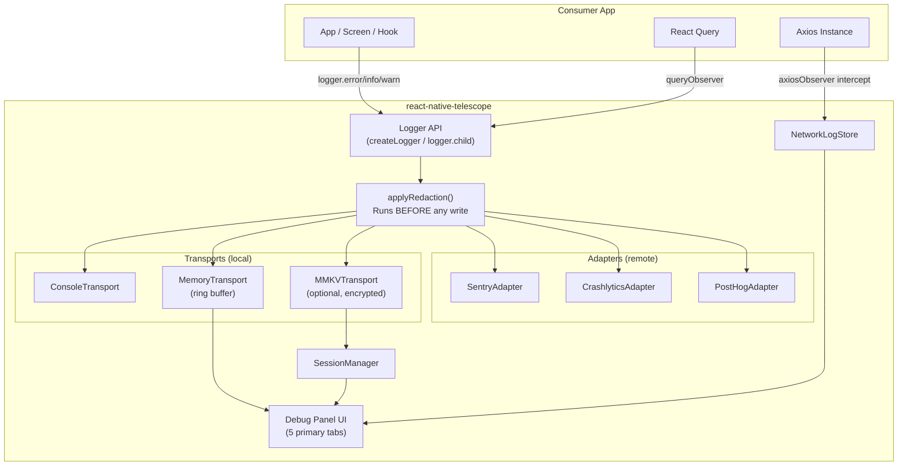
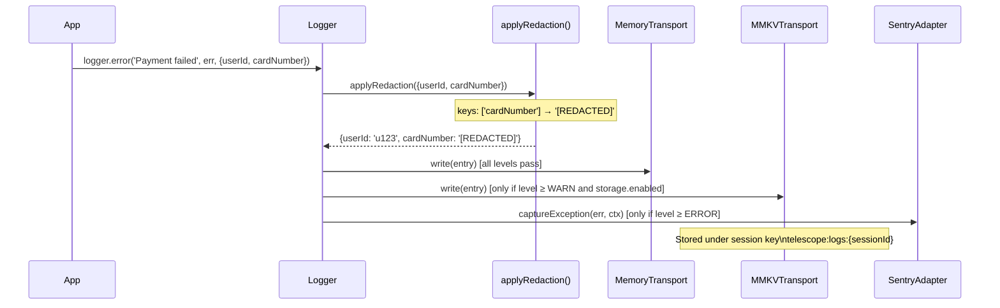
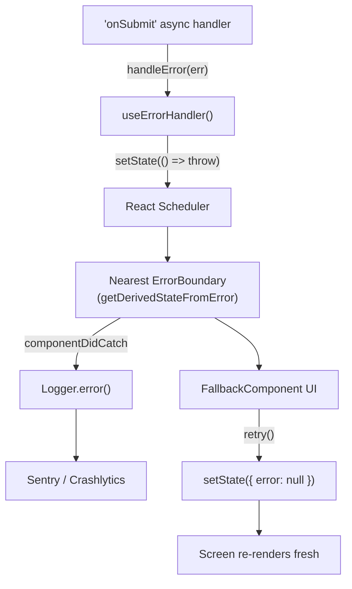
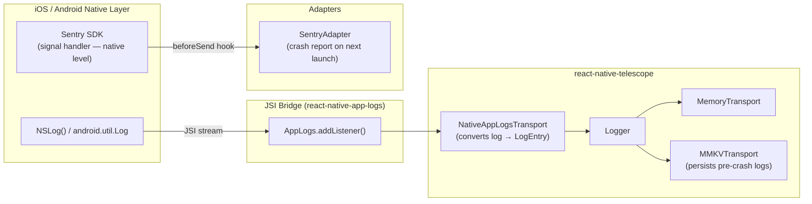
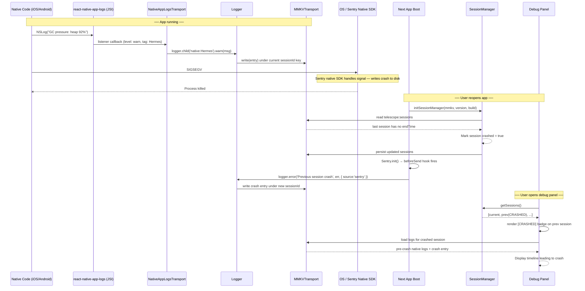
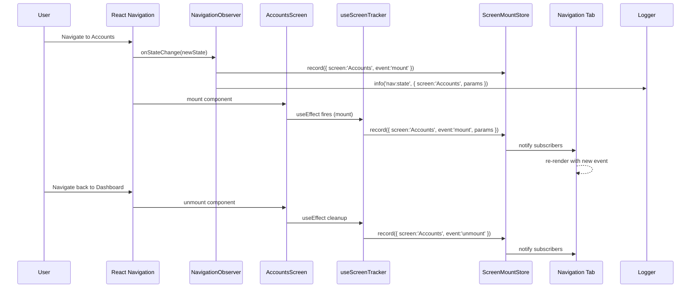
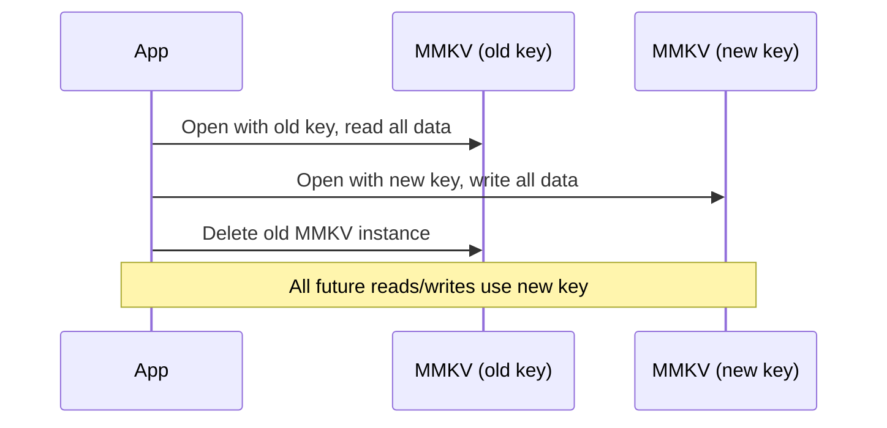
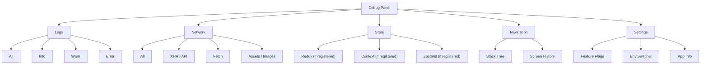

# `react-native-telescope` — Technical Architecture Plan

> **What it is**: A standalone, publishable npm package — a production-grade observability and debugging toolkit for React Native apps. Transport-based structured logger + observability adapter layer (Sentry / Crashlytics / PostHog / custom) + composable ErrorBoundaries + full-screen configurable debug panel with 6 tabs + first-party integrations for Axios, React Navigation, and React Query.
>
> **Design principle**: Zero forced dependencies. Every external SDK (Sentry, Crashlytics, PostHog, MMKV) is an optional peer dependency. Core installs in any React Native project with zero side effects.

---

## Table of Contents

- [`react-native-telescope` — Technical Architecture Plan](#react-native-telescope--technical-architecture-plan)
  - [Table of Contents](#table-of-contents)
  - [1. Prior Art \& Comparisons](#1-prior-art--comparisons)
    - [1.1 `react-native-logs`](#11-react-native-logs)
    - [1.2 `react-native-app-logs` (Margelo)](#12-react-native-app-logs-margelo)
    - [1.3 Reactotron](#13-reactotron)
  - [2. Project Setup](#2-project-setup)
    - [2.1 Toolchain Rationale](#21-toolchain-rationale)
    - [2.2 Directory Bootstrap](#22-directory-bootstrap)
    - [2.3 `package.json` — Critical Fields Explained](#23-packagejson--critical-fields-explained)
    - [2.4 `tsup.config.ts`](#24-tsupconfigts)
    - [2.5 `tsconfig.json`](#25-tsconfigjson)
    - [2.6 GitHub Actions](#26-github-actions)
    - [2.7 pnpm Workspace for Example App](#27-pnpm-workspace-for-example-app)
  - [3. Complete Folder Structure](#3-complete-folder-structure)
  - [4. Config Singleton](#4-config-singleton)
  - [5. Logger System](#5-logger-system)
    - [5.1 Architecture — Two Separate Backend Types](#51-architecture--two-separate-backend-types)
    - [5.2 Type Definitions (`src/logger/types.ts`)](#52-type-definitions-srcloggertypests)
    - [5.3 Logger Class (`src/logger/Logger.ts`)](#53-logger-class-srcloggerloggerts)
    - [5.4 MemoryTransport — Pre-Allocated Ring Buffer](#54-memorytransport--pre-allocated-ring-buffer)
    - [5.5 ConsoleTransport](#55-consoletransport)
    - [5.6 MMKVTransport](#56-mmkvtransport)
  - [6. Observability Adapter Layer](#6-observability-adapter-layer)
    - [6.1 Why `require()` Instead of Static `import`](#61-why-require-instead-of-static-import)
    - [6.2 SentryAdapter](#62-sentryadapter)
    - [6.3 FirebaseCrashlyticsAdapter](#63-firebasecrashlyticsadapter)
    - [6.4 PostHogAdapter](#64-posthogadapter)
    - [6.5 `createCustomAdapter` — Escape Hatch for Any Backend](#65-createcustomadapter--escape-hatch-for-any-backend)
  - [7. Error Boundary System](#7-error-boundary-system)
    - [7.1 Why Class Components](#71-why-class-components)
    - [7.2 `AppErrorBoundary`](#72-apperrorboundary)
    - [7.3 `ScreenErrorBoundary` — `resetOnBlur`](#73-screenerrorboundary--resetonblur)
    - [7.4 `withErrorBoundary` HOC](#74-witherrorboundary-hoc)
    - [7.5 `useErrorHandler` — Trigger Boundaries from Async Code](#75-useerrorhandler--trigger-boundaries-from-async-code)
    - [7.6 Should We Use `react-native-error-boundary` Instead?](#76-should-we-use-react-native-error-boundary-instead)
  - [8. Native Crash Log Extraction](#8-native-crash-log-extraction)
    - [8.1 What Can and Cannot Be Captured on the JS Side](#81-what-can-and-cannot-be-captured-on-the-js-side)
    - [8.2 Why `react-native-app-logs` — Not a Custom NativeModule](#82-why-react-native-app-logs--not-a-custom-nativemodule)
    - [8.3 JS Error Capture — Full Setup](#83-js-error-capture--full-setup)
    - [8.4 `react-native-app-logs` — Native Log Transport (Primary)](#84-react-native-app-logs--native-log-transport-primary)
      - [Installation (consumer app)](#installation-consumer-app)
      - [`NativeAppLogsTransport` — Implementation](#nativeapplogstransport--implementation)
      - [How Pre-Crash Log Recovery Works](#how-pre-crash-log-recovery-works)
    - [8.5 Previous Crash Data via Sentry / Firebase Adapters](#85-previous-crash-data-via-sentry--firebase-adapters)
    - [8.6 `TelescopeCrashReporter` — Unified JS Installer](#86-telescopecrashreporter--unified-js-installer)
    - [8.7 Layered Capture Strategy](#87-layered-capture-strategy)
    - [8.8 End-to-End Flow — Sequence Diagram](#88-end-to-end-flow--sequence-diagram)
  - [9. Integration Layer](#9-integration-layer)
    - [9.1 Axios Observer (`createAxiosObserver`)](#91-axios-observer-createaxiosobserver)
    - [9.2 Navigation Observer](#92-navigation-observer)
    - [9.3 Screen Lifecycle Tracking — Mount / Unmount / Time-on-Screen](#93-screen-lifecycle-tracking--mount--unmount--time-on-screen)
      - [`ScreenMountStore` — the backing store](#screenmountstore--the-backing-store)
      - [`useScreenTracker` — drop into any screen component](#usescreentracker--drop-into-any-screen-component)
      - [Alternative — navigator-level automatic tracking](#alternative--navigator-level-automatic-tracking)
    - [9.4 React Query Observer](#94-react-query-observer)
  - [10. Session Management — Current \& Previous Sessions](#10-session-management--current--previous-sessions)
    - [10.1 The Problem](#101-the-problem)
    - [10.2 Solution — Session-Scoped Storage Keys](#102-solution--session-scoped-storage-keys)
    - [10.3 `SessionManager` Implementation](#103-sessionmanager-implementation)
    - [10.4 Session-Scoped MMKV Keys](#104-session-scoped-mmkv-keys)
    - [10.5 Debug Panel Session Selector](#105-debug-panel-session-selector)
  - [11. Encryption for Stored Data](#11-encryption-for-stored-data)
    - [11.1 Why Encrypt](#111-why-encrypt)
    - [11.2 MMKV Built-in AES-256 Encryption](#112-mmkv-built-in-aes-256-encryption)
    - [11.3 Where the Key Comes From](#113-where-the-key-comes-from)
    - [11.4 Key Rotation (Planned for v0.2)](#114-key-rotation-planned-for-v02)
    - [11.5 Init Example with Encryption](#115-init-example-with-encryption)
  - [12. Debug Panel](#12-debug-panel)
    - [12.1 Panel Structure](#121-panel-structure)
    - [12.2 `DebugPanelProvider` Context](#122-debugpanelprovider-context)
    - [12.3 `useShakeDetector`](#123-useshakedetector)
    - [12.4 `NetworkLogStore` — `useSyncExternalStore` Pattern](#124-networklogstore--usesyncexternalstore-pattern)
    - [12.5 Tab Designs — Hierarchical Two-Level Tab System](#125-tab-designs--hierarchical-two-level-tab-system)
      - [Primary Tab 1 — Logs](#primary-tab-1--logs)
      - [Primary Tab 2 — Network](#primary-tab-2--network)
      - [Primary Tab 3 — State](#primary-tab-3--state)
      - [Primary Tab 4 — Navigation](#primary-tab-4--navigation)
      - [Primary Tab 5 — Settings](#primary-tab-5--settings)
      - [Secondary Tab State Persistence](#secondary-tab-state-persistence)
  - [13. Consumer Integration — Complete Setup](#13-consumer-integration--complete-setup)
    - [13.1 Installation](#131-installation)
    - [13.2 Minimal Setup (Logger only, no panel, no storage)](#132-minimal-setup-logger-only-no-panel-no-storage)
    - [13.3 Full Setup (logger + storage + panel + native logs)](#133-full-setup-logger--storage--panel--native-logs)
    - [13.4 Per-Screen Usage](#134-per-screen-usage)
      - [Scoped child loggers](#scoped-child-loggers)
      - [Screen lifecycle tracking](#screen-lifecycle-tracking)
    - [13.5 Registering State Slices (State Inspector Tab)](#135-registering-state-slices-state-inspector-tab)
    - [13.6 Multiple Adapters — Full Configuration](#136-multiple-adapters--full-configuration)
    - [13.7 Teardown](#137-teardown)
    - [13.8 TypeScript — Typed Loggers and Context](#138-typescript--typed-loggers-and-context)
    - [13.9 Full Integration Checklist](#139-full-integration-checklist)
    - [Approach](#approach)
    - [Logger Test Examples](#logger-test-examples)
    - [Ring Buffer Correctness Test](#ring-buffer-correctness-test)
    - [Adapter Tests — Mock the Entire SDK](#adapter-tests--mock-the-entire-sdk)
  - [15. Security Requirements](#15-security-requirements)
  - [16. Technical Decision Trade-offs](#16-technical-decision-trade-offs)
  - [17. Publishing to npm](#17-publishing-to-npm)
    - [First-Time Setup](#first-time-setup)
    - [Release Flow](#release-flow)
    - [Validate Before Any Publish](#validate-before-any-publish)
    - [Versioning Policy](#versioning-policy)
  - [18. Portfolio Strategy](#18-portfolio-strategy)

---

## 1. Prior Art & Comparisons

### 1.1 `react-native-logs`

**npm:** [`react-native-logs`](https://www.npmjs.com/package/react-native-logs)

A mature, well-maintained lightweight logger for React Native. Transport-based. Supports custom transports and log levels.

| Feature | `react-native-logs` | `react-native-telescope` |
|---|---|---|
| Transport-based logger | ✅ | ✅ |
| Custom transports | ✅ | ✅ |
| Namespaced loggers | ✅ (via `extend`) | ✅ (via `.child()`) |
| Debug panel UI | ❌ | ✅ |
| Network inspector | ❌ | ✅ |
| Screen lifecycle tracking | ❌ | ✅ |
| Crash reporter adapters | ❌ | ✅ (Sentry, Crashlytics, PostHog) |
| Session management | ❌ | ✅ |
| Structured `LogEntry` type | ❌ (strings only) | ✅ (typed, searchable) |
| Redaction | ❌ | ✅ |
| Encryption | ❌ | ✅ (via MMKV) |

**Relationship:** `react-native-logs` was an important design reference for the transport interface. `react-native-telescope` extends the concept with structured entries, adapter-layer crash reporting, and a full in-app UI.

### 1.2 `react-native-app-logs` (Margelo)

**GitHub:** [`margelo/react-native-app-logs`](https://github.com/margelo/react-native-app-logs)

A JSI-powered library for streaming **native platform logs** (NSLog on iOS, `android.util.Log` on Android) into the JS side.

| Feature | `react-native-app-logs` | `react-native-telescope` |
|---|---|---|
| Reads native NSLog / Android Log | ✅ (JSI, near-zero overhead) | ❌ (but can use it as a transport source — see §17.4) |
| JS logger API | ❌ | ✅ |
| Network inspector | ❌ | ✅ |
| Debug panel UI | ❌ | ✅ |
| Crash adapters | ❌ | ✅ |

**Relationship:** Complementary, not competing. Use `react-native-app-logs` as a **native log source** feeding into Telescope's logger via `installNativeAppLogsTransport()` (Section 17.4). This gives a unified view of both JS and native logs in the same panel.

### 1.3 Reactotron

**GitHub:** [`infinitered/reactotron`](https://github.com/infinitered/reactotron)

The most feature-rich existing debugger for React Native. Requires a **desktop companion app** (Electron) and a network bridge to your dev machine.

| Feature | Reactotron | `react-native-telescope` |
|---|---|---|
| Network request inspector | ✅ | ✅ |
| State inspector (Redux/MobX) | ✅ (deep integration) | ✅ (pull pattern, any store) |
| Benchmark / timespan | ✅ | ❌ (planned) |
| On-device panel (no desktop) | ❌ | ✅ |
| Works on physical devices remotely (no desktop) | ❌ | ✅ |
| Works in production/staging builds | ❌ | ✅ (opt-in) |
| Crash reporter adapter layer | ❌ | ✅ |
| Publishable as npm package | N/A | ✅ |

**Conclusion:** Reactotron is unbeatable for deep local development sessions on a simulator. `react-native-telescope` targets a different use case: **on-device debugging during QA, staging, and production triage** — no desktop required, no network bridge, works on real devices handed to QA testers.
## 2. Project Setup

### 2.1 Toolchain Rationale

| Tool | Role | Why |
|---|---|---|
| **`tsup`** (wraps esbuild) | Build | Produces CJS + ESM + `.d.ts` in one command, ~0 config |
| **`pnpm`** | Package manager | Strict dep isolation, workspace support for `example/` app |
| **`jest` + `@testing-library/react-native`** | Tests | Same toolchain as consumer apps we target |
| **TypeScript `strict`** | Types | `exactOptionalPropertyTypes`, `noUncheckedIndexedAccess` |
| **GitHub Actions** | CI/CD | Lint + typecheck + test on PR; auto-publish on tag |

### 2.2 Directory Bootstrap

```bash
mkdir react-native-telescope && cd react-native-telescope
pnpm init
git init
echo "node_modules\ndist\ncoverage" > .gitignore
```

### 2.3 `package.json` — Critical Fields Explained

```json
{
 "name": "react-native-telescope",
 "version": "0.1.0",
 "description": "Structured logging, observability adapters, and a debug panel for React Native",
 "license": "MIT",
 "author": "Your Name",
 "repository": { "type": "git", "url": "https://github.com/yourhandle/react-native-telescope" },

 "main":   "dist/index.js",       // Metro reads this — must be CJS
 "module": "dist/index.mjs",      // Modern bundlers (webpack, vite) — must be ESM
 "types":  "dist/index.d.ts",

 // Sub-path exports — consumers import only what they need (tree-shaking)
 "exports": {
   ".": {
     "import":  "./dist/index.mjs",
     "require": "./dist/index.js",
     "types":   "./dist/index.d.ts"
   },
   "./adapters": {
     "import":  "./dist/adapters/index.mjs",
     "require": "./dist/adapters/index.js",
     "types":   "./dist/adapters/index.d.ts"
   },
   "./integrations/axios":       { "import": "./dist/integrations/axios.mjs" },
   "./integrations/navigation":  { "import": "./dist/integrations/navigation.mjs" },
   "./integrations/react-query": { "import": "./dist/integrations/react-query.mjs" }
 },

 // src/ included for declarationMap — consumers get Go-to-Definition to .ts source
 "files": ["dist", "src"],

 "scripts": {
   "build":          "tsup",
   "build:watch":    "tsup --watch",
   "test":           "jest",
   "test:coverage":  "jest --coverage",
   "lint":           "eslint src --ext .ts,.tsx",
   "typecheck":      "tsc --noEmit",
   "prepublishOnly": "pnpm run build && pnpm run test"  // Safety net — runs before every publish
 },

 // peerDependencies — NEVER in dependencies — consumer must already have these
 "peerDependencies": {
   "react": ">=18.0.0",
   "react-native": ">=0.73.0"
 },
 "peerDependenciesMeta": {
   "@sentry/react-native":               { "optional": true },
   "@react-native-firebase/crashlytics": { "optional": true },
   "posthog-react-native":               { "optional": true },
   "react-native-mmkv":                  { "optional": true },
   "axios":                              { "optional": true },
   "@react-navigation/native":           { "optional": true },
   "@tanstack/react-query":              { "optional": true }
 },

 // devDependencies — only needed to build/test; never shipped to consumers
 "devDependencies": {
   "typescript": "^5.4.0",
   "tsup": "^8.0.0",
   "jest": "^29.0.0",
   "ts-jest": "^29.0.0",
   "@testing-library/react-native": "^12.0.0",
   "@types/react": "^18.0.0",
   "eslint": "^8.0.0",
   "@typescript-eslint/parser": "^7.0.0",
   "prettier": "^3.0.0",
   "react": "19.0.0",
   "react-native": "0.74.0"
 }
}
```

**Key field reasoning:**
- `"main"` → Metro reads this. Must produce CJS output.
- `"module"` → Non-Metro bundlers (web, Storybook) read this. Must be ESM.
- `"exports"` → The modern standard. Overrides `main`/`module` in Node.js ≥12 and Metro ≥0.73. Enables sub-path imports like `import { SentryAdapter } from 'react-native-telescope/adapters'` — adapter code is in a separate chunk and never loaded by apps that only use the logger.
- `"files"` → Only these directories are packaged by `npm pack`. Explicit and safer than `.npmignore`.
- `"prepublishOnly"` → Ensures every publish is built and tested. Cannot be bypassed accidentally.

### 2.4 `tsup.config.ts`

```typescript
import { defineConfig } from 'tsup';

export default defineConfig({
 entry: {
   'index':                    'src/index.ts',
   'adapters/index':           'src/adapters/index.ts',
   'integrations/axios':       'src/integrations/axios/index.ts',
   'integrations/navigation':  'src/integrations/navigation/index.ts',
   'integrations/react-query': 'src/integrations/reactQuery/index.ts',
 },
 format: ['cjs', 'esm'],      // Produce both — one command, both outputs
 dts: true,                   // Generate .d.ts + .d.mts alongside each output file
 sourcemap: true,
 clean: true,                 // Wipe dist/ before each build — no stale artifacts
 treeshake: true,
 external: [                  // Never bundle peer deps — consumer already has them
   'react', 'react-native',
   '@sentry/react-native',
   '@react-native-firebase/crashlytics',
   'posthog-react-native',
   'react-native-mmkv',
   'axios',
   '@react-navigation/native',
   '@tanstack/react-query',
 ],
 esbuildOptions(options) {
   options.jsx = 'automatic';  // React 17+ JSX transform — no import React needed
 },
});
```

Multiple `entry` points produce separate output files that match the `exports` map. An app using only the logger never loads debug panel React components.

### 2.5 `tsconfig.json`

```json
{
 "compilerOptions": {
   "target": "ES2020",
   "lib": ["ES2020"],
   "module": "ESNext",
   "moduleResolution": "bundler",     // Resolves .ts/.tsx without extensions — same as Metro
   "jsx": "react-native",
   "strict": true,
   "exactOptionalPropertyTypes": true,
   "noUncheckedIndexedAccess": true,  // arr[i] is T | undefined — prevents runtime index bugs
   "declaration": true,
   "declarationMap": true,            // Go-to-Definition → original .ts source
   "composite": true,
   "incremental": true,
   "outDir": "dist",
   "rootDir": "src"
 },
 "include": ["src"],
 "exclude": ["node_modules", "dist", "example", "__tests__"]
}
```

### 2.6 GitHub Actions

**`.github/workflows/ci.yml`** — runs on every push and PR:

```yaml
name: CI
on: [push, pull_request]
jobs:
 test:
   runs-on: ubuntu-latest
   steps:
     - uses: actions/checkout@v4
     - uses: pnpm/action-setup@v3
     - uses: actions/setup-node@v4
       with: { node-version: 20, cache: pnpm }
     - run: pnpm install --frozen-lockfile
     - run: pnpm run typecheck
     - run: pnpm run lint
     - run: pnpm run test:coverage
     - run: pnpm run build
```

**`.github/workflows/release.yml`** — runs on tag push:

```yaml
name: Release
on:
 push:
   tags: ['v*']
jobs:
 publish:
   runs-on: ubuntu-latest
   steps:
     - uses: actions/checkout@v4
     - uses: pnpm/action-setup@v3
     - uses: actions/setup-node@v4
       with: { node-version: 20, registry-url: 'https://registry.npmjs.org' }
     - run: pnpm install --frozen-lockfile
     - run: pnpm publish --no-git-checks
       env:
         NODE_AUTH_TOKEN: ${{ secrets.NPM_TOKEN }}
```

Publishing: `npm version minor && git push --tags` → CI builds, tests, and publishes automatically.

### 2.7 pnpm Workspace for Example App

**`pnpm-workspace.yaml`:**
```yaml
packages:
 - '.'
 - 'example'
```

**`example/package.json`** includes `"react-native-telescope": "workspace:*"` — links the local `dist/` output directly. No publishing required during development. Metro resolves `workspace:*` to the parent package's `dist/` output.

---
## 3. Complete Folder Structure

```
react-native-telescope/
├── src/
│   ├── index.ts                            ← Main barrel: logger, config, boundaries, panel
│   │
│   ├── logger/
│   │   ├── types.ts                        ← LogLevel, LogEntry, ITransport, IObservabilityAdapter
│   │   ├── Logger.ts                       ← Core class
│   │   ├── createLogger.ts                 ← Factory + global default instance
│   │   ├── transports/
│   │   │   ├── ConsoleTransport.ts         ← Colorized, __DEV__-gated
│   │   │   ├── MemoryTransport.ts          ← Pre-allocated ring buffer → feeds LogViewer
│   │   │   └── MMKVTransport.ts            ← Optional peer dep: react-native-mmkv
│   │   └── index.ts
│   │
│   ├── adapters/                           ← Remote observability backends
│   │   ├── types.ts                        ← IObservabilityAdapter interface
│   │   ├── SentryAdapter.ts                ← Optional peer dep: @sentry/react-native
│   │   ├── FirebaseCrashlyticsAdapter.ts   ← Optional peer dep: @react-native-firebase/crashlytics
│   │   ├── PostHogAdapter.ts               ← Optional peer dep: posthog-react-native
│   │   ├── createCustomAdapter.ts          ← Escape hatch for Datadog, Amplitude, etc.
│   │   └── index.ts
│   │
│   ├── errorBoundary/
│   │   ├── AppErrorBoundary.tsx            ← Root-level, catches everything
│   │   ├── ScreenErrorBoundary.tsx         ← Per-screen, resetOnBlur support
│   │   ├── withErrorBoundary.tsx           ← HOC wrapper
│   │   ├── useErrorHandler.ts              ← Imperative capture in async handlers
│   │   └── types.ts
│   │
│   ├── config/
│   │   ├── ObservabilityConfig.ts          ← Singleton: init() / get() / reset()
│   │   ├── FeatureFlagManager.ts           ← isEnabled() / override() / MMKV persistence
│   │   └── types.ts
│   │
│   ├── debugPanel/
│   │   ├── DebugPanelProvider.tsx          ← Context: open state + registered slices
│   │   ├── DebugPanel.tsx                  ← Full-screen Modal + tab bar
│   │   ├── stores/
│   │   │   └── NetworkLogStore.ts          ← Separate ring buffer for N/W entries
│   │   ├── components/
│   │   │   ├── LogViewer.tsx               ← FlatList + dynamic namespace chips + search
│   │   │   ├── NetworkLog.tsx              ← Request/response cards + cURL copy
│   │   │   ├── NavigatorPanel.tsx          ← Stack tree + History tab
│   │   │   ├── StateInspector.tsx          ← JSON tree of registered slices
│   │   │   ├── FeatureFlagsPanel.tsx       ← Toggle list + MMKV persistence
│   │   │   └── DevInfo.tsx                 ← App info + env switcher
│   │   ├── hooks/
│   │   │   ├── useDebugPanel.ts            ← openPanel / closePanel / registerStateSlice
│   │   │   └── useShakeDetector.ts         ← Accelerometer-based shake detection
│   │   └── index.ts
│   │
│   ├── integrations/
│   │   ├── axios/
│   │   │   ├── axiosObserver.ts            ← createAxiosObserver()
│   │   │   ├── curlSerializer.ts           ← Generates cURL string from NetworkLogEntry
│   │   │   └── types.ts
│   │   ├── navigation/
│   │   │   └── NavigationObserver.ts       ← createNavigationObserver()
│   │   └── reactQuery/
│   │       └── queryObserver.ts            ← createQueryObserver()
│   │
│   └── hooks/
│       ├── useLogger.ts                    ← Scoped logger tied to component namespace
│       └── useObservability.ts             ← Combined: logger + panel + flags
│
├── __tests__/
│   ├── logger/
│   ├── adapters/
│   ├── errorBoundary/
│   └── integrations/
│
├── example/                                ← Expo bare app (pnpm workspace:*)
│   ├── App.tsx
│   └── package.json
│
├── .github/
│   └── workflows/
│       ├── ci.yml
│       └── release.yml
│
├── tsconfig.json
├── tsup.config.ts
├── jest.config.js
├── .eslintrc.js
├── .prettierrc
├── pnpm-workspace.yaml
├── package.json
├── README.md
├── ARCHITECTURE.md
└── CHANGELOG.md
```

---
## 4. Config Singleton

Single `init()` call in `App.tsx` or `index.js`. Throws on `get()` if called before `init()` — no silent misconfiguration failures.

```typescript
export interface StorageConfig {
 /**
  * Whether to persist logs and network entries across app restarts.
  * Requires react-native-mmkv as an installed peer dependency.
  * Default: false — opt-in consciously.
  */
 enabled: boolean;
 /** Maximum number of sessions to retain (current + N previous). Default: 2 */
 maxSessions?: number;
 /**
  * Optional AES-256 encryption via MMKV's built-in encryption support.
  * If enabled, the consumer MUST provide a key. Key must be 16–32 bytes.
  * Key rotation support is planned for a future release.
  */
 encryption?: {
   enabled: boolean;
   key: string;  // Consumer-provided; never hardcode — load from secure storage or env
 };
}

export interface TelescopeConfig {
 app: {
   name: string;
   version: string;
   buildNumber: number | string;
   buildType: 'development' | 'staging' | 'production' | string;
   environments?: string[];
   currentEnvironment?: string;
 };
 logger: LoggerConfig;
 /**
  * Persistence layer — entirely optional.
  * When disabled (default), only MemoryTransport is used and all data is lost on restart.
  */
 storage?: StorageConfig;
 debugPanel?: {
   enabled: boolean;
   entryGesture?: Array<'shake' | 'multiTap'>;
   tabs?: DebugPanelTab[];
   multiTapCount?: number;      // default: 5
   multiTapMaxDelay?: number;   // ms between taps, default: 300
 };
 errorBoundary?: {
   onError?: (error: Error, info: React.ErrorInfo) => void;
   FallbackComponent?: React.ComponentType<{ error: Error; retry: () => void }>;
 };
}

// Usage:
ObservabilityConfig.init({
 app: {
   name: 'MyApp', version: '1.2.3', buildNumber: 42,
   buildType: process.env.BUILD_TYPE ?? 'development',
   environments: ['development', 'staging', 'production'],
   currentEnvironment: process.env.API_ENV ?? 'development',
 },
 logger: {
   namespace: 'app',
   level: __DEV__ ? LogLevel.DEBUG : LogLevel.WARN,
   transports: [new ConsoleTransport(), new MemoryTransport({ maxEntries: 500 })],
   adapters: [new SentryAdapter({ minLevel: LogLevel.ERROR })],
   redact: ['password', 'token', 'cardNumber', 'ssn'],
 },
 debugPanel: {
   enabled: __DEV__ || process.env.ENABLE_DEBUG_PANEL === 'true',
   entryGesture: ['shake', 'multiTap'],
   tabs: ['logs', 'network', 'navigator', 'state', 'flags', 'info'],
 },
 errorBoundary: {
   onError: (error, info) => logger.error('crash', error, { componentStack: info.componentStack }),
 },
});
```

---
## 5. Logger System

### 5.1 Architecture — Two Separate Backend Types

The central design insight is separating _local write destinations_ from _remote backends_:

```
logger.error('Payment failed', err, { userId })
      │
      ├── Transports  (local — every call, minLevel-filtered)
      │   ├── ConsoleTransport.write()       → terminal output (__DEV__-gated)
      │   ├── MemoryTransport.write()        → ring buffer → feeds LogViewer tab
      │   └── MMKVTransport.write()          → persists across app restarts
      │
      └── Adapters  (remote — minLevel-filtered per adapter)
          ├── SentryAdapter.captureException()
          ├── FirebaseCrashlyticsAdapter.captureException()
          └── PostHogAdapter.captureException()
```

**Overall system architecture (Mermaid):**



**Logger write sequence (Mermaid):**



### 5.2 Type Definitions (`src/logger/types.ts`)

```typescript
export enum LogLevel {
 DEBUG  = 0,
 INFO   = 1,
 WARN   = 2,
 ERROR  = 3,
 SILENT = 4,   // Disables all output — useful in tests
}

export interface LogEntry {
 readonly id: string;
 readonly timestamp: number;                              // Unix ms — Date.now()
 readonly level: LogLevel;
 readonly namespace: string;                              // Hierarchical: "auth:otp"
 readonly message: string;
 readonly context?: Readonly<Record<string, unknown>>;   // Already redacted before write
 readonly error?: Error;
}

// LOCAL write destination
export interface ITransport {
 readonly name: string;
 readonly minLevel: LogLevel;
 write(entry: LogEntry): void;
}

// REMOTE crash / event backend
export interface IObservabilityAdapter {
 readonly name: string;
 readonly minLevel: LogLevel;
 captureException(error: Error, context?: Record<string, unknown>): void;
 captureMessage?(message: string, level: LogLevel, context?: Record<string, unknown>): void;
 setUser?(user: { id?: string; email?: string; [key: string]: unknown }): void;
 setContext?(key: string, value: Record<string, unknown>): void;
 flush?(): Promise<void>;   // Some SDKs need manual flush before crash
}

/**
* Fine-grained redaction control. Using a string[] is a shorthand for the default behaviour.
* Both forms are optional — omit entirely if your app has no secrets in log context.
*/
export interface RedactConfig {
 keys: string[];                    // Context key names to scrub
 replacement?: string;              // Default: '[REDACTED]'. Use '' to store an empty string.
 mode?: 'replace' | 'omit';        // 'replace': keep key, swap value (default) | 'omit': delete key entirely
}

export interface LoggerConfig {
 namespace: string;
 level: LogLevel;
 transports: ITransport[];
 adapters?: IObservabilityAdapter[];
 redact?: string[] | RedactConfig;  // OPTIONAL — omit if context contains no PII
}
```

### 5.3 Logger Class (`src/logger/Logger.ts`)

**Key design decisions:**
- `redact` is applied in `write()` **before any transport or adapter call** — security guarantee, not a display feature
- `child(namespace)` returns a new Logger sharing the same transports/adapters/redact but with a prefixed namespace (`"app:auth:otp"`)
- `setUser()` / `setContext()` iterate all adapters — one call in the auth flow sets identity on Sentry + Crashlytics + PostHog simultaneously

```typescript
export class Logger {
 private readonly config: Required<LoggerConfig>;

 constructor(config: LoggerConfig) {
   this.config = { adapters: [], redact: [], ...config };
 }

 debug(message: string, context?: Record<string, unknown>): void {
   this.write(LogLevel.DEBUG, message, context);
 }
 info(message: string, context?: Record<string, unknown>): void {
   this.write(LogLevel.INFO, message, context);
 }
 warn(message: string, context?: Record<string, unknown>): void {
   this.write(LogLevel.WARN, message, context);
 }
 error(
   message: string,
   errorOrContext?: Error | Record<string, unknown>,
   context?: Record<string, unknown>
 ): void {
   const [err, ctx] = errorOrContext instanceof Error
     ? [errorOrContext, context]
     : [undefined, errorOrContext];
   this.write(LogLevel.ERROR, message, ctx, err);
 }

 child(namespace: string): Logger {
   return new Logger({
     ...this.config,
     namespace: `${this.config.namespace}:${namespace}`,
   });
 }

 setUser(user: Parameters<NonNullable<IObservabilityAdapter['setUser']>>[0]): void {
   this.config.adapters.forEach(a => a.setUser?.(user));
 }

 setContext(key: string, value: Record<string, unknown>): void {
   this.config.adapters.forEach(a => a.setContext?.(key, value));
 }

 private write(
   level: LogLevel,
   message: string,
   context?: Record<string, unknown>,
   error?: Error
 ): void {
   if (level < this.config.level) return;  // Logger-level threshold

   const entry: LogEntry = {
     id: `${Date.now()}-${Math.random().toString(36).slice(2)}`,
     timestamp: Date.now(),
     level,
     namespace: this.config.namespace,
     message,
     context: context ? this.applyRedaction(context) : undefined,  // Redact first
     error,
   };

   // Fan out to transports (local)
   for (const transport of this.config.transports) {
     if (level >= transport.minLevel) transport.write(entry);
   }

   // Fan out to adapters (remote)
   for (const adapter of this.config.adapters) {
     if (level >= adapter.minLevel) {
       if (error) {
         adapter.captureException(error, entry.context);
       } else {
         adapter.captureMessage?.(message, level, entry.context);
       }
     }
   }
 }

 private applyRedaction(context: Record<string, unknown>): Record<string, unknown> {
   if (this.config.redact.length === 0) return context;
   return Object.fromEntries(
     Object.entries(context).map(([k, v]) => [
       k,
       this.config.redact.includes(k) ? '[REDACTED]' : v,
     ])
   );
 }
}
```

### 5.4 MemoryTransport — Pre-Allocated Ring Buffer

**Why not `unshift`-based:** `unshift` is O(n) — every write shifts all existing elements. In a long session with 500 entries, each log write does 500 element moves. A pre-allocated ring buffer uses a fixed array with a `head` pointer — every write is O(1), zero GC overhead.

```typescript
export class MemoryTransport implements ITransport {
 readonly name = 'memory';
 readonly minLevel: LogLevel;
 private readonly buffer: LogEntry[];
 private readonly maxEntries: number;
 private head = 0;   // Oldest slot index
 private count = 0;  // Current fill count

 constructor(options: { maxEntries?: number; minLevel?: LogLevel } = {}) {
   this.maxEntries = options.maxEntries ?? 500;
   this.minLevel = options.minLevel ?? LogLevel.DEBUG;
   this.buffer = new Array(this.maxEntries);  // Pre-allocated — no GC from resizing
 }

 write(entry: LogEntry): void {
   const index = (this.head + this.count) % this.maxEntries;
   this.buffer[index] = entry;
   if (this.count < this.maxEntries) {
     this.count++;
   } else {
     this.head = (this.head + 1) % this.maxEntries;  // Overwrite oldest
   }
 }

 // Returns entries chronologically (oldest first)
 getEntries(): LogEntry[] {
   const result: LogEntry[] = [];
   for (let i = 0; i < this.count; i++) {
     const entry = this.buffer[(this.head + i) % this.maxEntries];
     if (entry) result.push(entry);
   }
   return result;
 }

 // Used by LogViewer to build namespace filter chips dynamically
 getNamespaces(): string[] {
   return [...new Set(this.getEntries().map(e => e.namespace))].sort();
 }

 clear(): void {
   this.head = 0;
   this.count = 0;
 }
}
```

### 5.5 ConsoleTransport

```typescript
export class ConsoleTransport implements ITransport {
 readonly name = 'console';
 readonly minLevel: LogLevel;
 private readonly logInProduction: boolean;

 write(entry: LogEntry): void {
   // Hard safety: never write to console in production unless explicitly opted in
   if (!__DEV__ && !this.logInProduction) return;

   const COLORS = { [LogLevel.DEBUG]: '\x1b[37m', [LogLevel.INFO]: '\x1b[36m',
                    [LogLevel.WARN]: '\x1b[33m',  [LogLevel.ERROR]: '\x1b[31m' };
   const prefix = `${COLORS[entry.level] ?? ''}[${entry.namespace}]\x1b[0m`;
   const fn = entry.level >= LogLevel.ERROR ? console.error
            : entry.level >= LogLevel.WARN  ? console.warn
            : console.log;

   fn(prefix, entry.message, entry.context ?? '', entry.error ?? '');
 }
}
```

### 5.6 MMKVTransport

Persists logs across app restarts — critical for diagnosing crashes that kill the process before a developer sees the MemoryTransport. Requires `react-native-mmkv` as an optional peer dep.

```typescript
import type { MMKV } from 'react-native-mmkv';  // type-only — never crashes if not installed

export class MMKVTransport implements ITransport {
 readonly name = 'mmkv';
 readonly minLevel: LogLevel;  // Default: WARN — only persist meaningful entries

 write(entry: LogEntry): void {
   try {
     const raw = this.storage.getString('telescope:logs');
     const entries: LogEntry[] = raw ? JSON.parse(raw) : [];
     entries.unshift(entry);
     if (entries.length > this.maxEntries) entries.length = this.maxEntries;
     // Serialize Error objects manually — they don't survive JSON.stringify
     this.storage.set('telescope:logs', JSON.stringify(entries, (key, value) =>
       key === 'error' && value instanceof Error
         ? { message: value.message, stack: value.stack }
         : value
     ));
   } catch {
     // Never throw from a transport — silent failure
   }
 }
}
```

---
## 6. Observability Adapter Layer

### 6.1 Why `require()` Instead of Static `import`

Adapters use **dynamic `require()` inside the constructor**, not a static `import` at the top of the file.

Static `import` is evaluated at **module parse time** — if `@sentry/react-native` is not installed, the entire module fails to parse and **crashes the app on startup**. Dynamic `require()` only throws when `new SentryAdapter()` is called — which only happens when the consumer explicitly uses it, meaning they have the SDK installed.

### 6.2 SentryAdapter

```typescript
export class SentryAdapter implements IObservabilityAdapter {
 readonly name = 'sentry';
 readonly minLevel: LogLevel;
 private sentry: typeof import('@sentry/react-native') | null = null;

 constructor(options: { minLevel?: LogLevel } = {}) {
   this.minLevel = options.minLevel ?? LogLevel.ERROR;
   try {
     this.sentry = require('@sentry/react-native');
   } catch {
     console.warn('[telescope] SentryAdapter: @sentry/react-native is not installed.');
   }
 }

 captureException(error: Error, context?: Record<string, unknown>): void {
   if (!this.sentry) return;
   this.sentry.withScope(scope => {
     if (context) scope.setExtras(context);
     this.sentry!.captureException(error);
   });
 }

 captureMessage(message: string, level: LogLevel, context?: Record<string, unknown>): void {
   if (!this.sentry) return;
   const sentryLevel = level >= LogLevel.ERROR ? 'error'
                     : level >= LogLevel.WARN  ? 'warning' : 'info';
   this.sentry.withScope(scope => {
     if (context) scope.setExtras(context);
     this.sentry!.captureMessage(message, sentryLevel);
   });
 }

 setUser(user: ObservabilityUser): void { this.sentry?.setUser(user); }
 async flush(): Promise<void> { await this.sentry?.flush(2000); }
}
```

### 6.3 FirebaseCrashlyticsAdapter

```typescript
export class FirebaseCrashlyticsAdapter implements IObservabilityAdapter {
 readonly name = 'firebase-crashlytics';
 readonly minLevel: LogLevel;
 private crashlytics: any = null;

 constructor(options: { minLevel?: LogLevel } = {}) {
   this.minLevel = options.minLevel ?? LogLevel.ERROR;
   try {
     this.crashlytics = require('@react-native-firebase/crashlytics').default;
   } catch {
     console.warn('[telescope] FirebaseCrashlyticsAdapter: not installed.');
   }
 }

 captureException(error: Error, context?: Record<string, unknown>): void {
   const instance = this.crashlytics?.();
   if (!instance) return;
   if (context) instance.log(JSON.stringify(context));
   instance.recordError(error);
 }

 setUser(user: ObservabilityUser): void {
   const instance = this.crashlytics?.();
   if (!instance) return;
   if (user.id) instance.setUserId(String(user.id));
   const { id, ...attrs } = user;
   Object.entries(attrs).forEach(([k, v]) => instance.setAttribute(k, String(v)));
 }
}
```

### 6.4 PostHogAdapter

PostHog is different — the consumer passes an already-initialized `PostHog` instance because PostHog requires async initialization before use. No `require()` needed.

```typescript
export class PostHogAdapter implements IObservabilityAdapter {
 readonly name = 'posthog';
 readonly minLevel: LogLevel;

 constructor(options: { client: PostHog; minLevel?: LogLevel }) {
   this.client = options.client;
   this.minLevel = options.minLevel ?? LogLevel.WARN;  // Analytics — capture WARN+
 }

 captureException(error: Error, context?: Record<string, unknown>): void {
   this.client.capture('$exception', {
     $exception_message: error.message,
     $exception_stack_trace: error.stack,
     ...context,
   });
 }

 setUser(user: ObservabilityUser): void {
   if (user.id) this.client.identify(String(user.id), user);
 }
}
```

### 6.5 `createCustomAdapter` — Escape Hatch for Any Backend

```typescript
export function createCustomAdapter(
 impl: Omit<IObservabilityAdapter, 'minLevel'> & { minLevel?: LogLevel }
): IObservabilityAdapter {
 return { minLevel: LogLevel.ERROR, ...impl };
}

// Usage — Datadog, Amplitude, homegrown backend:
const datadogAdapter = createCustomAdapter({
 name: 'datadog',
 captureException: (error, ctx) => DdLogs.error(error.message, { ...ctx }),
 setUser: (user) => DdSdkReactNative.setUser({ id: String(user.id ?? '') }),
});
```

---
## 7. Error Boundary System

### 7.1 Why Class Components

`getDerivedStateFromError` and `componentDidCatch` are React class lifecycle methods — error boundaries **cannot be function components** (React limitation as of React 19). The class component is the boundary; a thin function component wrapper is added on top to enable hook usage (`useFocusEffect` for `resetOnBlur`).

### 7.2 `AppErrorBoundary`

```typescript
export class AppErrorBoundary extends React.Component<Props, State> {
 state: State = { error: null };

 static getDerivedStateFromError(error: Error): State {
   return { error };
 }

 componentDidCatch(error: Error, info: React.ErrorInfo): void {
   this.props.logger?.error('AppErrorBoundary caught', error, {
     componentStack: info.componentStack,
   });
   this.props.onError?.(error, info);
 }

 retry = (): void => this.setState({ error: null });

 render() {
   if (this.state.error) {
     const Fallback = this.props.FallbackComponent;
     return Fallback
       ? <Fallback error={this.state.error} retry={this.retry} />
       : <DefaultFallback error={this.state.error} retry={this.retry} />;
   }
   return this.props.children;
 }
}
```

### 7.3 `ScreenErrorBoundary` — `resetOnBlur`

When `resetOnBlur={true}`, the boundary uses a `resetKey` state in a function wrapper. On screen blur (navigating away), the key increments, which unmounts and remounts the boundary class component, clearing the error state. When the user navigates back, the screen renders fresh.

### 7.4 `withErrorBoundary` HOC

```typescript
export function withErrorBoundary<P extends object>(
 Component: React.ComponentType<P>,
 options: Omit<AppErrorBoundaryProps, 'children'> = {}
): React.FC<P> {
 const displayName = Component.displayName ?? Component.name ?? 'Component';
 const Wrapped: React.FC<P> = (props) => (
   <AppErrorBoundary {...options}>
     <Component {...props} />
   </AppErrorBoundary>
 );
 Wrapped.displayName = `withErrorBoundary(${displayName})`;
 return Wrapped;
}
```

### 7.5 `useErrorHandler` — Trigger Boundaries from Async Code

Async handlers can't propagate thrown errors to boundaries unless you use this pattern. Throwing inside a `setState` updater IS caught by the nearest error boundary:

```typescript
export function useErrorHandler(): (error: Error) => void {
 const [, setState] = useState<null>(null);
 return useCallback((error: Error) => {
   setState(() => { throw error; });
 }, []);
}

// Usage:
const handleError = useErrorHandler();
const onSubmit = async () => {
 try {
   await submitPayment();
 } catch (err) {
   handleError(err as Error);  // Triggers nearest ScreenErrorBoundary
 }
};
```

---

### 7.6 Should We Use `react-native-error-boundary` Instead?

[`react-native-error-boundary`](https://github.com/carloscuesta/react-native-error-boundary) (maintained by Carlos Cuesta) is a small library (~3 KB) that provides a class-based `ErrorBoundary` with `FallbackComponent` and `onError` props.

**Feature comparison:**

| Capability | `react-native-error-boundary` | Custom (Telescope) |
|---|---|---|
| Basic catch + fallback | ✅ | ✅ |
| `FallbackComponent` prop | ✅ | ✅ |
| `onError` callback | ✅ | ✅ |
| `resetOnBlur` (navigation-aware reset) | ❌ | ✅ |
| `useErrorHandler()` hook | ❌ | ✅ |
| `withErrorBoundary` HOC | ❌ | ✅ |
| Direct `Logger` instance injection | ❌ | ✅ |
| Typed `ErrorInfo.componentStack` prop | ❌ | ✅ |

**Decision for `react-native-telescope`:** Build a thin custom implementation. The entire boundary system is ~160 lines of tested TypeScript. The differentiating features (`resetOnBlur`, `useErrorHandler`, logger propagation) require deep integration with the toolkit's Logger — they can't be bolted onto an external library without a wrapper.

**Legitimate use case for the library:** If a consumer only needs a basic root-level boundary with a custom fallback and does not want to use the full Telescope toolkit, `react-native-error-boundary` is a valid choice. Document it in the README as an alternative.

**Architecture diagram:**



---
## 8. Native Crash Log Extraction

### 8.1 What Can and Cannot Be Captured on the JS Side

| Error Type | JS Catchable? | Mechanism |
|---|---|---|
| JS exceptions (synchronous throw) | ✅ | `ErrorUtils.setGlobalHandler` |
| Unhandled Promise rejections | ✅ | `promise/rejection-tracking` module |
| React render errors | ✅ | `ErrorBoundary.componentDidCatch` |
| Network errors | ✅ | Axios/fetch interceptors |
| RN bridge/JSI errors | ✅ (partial) | `LogBox` override |
| **Native signal crashes** (SIGSEGV, OOM) | ❌ | Process killed before JS runs |
| **iOS watchdog timer kill** | ❌ | System-level termination |
| **Android ANR** | ❌ | System-level |
| **Hermes JVM OOM** | ❌ | JVM kills process |

**Key insight:** Signal-level native crashes kill the process before any JS code — or any custom native module code we write — can run. Writing our own signal handler in Swift/Kotlin adds significant complexity and fragility (signal handlers must be async-signal-safe, can conflict with existing handlers from Sentry or Crashlytics, and do not survive Hermes OOM). Instead, `react-native-telescope` uses **`react-native-app-logs`** as its native log transport and delegates actual crash reporting to the established adapter layer (Sentry, Firebase Crashlytics).

---

### 8.2 Why `react-native-app-logs` — Not a Custom NativeModule

[`react-native-app-logs`](https://github.com/margelo/react-native-app-logs) (by Margelo / William Candillon) uses **JSI** to stream `NSLog` (iOS) and `android.util.Log` (Android) output directly into JS with near-zero overhead.

**Why this instead of a custom signal handler NativeModule:**

| Concern | Custom NativeModule | `react-native-app-logs` |
|---|---|---|
| Signal-handler async-safety | ❌ Must be async-signal-safe — very limited APIs allowed | ✅ N/A — logs are streamed before crash |
| Conflict with Sentry/Crashlytics | ❌ Both install signal handlers; two handlers = undefined behaviour | ✅ No conflict — reads from OS log buffer |
| Hermes OOM crash | ❌ JVM killed; handler may never execute | ✅ Pre-crash logs already written via NSLog/Log.e |
| Maintenance burden | ❌ Custom Swift + Kotlin modules inside consumer app | ✅ Maintained third-party library |
| Log volume before crash | ❌ Only captures the crash event itself | ✅ Captures **all** native logs preceding the crash |
| Integration effort | ❌ AppDelegate.swift + MainApplication.kt edits in consumer app | ✅ One npm install + optional peer dep |

The strategy: `react-native-app-logs` streams native logs into `MMKVTransport` in real time. When a crash happens and the user relaunches, the **logs written just before the crash** are already in MMKV under the crashed session key. The panel surfaces them under the `[CRASHED]` session badge.



---

### 8.3 JS Error Capture — Full Setup

All JS-layer errors are caught here. This runs entirely in JS and covers the majority of bugs encountered in production.

```typescript
// src/core/globalErrorHandler.ts

export function installGlobalErrorHandler(logger: Logger): void {
 // 1. Synchronous JS exceptions (fatal and non-fatal)
 ErrorUtils.setGlobalHandler((error: Error, isFatal?: boolean) => {
   logger.error('Global JS error', error, {
     isFatal: isFatal ?? false,
     handler: 'ErrorUtils',
   });
   // MMKVTransport writes synchronously — no async flush needed before process exit
 });

 // 2. Unhandled Promise rejections
 // react-native ships the 'promise' package — override its rejection handler
 const tracking = require('promise/setimmediate/rejection-tracking');
 tracking.enable({
   allRejections: true,
   onUnhandled(id: number, error: unknown) {
     logger.error(
       'Unhandled promise rejection',
       error instanceof Error ? error : new Error(String(error)),
       { rejectionId: id }
     );
   },
   onHandled() {},  // Suppress false-positive noise from caught-later promises
 });
}
```

---

### 8.4 `react-native-app-logs` — Native Log Transport (Primary)

This is the core of Telescope's native log integration. It is implemented as a standard `ITransport` — it plugs into the same transport pipeline as `ConsoleTransport` and `MMKVTransport`.

#### Installation (consumer app)

```bash
# react-native-app-logs is an optional peer dependency
npm install react-native-app-logs
# iOS
cd ios && pod install
```

No `AppDelegate.swift` or `MainApplication.kt` changes are required. The library installs itself automatically during pod install / Gradle sync.

#### `NativeAppLogsTransport` — Implementation

```typescript
// src/transports/NativeAppLogsTransport.ts
import { LogLevel, type LogEntry, type ITransport } from '../logger/types';
import type { Logger } from '../logger/Logger';

/**
* Level map from react-native-app-logs levels → Telescope LogLevel.
* 'verbose' is treated as DEBUG — it maps to the lowest level.
*/
const LEVEL_MAP: Record<string, LogLevel> = {
 verbose: LogLevel.DEBUG,
 debug:   LogLevel.DEBUG,
 info:    LogLevel.INFO,
 warn:    LogLevel.WARN,
 error:   LogLevel.ERROR,
};

export interface NativeAppLogsTransportOptions {
 /**
  * Only forward native logs at or above this level.
  * Default: LogLevel.WARN — native verbose/debug output is very high volume.
  * Set to LogLevel.DEBUG only in controlled dev sessions.
  */
 minLevel?: LogLevel;
 /**
  * Optional allow-list of native log tags to forward.
  * Example: ['ReactNativeJS', 'Hermes', 'YourSDKTag']
  * When omitted, all tags pass through (filtered by minLevel only).
  */
 allowedTags?: string[];
}

export class NativeAppLogsTransport implements ITransport {
 readonly name = 'native-app-logs';
 readonly minLevel: LogLevel;
 private cleanup?: () => void;
 private readonly allowedTags?: Set<string>;

 constructor(options: NativeAppLogsTransportOptions = {}) {
   this.minLevel = options.minLevel ?? LogLevel.WARN;
   this.allowedTags = options.allowedTags ? new Set(options.allowedTags) : undefined;
 }

 /**
  * `install` must be called after the transport is added to the Logger.
  * It starts the native log listener. Returns false if react-native-app-logs is not installed.
  */
 install(logger: Logger): boolean {
   try {
     const { AppLogs } = require('react-native-app-logs');

     const subscription = AppLogs.addListener((log: {
       message: string;
       level: 'verbose' | 'debug' | 'info' | 'warn' | 'error';
       tag?: string;
       timestamp?: number;
     }) => {
       const level = LEVEL_MAP[log.level] ?? LogLevel.INFO;

       // Filter by level
       if (level < this.minLevel) return;

       // Filter by tag allow-list
       if (this.allowedTags && log.tag && !this.allowedTags.has(log.tag)) return;

       // Use logger.child() so the entry lands in MemoryTransport and MMKVTransport
       // automatically — this is the mechanism that captures pre-crash logs
       const nativeLogger = logger.child(`native:${log.tag ?? 'app'}`);
       switch (level) {
         case LogLevel.ERROR: nativeLogger.error(log.message); break;
         case LogLevel.WARN:  nativeLogger.warn(log.message);  break;
         default:             nativeLogger.info(log.message);  break;
       }
     });

     this.cleanup = () => subscription.remove();
     return true;
   } catch {
     // react-native-app-logs not installed — degrade gracefully
     console.warn(
       '[telescope] NativeAppLogsTransport: react-native-app-logs is not installed. ' +
       'Native log streaming disabled.'
     );
     return false;
   }
 }

 /**
  * ITransport.write is a no-op for this transport —
  * data flows IN from native (push), not out from JS (pull).
  * The transport works by having the native listener call logger.child().warn/error() directly.
  */
 write(_entry: LogEntry): void { /* no-op — inbound only */ }

 uninstall(): void {
   this.cleanup?.();
   this.cleanup = undefined;
 }
}
```

#### How Pre-Crash Log Recovery Works

When a native crash occurs, the process dies. But by that point, all native log calls made in the seconds before the crash have already been forwarded through JSI and written to `MMKVTransport` by `NativeAppLogsTransport`. On the next launch, `SessionManager` detects the missing `endTime` and marks the session as crashed. The pre-crash native logs are accessible under that session in the panel.

```
Timeline:
 14:01:02  native: [Hermes]     GC pressure: heap at 92%          ← stored in MMKV
 14:01:03  native: [ReactNative] High memory warning              ← stored in MMKV
 14:01:04  native: [Hermes]     OOM — process killed              ← process dies (no more writes)
- - - - - - - - - - - - - - - - - - - - - - - - - - - -
 [next launch]
 Session 2: "14:01:01 — v1.2.3 (3s) [CRASHED]"
   → Logs tab shows pre-crash native entries from MMKV
```

---

### 8.5 Previous Crash Data via Sentry / Firebase Adapters

For apps using Sentry or Firebase Crashlytics, the crash report (with full symbolicated stack trace) arrives on the **next launch** via the SDK's own native persistence. Hook into this to also surface the crash in Telescope's log panel:

```typescript
// Works with SentryAdapter — add to Sentry.init() in your app
Sentry.init({
 dsn: '...',
 beforeSend(event, hint) {
   // Sentry sets this tag when transmitting a report from a previous fatal session
   if (event.tags?.['crashed_last_session'] || hint?.originalException) {
     const err = hint?.originalException;
     logger.error(
       'Previous session crash (Sentry)',
       err instanceof Error ? err : new Error(String(err)),
       {
         stackTrace: event.exception?.values?.[0]?.stacktrace,
         sessionId:  event.tags?.['session_id'],
         source:     'sentry-beforeSend',
       }
     );
   }
   return event;  // Still send to Sentry dashboard
 },
});
```

No custom NativeModule is needed. Sentry and Crashlytics handle their own crash persistence in native code using reserved OS mechanisms that cannot conflict with other handlers.

---

### 8.6 `TelescopeCrashReporter` — Unified JS Installer

```typescript
// src/core/TelescopeCrashReporter.ts

import type { Logger } from '../logger/Logger';
import { installGlobalErrorHandler } from './globalErrorHandler';
import { NativeAppLogsTransport } from '../transports/NativeAppLogsTransport';
import { LogLevel } from '../logger/types';

export interface CrashReporterOptions {
 /**
  * Stream native NSLog (iOS) and android.util.Log (Android) into the logger.
  * Requires react-native-app-logs as an installed peer dependency.
  * Default: false — opt in, as native log volume can be high.
  */
 nativeAppLogs?: boolean | {
   minLevel?: LogLevel;
   /** Allow-list of native log tags. Omit to allow all. */
   allowedTags?: string[];
 };
}

export class TelescopeCrashReporter {
 private static nativeTransport?: NativeAppLogsTransport;

 /**
  * Wire all crash capture in one call.
  * Call after ObservabilityConfig.init() and initSessionManager().
  */
 static install(logger: Logger, options: CrashReporterOptions = {}): void {
   // 1. JS synchronous errors + unhandled promise rejections
   installGlobalErrorHandler(logger);

   // 2. Native log streaming via react-native-app-logs (optional)
   if (options.nativeAppLogs) {
     const opts = typeof options.nativeAppLogs === 'object' ? options.nativeAppLogs : {};
     const transport = new NativeAppLogsTransport({
       minLevel:    opts.minLevel ?? LogLevel.WARN,
       allowedTags: opts.allowedTags,
     });
     const installed = transport.install(logger);
     if (installed) {
       this.nativeTransport = transport;
     }
   }
 }

 /** Remove the native log subscription. Call on app teardown or logout. */
 static teardown(): void {
   this.nativeTransport?.uninstall();
   this.nativeTransport = undefined;
 }
}
```

**Recommended init sequence in `App.tsx` / `index.js`:**

```typescript
// Step 1 — Config (must be first)
ObservabilityConfig.init({
 app:    { name: 'MyApp', version: '1.2.3', buildNumber: 42, buildType },
 logger: { ... },
 storage: { enabled: true, encryption: { enabled: true, key: ENC_KEY } },
});

// Step 2 — Session management (reads MMKV, detects crashed sessions)
initSessionManager(mmkv, appVersion, buildNumber);

// Step 3 — Crash & native log wiring
TelescopeCrashReporter.install(logger, {
 nativeAppLogs: {
   minLevel: __DEV__ ? LogLevel.DEBUG : LogLevel.WARN,
   allowedTags: ['ReactNativeJS', 'Hermes', 'YourApp'],
 },
});
```

---

### 8.7 Layered Capture Strategy

| Layer | Mechanism | What it captures |
|---|---|---|
| JS synchronous errors | `installGlobalErrorHandler()` | Throws + unhandled rejections |
| React render errors | `AppErrorBoundary` | Component tree failures |
| Network failures | `createAxiosObserver()` | API errors + timeouts |
| Native log stream | `NativeAppLogsTransport` (react-native-app-logs) | NSLog / android.util.Log output including pre-crash logs |
| Signal-level crash report | Sentry / Firebase Crashlytics adapter | Symbolicated stack on next launch |
| Session crash detection | `SessionManager` (no `endTime`) | Marks any abnormal exit as crashed |

---

### 8.8 End-to-End Flow — Sequence Diagram



---
## 9. Integration Layer

### 9.1 Axios Observer (`createAxiosObserver`)

Installs request + response interceptors. Each request config is stamped with a unique `__telescopeId` and `__telescopeTs` timestamp. The response interceptor reads these to compute duration and update the corresponding `NetworkLogStore` entry from `pending → success/error`.

```typescript
export function createAxiosObserver(
 instance: AxiosInstance,
 opts: AxiosObserverOptions
): () => void {  // Returns cleanup fn to eject interceptors

 if (!__DEV__ && !opts.logInProduction) return () => {};  // No-op in production

 const reqId = instance.interceptors.request.use(config => {
   const id = generateId();
   (config as any).__telescopeId = id;
   (config as any).__telescopeTs = Date.now();

   opts.networkLogStore?.add({
     id, timestamp: Date.now(),
     method: config.method?.toUpperCase() ?? 'UNKNOWN',
     url: buildUrl(config),
     requestHeaders: redactHeaders(config.headers, opts.sensitiveHeaders),
     requestBody: redactBody(safeParseBody(config.data), opts.sensitiveBodyKeys),
     state: 'pending',
   });
   return config;
 });

 const resId = instance.interceptors.response.use(
   response => {
     const duration = Date.now() - (response.config as any).__telescopeTs;
     opts.networkLogStore?.update((response.config as any).__telescopeId, {
       statusCode: response.status,
       durationMs: duration,
       responseBody: redactBody(response.data, opts.sensitiveBodyKeys),
       state: 'success',
     });
     return response;
   },
   (error: AxiosError) => {
     opts.networkLogStore?.update((error.config as any)?.__telescopeId, {
       statusCode: error.response?.status,
       error: error.message,
       state: 'error',
     });
     opts.logger.error(`API error: ${error.config?.url}`, error);
     return Promise.reject(error);
   }
 );

 return () => {
   instance.interceptors.request.eject(reqId);
   instance.interceptors.response.eject(resId);
 };
}
```

**cURL serializer** (`curlSerializer.ts`) — generates a copy-pasteable `curl` command from any `NetworkLogEntry`. Used by the Copy cURL button in the Network tab.

### 9.2 Navigation Observer

```typescript
export function createNavigationObserver(
 navigationRef: React.RefObject<NavigationContainerRef<any>>,
 opts: { logger: Logger }
): (state: NavigationState | undefined) => void {
 return (state) => {
   if (!state) return;
   const route = navigationRef.current?.getCurrentRoute();
   if (route) {
     opts.logger.info('Navigation', {
       screen: route.name,
       params: route.params,
       key: route.key,
     });
   }
 };
}

// Usage:
<NavigationContainer
 ref={navRef}
 onStateChange={createNavigationObserver(navRef, { logger })}
>
```

### 9.3 Screen Lifecycle Tracking — Mount / Unmount / Time-on-Screen

This answers the question: _"Which screens are currently mounted? How many times has Login been mounted this session? How long did the user spend on Dashboard?"_

#### `ScreenMountStore` — the backing store

A separate lightweight store that records each mount/unmount event. Independent of `MemoryTransport` — navigation events and screen lifecycle events are stored separately to keep concerns clean.

```typescript
// src/integrations/navigation/ScreenMountStore.ts

export interface ScreenLifecycleEvent {
 screen: string;
 event: 'mount' | 'unmount';
 timestamp: number;
 params?: Record<string, unknown>;
 sessionId: string;
}

export interface ScreenSummary {
 screen: string;
 mountCount: number;
 currentlyMounted: boolean;
 totalTimeMs: number;          // Sum of all time-on-screen intervals
 lastMountedAt?: number;
}

class ScreenMountStoreClass {
 private events: ScreenLifecycleEvent[] = [];
 private listeners = new Set<() => void>();

 record(event: ScreenLifecycleEvent): void {
   this.events.push(event);
   this.listeners.forEach(fn => fn());
 }

 getEvents(): ScreenLifecycleEvent[] {
   return this.events;
 }

 /** Computed summary per screen — used by Navigation tab Screen History */
 getSummaries(): ScreenSummary[] {
   const map = new Map<string, ScreenSummary>();

   for (const e of this.events) {
     if (!map.has(e.screen)) {
       map.set(e.screen, {
         screen: e.screen, mountCount: 0,
         currentlyMounted: false, totalTimeMs: 0,
       });
     }
     const s = map.get(e.screen)!;
     if (e.event === 'mount') {
       s.mountCount++;
       s.currentlyMounted = true;
       s.lastMountedAt = e.timestamp;
     } else {
       s.currentlyMounted = false;
       if (s.lastMountedAt) {
         s.totalTimeMs += e.timestamp - s.lastMountedAt;
       }
     }
   }
   return [...map.values()];
 }

 clear(): void { this.events = []; this.listeners.forEach(fn => fn()); }

 // useSyncExternalStore interface
 subscribe = (cb: () => void): (() => void) => {
   this.listeners.add(cb);
   return () => this.listeners.delete(cb);
 };
}

export const ScreenMountStore = new ScreenMountStoreClass();
```

#### `useScreenTracker` — drop into any screen component

```typescript
// src/integrations/navigation/useScreenTracker.ts
import { useEffect } from 'react';
import { useRoute } from '@react-navigation/native';
import type { Logger } from '../../logger/Logger';
import { ScreenMountStore } from './ScreenMountStore';
import { getCurrentSessionId } from '../../storage/SessionManager';

/**
* Place at the top of any screen component.
* Logs MOUNT on first render, UNMOUNT on cleanup.
*
* @example
*   function AccountsScreen() {
*     useScreenTracker();  // or useScreenTracker({ logger })
*     ...
*   }
*/
export function useScreenTracker(opts?: { logger?: Logger }): void {
 const route = useRoute();

 useEffect(() => {
   const event = {
     screen: route.name,
     event: 'mount' as const,
     timestamp: Date.now(),
     params: route.params as Record<string, unknown> | undefined,
     sessionId: getCurrentSessionId(),
   };
   ScreenMountStore.record(event);
   opts?.logger?.info('screen:mount', {
     screen: route.name,
     params: route.params,
   });

   return () => {
     ScreenMountStore.record({
       ...event,
       event: 'unmount',
       timestamp: Date.now(),
     });
     opts?.logger?.info('screen:unmount', { screen: route.name });
   };
 }, []); // Mount = empty deps. Route name won't change while mounted.
}
```

#### Alternative — navigator-level automatic tracking

For apps that can't add `useScreenTracker` to every screen, a navigator-level listener provides automatic tracking (less precise — only fires on navigation focus/blur, not component mount):

```typescript
// src/integrations/navigation/NavigationObserver.ts
// Enhanced version — tracks both state changes AND focus/blur events

export function createNavigationObserver(
 navigationRef: React.RefObject<NavigationContainerRef<any>>,
 opts: { logger: Logger }
) {
 return {
   // Attach to NavigationContainer.onStateChange
   onStateChange: (state: NavigationState | undefined) => {
     if (!state) return;
     const route = navigationRef.current?.getCurrentRoute();
     if (!route) return;

     opts.logger.info('nav:state', {
       screen: route.name,
       params: route.params,
       key: route.key,
     });

     ScreenMountStore.record({
       screen: route.name,
       event: 'mount',  // We record focus as a virtual "mount" at navigator level
       timestamp: Date.now(),
       params: route.params as Record<string, unknown> | undefined,
       sessionId: getCurrentSessionId(),
     });
   },
 };
}
```

**Sequence diagram — what happens when a user navigates:**



### 9.4 React Query Observer

```typescript
export function createQueryObserver(
 queryClient: QueryClient,
 opts: { logger: Logger }
): () => void {
 return queryClient.getQueryCache().subscribe(event => {
   if (event.type === 'updated' && event.query.state.status === 'error') {
     const error = event.query.state.error;
     opts.logger.error(
       'ReactQuery error',
       error instanceof Error ? error : new Error(String(error)),
       { queryKey: JSON.stringify(event.query.queryKey) }
     );
   }
 });
 // Returns unsubscribe function — call on app unmount
}
```

---
## 10. Session Management — Current & Previous Sessions

### 10.1 The Problem

When the app crashes, the OS kills the process instantly. Everything in `MemoryTransport` (the in-memory ring buffer) is gone before a developer ever opens the debug panel. `MMKVTransport` survives restarts, but if all logs are written to a single flat key, data from multiple runs is commingled — making it impossible to isolate "what happened before the crash."

### 10.2 Solution — Session-Scoped Storage Keys

Every app launch generates a unique `sessionId`. All persistent writes (logs, network entries) are stored under session-scoped MMKV keys. On each launch, the previous session's data is preserved separately and remains accessible in the panel via the **Session selector**.

```mermaid
flowchart LR
   A[App Launch] --> B{Previous session exists in MMKV?}
   B -- No --> C[Create new session, start writing]
   B -- Yes --> D{Previous session has endTime?}
   D -- No -->|"Process was killed (crash)"| E[Mark prev session\ncrashed = true]
   D -- Yes --> F[Archive as normal session]
   E --> G[Preserve prev session data\nunder its sessionId key]
   F --> G
   G --> C
   C --> H[App runs — logs written to current sessionId]
   H --> I{App closes normally?}
   I -- Yes --> J[Write endTime to current session meta]
   I -- No -->|Kill / crash| K[No endTime written\n→ detected as crash on next launch]
```

### 10.3 `SessionManager` Implementation

```typescript
// src/storage/SessionManager.ts
import type { MMKV } from 'react-native-mmkv';

export interface SessionMeta {
 sessionId: string;
 startTime: number;
 endTime?: number;             // Written on normal exit — absence = crash
 appVersion: string;
 buildNumber: string | number;
 crashed?: boolean;            // Set to true on next launch if endTime is missing
}

const SESSIONS_KEY = 'telescope:sessions';
const MAX_SESSIONS = 3;         // current + 2 previous

let currentSessionId: string = '';
let storage: MMKV | null = null;

export function initSessionManager(mmkv: MMKV, appVersion: string, buildNumber: string | number): void {
 storage = mmkv;

 // 1. Load existing sessions
 const raw = mmkv.getString(SESSIONS_KEY);
 const sessions: SessionMeta[] = raw ? JSON.parse(raw) : [];

 // 2. Detect crash: last session has no endTime
 const lastSession = sessions[0];
 if (lastSession && !lastSession.endTime) {
   lastSession.crashed = true;
 }

 // 3. Create new session
 currentSessionId = `${Date.now()}-${Math.random().toString(36).slice(2, 8)}`;
 const newSession: SessionMeta = {
   sessionId: currentSessionId,
   startTime: Date.now(),
   appVersion,
   buildNumber,
 };

 // 4. Prepend new session, trim to maxSessions
 sessions.unshift(newSession);
 if (sessions.length > MAX_SESSIONS) {
   // Prune oldest session data
   const evicted = sessions.splice(MAX_SESSIONS);
   evicted.forEach(s => {
     mmkv.delete(`telescope:logs:${s.sessionId}`);
     mmkv.delete(`telescope:network:${s.sessionId}`);
   });
 }

 mmkv.set(SESSIONS_KEY, JSON.stringify(sessions));

 // 5. Register app-close handler to write endTime
 // AppState 'background' is the closest we can get — 'inactive' fires first on iOS
 const { AppState } = require('react-native');
 AppState.addEventListener('change', (state: string) => {
   if (state === 'background') markSessionEnd();
 });
}

export function getCurrentSessionId(): string {
 return currentSessionId;
}

export function getSessions(): SessionMeta[] {
 if (!storage) return [];
 const raw = storage.getString(SESSIONS_KEY);
 return raw ? JSON.parse(raw) : [];
}

function markSessionEnd(): void {
 if (!storage || !currentSessionId) return;
 const raw = storage.getString(SESSIONS_KEY);
 const sessions: SessionMeta[] = raw ? JSON.parse(raw) : [];
 const current = sessions.find(s => s.sessionId === currentSessionId);
 if (current) {
   current.endTime = Date.now();
   storage.set(SESSIONS_KEY, JSON.stringify(sessions));
 }
}
```

### 10.4 Session-Scoped MMKV Keys

The `MMKVTransport` needs to be extended to use session-scoped keys:

```typescript
// Updated MMKVTransport.write():
write(entry: LogEntry): void {
 const sessionId = getCurrentSessionId();
 const key = `telescope:logs:${sessionId}`;
 try {
   const raw = this.storage.getString(key);
   const entries: LogEntry[] = raw ? JSON.parse(raw) : [];
   entries.unshift(entry);
   if (entries.length > this.maxEntries) entries.length = this.maxEntries;
   this.storage.set(key, JSON.stringify(entries, serializeError));
 } catch { /* silent */ }
}

// Read entries for a specific session (used by debug panel):
getEntriesForSession(sessionId: string): LogEntry[] {
 const raw = this.storage.getString(`telescope:logs:${sessionId}`);
 return raw ? JSON.parse(raw) : [];
}
```

### 10.5 Debug Panel Session Selector

The `[Session ▾]` dropdown at the top of the chrome renders a list of available sessions. Switching session updates a `selectedSessionId` in `DebugPanelContext`, which all tabs read when deciding which data source to use.

```typescript
// Session selector dropdown in panel chrome:
const sessions = getSessions();

// Render:
sessions.map(s => (
 <TouchableOpacity key={s.sessionId} onPress={() => setSelectedSession(s.sessionId)}>
   <Text>{formatSessionLabel(s)}</Text>
   {s.crashed && <Badge color="red" label="CRASHED" />}
   {s.sessionId === currentSessionId && <Badge color="green" label="CURRENT" />}
 </TouchableOpacity>
))

function formatSessionLabel(s: SessionMeta): string {
 const date = new Date(s.startTime).toLocaleTimeString();
 const duration = s.endTime
   ? `${Math.round((s.endTime - s.startTime) / 1000)}s`
   : 'ongoing';
 return `${date} — v${s.appVersion} (${duration})`;
}
```

---
## 11. Encryption for Stored Data

### 11.1 Why Encrypt

Logs stored via `MMKVTransport` may contain sensitive context even after `redact` is applied. Device backups (iCloud, Google Backup) may include MMKV data files. Encryption prevents log data from being readable in a device backup or by other apps on a jailbroken/rooted device.

### 11.2 MMKV Built-in AES-256 Encryption

`react-native-mmkv` uses **AES-256-GCM** encryption natively (via the underlying MMKV C++ library). Enabling it requires passing `encryptionKey` to the MMKV constructor. There is **zero performance overhead** compared to unencrypted MMKV — encryption is handled in native code.

```typescript
// src/storage/createStorage.ts
import { MMKV } from 'react-native-mmkv';
import type { StorageConfig } from '../config/types';

export function createStorage(config: StorageConfig): MMKV {
 if (!config.enabled) {
   throw new Error('[telescope] createStorage called but storage.enabled is false');
 }

 const mmkvOptions: ConstructorParameters<typeof MMKV>[0] = {
   id: 'telescope-storage',  // Separate MMKV instance — never conflicts with app MMKV data
 };

 if (config.encryption?.enabled) {
   if (!config.encryption.key || config.encryption.key.length < 16) {
     throw new Error(
       '[telescope] Encryption key must be at least 16 characters. ' +
       'Load it from your secure environment (env var, Keychain, Keystore) — never hardcode.'
     );
   }
   mmkvOptions.encryptionKey = config.encryption.key;
 }

 return new MMKV(mmkvOptions);
}
```

### 11.3 Where the Key Comes From

**Never hardcode the encryption key in source code.** Options by platform:

| Source | Platform | Notes |
|---|---|---|
| `react-native-keychain` | iOS + Android | Stores in iOS Keychain / Android Keystore — survives reinstall on iOS |
| Environment variable | All (build time) | Good for CI/staging. Key is baked into the bundle — less secure than Keychain |
| `expo-secure-store` | Expo | Same as Keychain/Keystore under the hood |
| Derived from user PIN | All | `PBKDF2(userPin, deviceId)` — rotates automatically on PIN change |

**Recommended pattern for a QA debug build:**
```typescript
// Derive from bundle ID + build number — not a secret key but prevents cross-app reads
import { getBundleId } from 'react-native-device-info';
const encryptionKey = `${await getBundleId()}-${buildNumber}`;
```

### 11.4 Key Rotation (Planned for v0.2)

MMKV does not support transparent key rotation in a single operation. The rotation procedure is:



The `StorageConfig` will gain a `keyVersion: number` field. When the app is re-initialized with an incremented `keyVersion`, `SessionManager` detects the version mismatch and triggers the rotation procedure before any reads/writes.

### 11.5 Init Example with Encryption

```typescript
ObservabilityConfig.init({
 app: { name: 'MyApp', version: '1.0.0', buildNumber: 42, buildType: 'staging' },
 logger: {
   namespace: 'app',
   level: LogLevel.DEBUG,
   transports: [new ConsoleTransport(), new MemoryTransport()],
   redact: { keys: ['password', 'token', 'cardNumber'], mode: 'omit' },
 },
 storage: {
   enabled: true,
   maxSessions: 3,
   encryption: {
     enabled: true,
     key: process.env.TELESCOPE_ENCRYPTION_KEY ?? '',  // From CI secret or Keychain
   },
 },
 debugPanel: { enabled: __DEV__ },
});
```

---
## 12. Debug Panel

### 12.1 Panel Structure

Full-screen `Modal` (not a floating overlay). Tab content is lazy-mounted — only the active tab is rendered. All tab components are `React.memo` wrapped.

```
┌──────────────────────────────────────────────┐
│  🔭 Telescope                [Share ↗] [✕]  │
├──[ Logs ]─[ Network ]─[ Navigator ]─[...]───┤
│  [ Search — scoped to active tab ]           │
│  [ Filter chips — scoped to active tab ]     │
├──────────────────────────────────────────────┤
│  Content (only active tab mounted)           │
└──────────────────────────────────────────────┘
```

### 12.2 `DebugPanelProvider` Context

```typescript
interface DebugPanelContextValue {
 isOpen: boolean;
 openPanel: (tab?: DebugPanelTab) => void;
 closePanel: () => void;
 activeTab: DebugPanelTab;
 setActiveTab: (tab: DebugPanelTab) => void;
 stateSlices: Map<string, () => unknown>;           // Pull pattern — selector functions
 registerStateSlice: (name: string, fn: () => unknown) => void;
 unregisterStateSlice: (name: string) => void;
}
```

`stateSlices` stores **selector functions** (`() => unknown`), not values. `StateInspector` calls each `fn()` at render time. No subscriptions, no re-renders from external state changes, no memory leaks.

### 12.3 `useShakeDetector`

```typescript
export function useShakeDetector(onShake: () => void, enabled: boolean): void {
 const lastShakeRef = useRef(0);
 const THRESHOLD = 1.5;   // Gs
 const COOLDOWN  = 1000;  // ms — prevent double-fire

 useEffect(() => {
   if (!enabled) return;
   const subscription = Accelerometer.addListener(({ x, y, z }) => {
     const magnitude = Math.sqrt(x * x + y * y + z * z);
     const now = Date.now();
     if (magnitude > THRESHOLD && now - lastShakeRef.current > COOLDOWN) {
       lastShakeRef.current = now;
       onShake();
     }
   });
   Accelerometer.setUpdateInterval(100);
   return () => subscription.remove();  // Unsubscribe on cleanup — no background drain
 }, [enabled, onShake]);
}
```

### 12.4 `NetworkLogStore` — `useSyncExternalStore` Pattern

A separate ring buffer for network entries — fully decoupled from `MemoryTransport`. The `NetworkLog` tab uses `useSyncExternalStore` (React 18 primitive) instead of `useEffect` + `useState` polling. The `useEffect` polling pattern can miss updates under React's concurrent scheduler; `useSyncExternalStore` is concurrent-mode-safe.

```typescript
// In NetworkLog.tsx:
const entries = useSyncExternalStore(
 NetworkLogStore.subscribe,
 NetworkLogStore.getEntries,
);
```

### 12.5 Tab Designs — Hierarchical Two-Level Tab System

The panel uses **two nested tab bars**: a primary bar with 5 fixed tabs, and a secondary bar whose items are context-sensitive to the active primary tab. This avoids the "too many tabs" problem while keeping all data a single tap away.



**Panel chrome layout:**

```
┌────────────────────────────────────────────────────┐
│  🔭 Telescope          [Session ▾] [Share ↗] [✕]  │
├─[Logs]──[Network]──[State]──[Navigation]──[Settings]┤  ← PRIMARY tabs
├─[All]──[Info]──[Warn]──[Error]──────────────────────┤  ← SECONDARY tabs (context-sensitive)
│  🔍 Search...                                        │
├────────────────────────────────────────────────────┤
│  Content — only active primary+secondary rendered  │
└────────────────────────────────────────────────────┘
```

The **Session selector** (`[Session ▾]`) dropdown appears at the top of the chrome and applies globally to all tabs. It lets the user switch between the current session and up to N previous sessions. See Section 15 for implementation details.

---

#### Primary Tab 1 — Logs

Secondary sub-tabs filter by log level. The namespace chip row (horizontal scroll) is shared across sub-tabs and filters by logger namespace.

```
PRIMARY:    [ Logs ● ]
SECONDARY:  [ All (112) ] [ Info (67) ] [ Warn (31) ] [ Error (14) ]

Namespaces: [ all ] [ app ] [ auth ] [ payments ] [ nav ]  ← horizontal scroll, dynamic

Log entry card:
┌────────────────────────────────────────────────────┐
│  [WARN]  [app:auth]    14:23:01.042            ▼  │
│  OTP verification failed                           │
├────────────────────────────────────────────────────┤  ← expanded
│  context: { userId: "u123", attempts: 3 }          │
│  error:   OTPExpiredError: Code expired            │
│    stack: at validateOtp (/src/auth/otp.ts:47)     │
│                   [Copy entry]    [Copy stack]     │
└────────────────────────────────────────────────────┘

Footer: Showing 112/500  [Clear ×]  [Share all ↗]  [Logging: ON ●]
```

**Implementation note:** The secondary tab counts (`Info (67)`, etc.) are computed once when the logs array changes using `useMemo`. Namespace chips are derived from `memoryTransport.getNamespaces()` — any string passed to `createLogger()` or `logger.child()` auto-appears here without any registration step.

```typescript
// LogsTab.tsx — level filter + namespace filter combined
const filteredEntries = useMemo(() => {
 return entries
   .filter(e => activeLevel === 'all' || e.level === activeLevel)
   .filter(e => activeNs === 'all' || e.namespace.startsWith(activeNs))
   .filter(e => !searchQuery || e.message.toLowerCase().includes(searchQuery));
}, [entries, activeLevel, activeNs, searchQuery]);
```

---

#### Primary Tab 2 — Network

Secondary sub-tabs filter by request type. XHR covers Axios calls; Fetch covers native `fetch`; Assets covers image/font/bundle requests.

```
PRIMARY:    [ Network ]
SECONDARY:  [ All (43) ] [ XHR / API (28) ] [ Fetch (10) ] [ Assets (5) ]

Method / Status filters: [ GET ] [ POST ] [ PUT ] [ DELETE ] ─── [ 2xx ] [ 4xx ] [ 5xx ]

Entry card:
┌────────────────────────────────────────────────────┐
│  [POST] [201 ✓]  /api/v1/auth/login      243ms  ▼ │
├────────────────────────────────────────────────────┤  ← expanded
│  ── Request ──────────────────────────────────────│
│  Headers: { Authorization: "[REDACTED]" }          │
│  Body:    { email: "u@ex.com", password:"[REDACT]"}│
│  ── Response ─────────────────────────────────────│
│  Body: { token: "[REDACTED]", userId: "u123" }     │
│              [Copy cURL]  [Copy req]  [Copy res]   │
└────────────────────────────────────────────────────┘
```

Status badge colors: `2xx` green, `3xx` blue, `4xx` orange, `5xx` red, `pending` grey.

The `NetworkLogStore` tracks `source: 'xhr' | 'fetch' | 'asset'` on each entry — set by the respective observer at intercept time — so sub-tab filtering is a simple `Array.filter`.

---

#### Primary Tab 3 — State

Secondary sub-tabs are **dynamically generated** from the registered state slices. If only Redux is registered, only one sub-tab appears. If Redux + two Contexts are registered, three sub-tabs appear. This requires no hardcoding.

```
PRIMARY:    [ State ]
SECONDARY:  [ Redux ] [ AuthContext ] [ ThemeContext ]  ← built from registered slices

[Refresh ↻]  [Search keys...]
──────────────────────────────────────────────────────
▼ auth   (from Redux store)
   isLoggedIn: true
   userId: "u123"
   tokenExpiry: 1712345678000
▼ subscription
   plan: "premium"
   renewsAt: "2026-05-01"
```

```typescript
// Registration — consumer calls this once per state manager
const { registerStateSlice } = useDebugPanel();

// For Redux:
registerStateSlice('Redux', () => store.getState());

// For React Context (pass a selector, not the value — avoids re-renders):
registerStateSlice('AuthContext', () => authContextRef.current);

// For Zustand:
registerStateSlice('ThemeStore', () => useThemeStore.getState());
```

State slices use a **pull pattern**: the `StateInspector` calls each selector `fn()` only when the tab is opened or the Refresh button is tapped. No subscriptions, no background re-renders.

---

#### Primary Tab 4 — Navigation

Two secondary sub-tabs: **Stack Tree** (current navigation state) and **Screen History** (log of every screen visit with mount/unmount events).

```
PRIMARY:    [ Navigation ]
SECONDARY:  [ Stack Tree ] [ Screen History ]

── Stack Tree ────────────────────────────────────────
 Root Navigator
 └─ MainStack
    └─ DashboardStack
       ├─ Dashboard
       └─ Accounts  ← CURRENT
             params: { accountId: "acc_789", source: "deep-link" }
             key: "Accounts-xk2j9"

── Screen History ────────────────────────────────────
 Search screens...
 ─────────────────────────────────────────────────
 14:25:02  MOUNT    Accounts     params: {accountId: "acc_789"}
 14:24:58  UNMOUNT  Dashboard
 14:24:55  MOUNT    Dashboard    params: {}
 14:24:50  UNMOUNT  Login
 14:24:42  MOUNT    Login        (3 total mounts)
 ─────────────────────────────────────────────────
 Accounts:   mounted 1×,  avg time on screen: 43s
 Dashboard:  mounted 2×,  avg time on screen: 18s
 Login:      mounted 1×
```

The Screen History tab shows **mount/unmount events** sourced from the `ScreenMountStore` (Section 8.3). The per-screen summary at the bottom provides mount counts and average time-on-screen — useful for debugging navigation loops or unexpected remounts. See Section 8.3 for the `useScreenTracker` hook implementation.

---

#### Primary Tab 5 — Settings

Everything that doesn't belong in a data-inspection tab lives here. Three secondary sub-tabs.

```
PRIMARY:    [ Settings ]
SECONDARY:  [ Feature Flags ] [ Environment ] [ App Info ]

── Feature Flags ─────────────────────────────────────
 [Reset all overrides]
 ─────────────────────────────────────────────────
 new_dashboard_ui      remote: false   override: ON  ●  [toggle]
 payment_v2            remote: true    override: —       [toggle]
 beta_search           remote: false   override: —       [toggle]

── Environment ───────────────────────────────────────
 ( ) development   http://localhost:3000
 (●) staging       https://api-staging.myapp.com
 ( ) production    https://api.myapp.com    [locked in prod]
 [Apply & Restart]

── App Info ──────────────────────────────────────────
 Version:      1.2.3 (build 42)
 Bundle ID:    com.myapp.ios
 Device:       iPhone 15 Pro — iOS 17.4
 JS Engine:    Hermes
 React Native: 0.74.0
 Build type:   staging
 Session ID:   1712345678-abc123
 [Copy all info]  [Clear all stored logs]
```

**Feature Flags** overrides are persisted in MMKV (if storage is enabled) so they survive hot reloads and app restarts within the same session. `[Reset all overrides]` clears MMKV entries and re-reads remote flag values.

---

#### Secondary Tab State Persistence

The last-active primary tab and secondary sub-tab index are stored in `DebugPanelContext` state (not MMKV) — they reset on panel close. This means re-opening the panel always starts fresh at Logs/All, which is the most useful starting point for a QA tester.

---
## 13. Consumer Integration — Complete Setup

This section is the authoritative end-to-end integration guide. It covers every step from installation to per-screen usage, state slice registration, multi-adapter configuration, teardown, and TypeScript tips. Read this before writing any code.

---

### 13.1 Installation

```bash
# Required peer dependencies (always)
npm install react-native-telescope

# Optional — add only what you use
npm install react-native-mmkv           # Persistent storage + encryption
npm install react-native-app-logs       # Native log streaming
npm install @sentry/react-native        # Sentry adapter
npm install @react-native-firebase/crashlytics  # Crashlytics adapter
npm install posthog-react-native        # PostHog adapter
npm install axios                       # Axios network observer
npm install @react-navigation/native    # Navigation observer
npm install @tanstack/react-query       # React Query observer

# iOS — run after any new peer dep installation
cd ios && pod install
```

`react-native-telescope` itself has **zero required native code**. All native features come from peer deps that the consumer already controls.

---

### 13.2 Minimal Setup (Logger only, no panel, no storage)

For teams that just want structured logging with remote error reporting and nothing else:

```typescript
// src/logger.ts — create once, export everywhere
import {
 createLogger, LogLevel, ConsoleTransport, MemoryTransport,
} from 'react-native-telescope';
import { SentryAdapter } from 'react-native-telescope/adapters';

export const memoryTransport = new MemoryTransport({ maxEntries: 300 });

export const logger = createLogger({
 namespace: 'app',
 level: __DEV__ ? LogLevel.DEBUG : LogLevel.WARN,
 transports: [
   new ConsoleTransport(),   // Terminal output — auto-disabled in production
   memoryTransport,          // In-memory ring buffer — feeds debug panel if added later
 ],
 adapters: [
   new SentryAdapter({ minLevel: LogLevel.ERROR }),
 ],
 redact: { keys: ['password', 'token', 'apiKey', 'cardNumber'], mode: 'replace' },
});
```

```tsx
// App.tsx — minimal, no debug panel
import { AppErrorBoundary } from 'react-native-telescope';
import { logger } from './src/logger';

export default function App() {
 return (
   <AppErrorBoundary logger={logger}>
     <YourNavigator />
   </AppErrorBoundary>
 );
}
```

Use anywhere:
```typescript
import { logger } from './src/logger';
logger.info('App started');
logger.error('Payment failed', new Error('Insufficient funds'), { userId: 'u123' });
```

---

### 13.3 Full Setup (logger + storage + panel + native logs)

Complete `App.tsx` / `index.js` for a staging or QA build with all features enabled.

```typescript
// src/telescope.ts — single module to import throughout the app

import {
 ObservabilityConfig, createLogger, LogLevel,
 ConsoleTransport, MemoryTransport,
} from 'react-native-telescope';
import { SentryAdapter, FirebaseCrashlyticsAdapter } from 'react-native-telescope/adapters';
import { MMKVTransport } from 'react-native-telescope/transports';
import { MMKV } from 'react-native-mmkv';
import { createStorage } from 'react-native-telescope/storage';

// ── 1. Storage (optional, encryption optional) ─────────────────────────────
export const telescopeStorage = createStorage({
 enabled: true,
 maxSessions: 3,
 encryption: {
   enabled: true,
   key: process.env.TELESCOPE_ENC_KEY ?? '',  // Load from Keychain / env — never hardcode
 },
});

// ── 2. Transports ──────────────────────────────────────────────────────────
export const memoryTransport = new MemoryTransport({ maxEntries: 500 });
const mmkvTransport = new MMKVTransport({
 storage: telescopeStorage,
 maxEntries: 200,
 minLevel: LogLevel.WARN,  // Only persist WARN+ — avoids filling storage with debugs
});

// ── 3. Logger ──────────────────────────────────────────────────────────────
export const logger = createLogger({
 namespace: 'app',
 level: __DEV__ ? LogLevel.DEBUG : LogLevel.WARN,
 transports: [new ConsoleTransport(), memoryTransport, mmkvTransport],
 adapters: [
   new SentryAdapter({ minLevel: LogLevel.ERROR }),
   new FirebaseCrashlyticsAdapter({ minLevel: LogLevel.ERROR }),
 ],
 redact: { keys: ['password', 'token', 'apiKey', 'cardNumber', 'ssn'], mode: 'omit' },
});

// ── 4. ObservabilityConfig ─────────────────────────────────────────────────
ObservabilityConfig.init({
 app: {
   name: 'MyApp',
   version: process.env.APP_VERSION ?? '0.0.1',
   buildNumber: process.env.BUILD_NUMBER ?? 0,
   buildType:   process.env.BUILD_TYPE   ?? 'staging',
   environments: ['development', 'staging', 'production'],
   currentEnvironment: process.env.API_ENV ?? 'staging',
 },
 logger: {
   namespace: 'app',
   level: LogLevel.DEBUG,
   transports: [memoryTransport, mmkvTransport],
   redact: { keys: ['password', 'token'], mode: 'omit' },
 },
 storage: {
   enabled: true,
   maxSessions: 3,
   encryption: { enabled: true, key: process.env.TELESCOPE_ENC_KEY ?? '' },
 },
 debugPanel: {
   enabled: __DEV__ || process.env.ENABLE_DEBUG_PANEL === 'true',
   entryGesture: ['shake', 'multiTap'],
   multiTapCount: 5,
 },
});
```

```tsx
// App.tsx — full setup
import React, { useRef } from 'react';
import { NavigationContainer, NavigationContainerRef } from '@react-navigation/native';
import {
 AppErrorBoundary, DebugPanelProvider,
 TelescopeCrashReporter, initSessionManager,
} from 'react-native-telescope';
import { createAxiosObserver } from 'react-native-telescope/integrations/axios';
import { createNavigationObserver } from 'react-native-telescope/integrations/navigation';
import { createQueryObserver } from 'react-native-telescope/integrations/react-query';
import { logger, memoryTransport, telescopeStorage } from './src/telescope';
import { axiosInstance } from './src/api/client';
import { queryClient } from './src/api/queryClient';
import { store } from './src/store/redux';
import { RootNavigator } from './src/navigation/RootNavigator';

// 1. Session manager — must run before TelescopeCrashReporter
initSessionManager(
 telescopeStorage,
 process.env.APP_VERSION ?? '0.0.1',
 process.env.BUILD_NUMBER ?? 0,
);

// 2. Crash & native log wiring
TelescopeCrashReporter.install(logger, {
 nativeAppLogs: {
   minLevel: __DEV__ ? LogLevel.DEBUG : LogLevel.WARN,
   allowedTags: ['ReactNativeJS', 'Hermes', 'MyApp'],
 },
});

// 3. Network observer — returns cleanup function
const cleanupAxios = createAxiosObserver(axiosInstance, {
 logger,
 sensitiveBodyKeys:    ['password', 'token', 'cardNumber'],
 sensitiveHeaderKeys:  ['Authorization', 'x-api-key'],
 logInProduction: false,  // Default — override only for incident triage
});

// 4. React Query observer — returns unsubscribe function
const unsubscribeQuery = createQueryObserver(queryClient, { logger });

const navRef = useRef<NavigationContainerRef<any>>(null);
const navObserver = createNavigationObserver(navRef, { logger });

export default function App() {
 return (
   <AppErrorBoundary logger={logger}>
     <DebugPanelProvider memoryTransport={memoryTransport}>
       <NavigationContainer ref={navRef} onStateChange={navObserver.onStateChange}>
         <RootNavigator />
       </NavigationContainer>
     </DebugPanelProvider>
   </AppErrorBoundary>
 );
}
```

---

### 13.4 Per-Screen Usage

#### Scoped child loggers

Every screen/feature should use `logger.child('namespace')` instead of the root logger. This prefixes every entry with a hierarchical namespace (`app:auth`, `app:payments`) which is what populates the namespace filter chips in the Logs tab.

```typescript
// src/screens/auth/LoginScreen.tsx
import { useLogger } from 'react-native-telescope';

function LoginScreen() {
 // useLogger returns logger.child(namespace) memoised per component
 const log = useLogger('auth:login');

 const handleSubmit = async (email: string, password: string) => {
   log.info('Login attempt', { email });  // password is NOT passed — intentional
   try {
     const result = await authService.login(email, password);
     log.info('Login success', { userId: result.userId });
     logger.setUser({ id: result.userId, email });  // Sets user on ALL adapters
   } catch (err) {
     log.error('Login failed', err as Error, { email, attempt: retryCount });
   }
 };
}
```

#### Screen lifecycle tracking

```typescript
// Place once at the top of every screen component
import { useScreenTracker } from 'react-native-telescope/integrations/navigation';

function AccountsScreen() {
 useScreenTracker();  // Emits mount/unmount events to ScreenMountStore
 // ...
}

// With logger (recommended — adds namespace entries to the log panel as well)
function PaymentsScreen() {
 useScreenTracker({ logger: logger.child('screen:payments') });
 // ...
}
```

---

### 13.5 Registering State Slices (State Inspector Tab)

Call `registerStateSlice` once per state manager, typically in the provider or root component where the store is accessible. The registration uses the pull pattern — the selector `fn` is only called when the panel is open, so there is no performance impact on the running app.

```tsx
import { useDebugPanel } from 'react-native-telescope';
import { store as reduxStore } from './src/store/redux';
import { useThemeStore } from './src/store/theme';  // Zustand

function AppRoot() {
 const { registerStateSlice, unregisterStateSlice } = useDebugPanel();

 useEffect(() => {
   // Redux — pass the store.getState selector
   registerStateSlice('Redux', () => reduxStore.getState());

   // Zustand — use getState() (not a React hook — no subscription)
   registerStateSlice('ThemeStore', () => useThemeStore.getState());

   // React Context — store value in a ref, pass the ref.current accessor
   // (See AuthProvider implementation below)

   return () => {
     unregisterStateSlice('Redux');
     unregisterStateSlice('ThemeStore');
   };
 }, []);

 return <YourApp />;
}

// React Context example — expose ref for pull access
export const AuthContext = React.createContext<AuthState | null>(null);

export function AuthProvider({ children }: { children: React.ReactNode }) {
 const [state, setState] = useState<AuthState>(initialState);
 const stateRef = useRef(state);
 stateRef.current = state;  // Always up to date, no subscription needed

 const { registerStateSlice, unregisterStateSlice } = useDebugPanel();
 useEffect(() => {
   registerStateSlice('AuthContext', () => stateRef.current);
   return () => unregisterStateSlice('AuthContext');
 }, []);

 return <AuthContext.Provider value={state}>{children}</AuthContext.Provider>;
}
```

---

### 13.6 Multiple Adapters — Full Configuration

```typescript
import {
 SentryAdapter,
 FirebaseCrashlyticsAdapter,
 PostHogAdapter,
 createCustomAdapter,
} from 'react-native-telescope/adapters';
import { PostHog } from 'posthog-react-native';

// PostHog requires async init — initialize before passing to adapters
const posthog = new PostHog('ph_project_key', { host: 'https://app.posthog.com' });
await posthog.ready;  // Wait for initialization

export const logger = createLogger({
 namespace: 'app',
 level: LogLevel.DEBUG,
 transports: [new ConsoleTransport(), memoryTransport, mmkvTransport],
 adapters: [
   // Sentry — catches every ERROR+ and sends stack traces
   new SentryAdapter({ minLevel: LogLevel.ERROR }),

   // Crashlytics — secondary crash reporter, useful for non-Sentry apps
   new FirebaseCrashlyticsAdapter({ minLevel: LogLevel.ERROR }),

   // PostHog — product analytics, capture WARN+ as events
   new PostHogAdapter({ client: posthog, minLevel: LogLevel.WARN }),

   // Custom — homegrown logging backend, Datadog, Amplitude, etc.
   createCustomAdapter({
     name: 'datadog',
     minLevel: LogLevel.ERROR,
     captureException: (err, ctx) =>
       DdLogs.error(err.message, { ...ctx, stack: err.stack }),
     setUser: (user) =>
       DdSdkReactNative.setUser({ id: String(user.id ?? ''), name: user.email }),
   }),
 ],
});
```

When a user logs in, one call propagates identity to all four adapters:
```typescript
logger.setUser({ id: user.id, email: user.email, plan: user.subscriptionPlan });
// → Sentry.setUser, Crashlytics.setUserId, posthog.identify, DdSdkReactNative.setUser
```

When a user logs out, clear identity and in-memory logs:
```typescript
logger.setUser({});             // Clear user on all adapters
memoryTransport.clear();        // Remove logs from panel — prevent viewing another user's data
TelescopeCrashReporter.teardown();  // Unsubscribe native log listener
```

---

### 13.7 Teardown

Telescope holds resources that must be explicitly released at app exit or logout:

```typescript
// On app unmount (AppState 'background' or component cleanup)
useEffect(() => {
 return () => {
   cleanupAxios();              // Eject Axios interceptors
   unsubscribeQuery();          // Remove React Query cache listener
   TelescopeCrashReporter.teardown();  // Remove native log JSI subscription
 };
}, []);

// On user logout
async function logout() {
 await authService.logout();
 logger.setUser({});            // Clear identity on all adapters
 memoryTransport.clear();       // Wipe in-memory logs
 // MMKVTransport retains data — previous session survives for debugging
}
```

---

### 13.8 TypeScript — Typed Loggers and Context

```typescript
// Define a discriminated union for context shapes — prevents passing wrong keys
type LogContext =
 | { domain: 'auth';     userId?: string; email?: string }
 | { domain: 'payments'; orderId: string; amount: number }
 | { domain: 'network';  url: string; statusCode?: number };

// Wrapper that enforces context type at call site
function typedLog(level: 'info' | 'warn' | 'error', ctx: LogContext, message: string) {
 logger[level](message, ctx);
}

// Usage — TypeScript prevents mismatched context
typedLog('info',  { domain: 'auth', userId: 'u123' }, 'Login success');
typedLog('error', { domain: 'payments', orderId: 'o456', amount: 99 }, 'Payment failed');
// typedLog('info', { domain: 'auth', orderId: 'x' }, '...')  // ← TS error: orderId not in 'auth' shape
```

---

### 13.9 Full Integration Checklist

Use this as a merge-request checklist when integrating Telescope into a new app.

**Required**
- [ ] `createLogger()` configured with at least `ConsoleTransport` + `MemoryTransport`
- [ ] `ObservabilityConfig.init()` called before any `logger.*` call
- [ ] `<AppErrorBoundary logger={logger}>` wraps the entire app tree
- [ ] `<DebugPanelProvider memoryTransport={memoryTransport}>` wraps the navigator
- [ ] `TelescopeCrashReporter.install(logger)` called after `ObservabilityConfig.init()`

**Recommended**
- [ ] `redact` configured with all PII field names for your domain
- [ ] `initSessionManager()` called before `TelescopeCrashReporter.install()`
- [ ] `createAxiosObserver()` installed on every Axios instance
- [ ] `createNavigationObserver()` attached to `NavigationContainer.onStateChange`
- [ ] `useScreenTracker()` in every screen component

**Optional but high-value**
- [ ] `MMKVTransport` added for cross-session log persistence
- [ ] `storage.encryption.enabled = true` with key from Keychain/env
- [ ] `SentryAdapter` + `FirebaseCrashlyticsAdapter` both registered
- [ ] `registerStateSlice('Redux', ...)` in root component
- [ ] `nativeAppLogs: { minLevel: LogLevel.WARN }` in staging builds
- [ ] `logger.setUser()` called on login; `memoryTransport.clear()` on logout
- [ ] Cleanup: `cleanupAxios()`, `unsubscribeQuery()`, `TelescopeCrashReporter.teardown()` on unmount

---


### Approach

- **Unit tests for logger and transports** — pure TypeScript, no React Native bridge required
- **Unit tests for adapters** — jest mocks for every external SDK; never import real SDKs in tests
- **Component tests** — `@testing-library/react-native` for ErrorBoundary and debug panel tabs
- **Coverage target** — ≥90% on `src/logger/` and `src/adapters/`

### Logger Test Examples

```typescript
describe('Logger', () => {
 it('fans out to all transports at or above minLevel', () => {
   const t1 = { name: 't1', minLevel: LogLevel.WARN, write: jest.fn() };
   const logger = createLogger({ namespace: 'test', level: LogLevel.DEBUG, transports: [t1] });

   logger.debug('should not reach');
   logger.warn('should reach');
   logger.error('should reach');

   expect(t1.write).toHaveBeenCalledTimes(2);
   expect(t1.write.mock.calls[0][0].level).toBe(LogLevel.WARN);
 });

 it('redacts specified keys before transport sees them', () => {
   const t = { name: 't', minLevel: LogLevel.DEBUG, write: jest.fn() };
   const logger = createLogger({
     namespace: 'test', level: LogLevel.DEBUG,
     transports: [t], redact: ['password']
   });
   logger.info('login', { email: 'a@b.com', password: 'secret123' });

   const entry: LogEntry = t.write.mock.calls[0][0];
   expect(entry.context?.password).toBe('[REDACTED]');
   expect(entry.context?.email).toBe('a@b.com');
 });
});
```

### Ring Buffer Correctness Test

```typescript
it('overwrites oldest entry when full', () => {
 const t = new MemoryTransport({ maxEntries: 3 });
 ['a', 'b', 'c', 'd'].forEach(msg => t.write(makeEntry(msg)));
 expect(t.getEntries().map(e => e.message)).toEqual(['b', 'c', 'd']); // 'a' evicted
});
```

### Adapter Tests — Mock the Entire SDK

```typescript
jest.mock('@sentry/react-native', () => ({
 captureException: jest.fn(),
 withScope: jest.fn(cb => cb({ setExtras: jest.fn() })),
 setUser: jest.fn(),
}));

describe('SentryAdapter', () => {
 it('calls captureException with the error', () => {
   const Sentry = require('@sentry/react-native');
   const adapter = new SentryAdapter();
   const error = new Error('boom');
   adapter.captureException(error, { userId: '123' });
   expect(Sentry.captureException).toHaveBeenCalledWith(error);
 });
});
```

---
## 15. Security Requirements

1. **Redaction at write time**: `applyRedaction()` runs in `Logger.write()` — before any transport or adapter call. It is a data hygiene guarantee, not a display filter.
2. **ConsoleTransport production guard**: `if (!__DEV__ && !this.logInProduction) return` — hard-disabled by default in production.
3. **Axios observer production guard**: `if (!__DEV__ && !opts.logInProduction) return` — interceptors are not installed in production unless explicitly opted in.
4. **Sensitive headers and body keys**: Redacted in Axios observer at intercept time — the redacted values are what gets stored in `NetworkLogStore`. The raw values never reach the panel.
5. **Logout hook**: `MemoryTransport.clear()` must be called on user logout — documented in README with a code example. The toolkit cannot do this automatically because it doesn't own the app's session lifecycle.
6. **Stack traces**: Error stack traces are forwarded only via `adapter.captureException()` to secured crash reporting dashboards. They are never written to `console.log` in production.
7. **Panel disabled by default in production**: `debugPanel.enabled` defaults to `__DEV__`. Explicitly opting in for a preprod build is a conscious decision, not accidental.

---
## 16. Technical Decision Trade-offs

| Decision | Choice | Consequence |
|---|---|---|
| **Transport vs. Adapter separation** | Two distinct interfaces | Transports and remote backends are independently swappable |
| **`require()` in adapters** | Dynamic, lazy require in constructor | Never crashes on missing peer dep at parse time |
| **Pre-allocated ring buffer** | `new Array(N)` + head pointer | O(1) writes, no GC pressure vs. O(n) `unshift` |
| **`useSyncExternalStore` for NetworkLog** | React 18 primitive | Concurrent-mode-safe; `useEffect` polling can miss updates |
| **`minLevel` per transport AND per adapter** | Independent thresholds | Crashlytics only for `ERROR`, PostHog for `WARN+`, Console for everything in dev |
| **Pull pattern for State Inspector** | Selector `fn`, not value | No subscription, no memory leak, no re-render on external state change |
| **Sub-path `exports`** | Multiple entry points in `package.json` | Sentry/panel code is in separate chunks; excluded from apps that don't use it |
| **`declarationMap: true`** | Included in `files` | IDEs "Go to Definition" navigates to `.ts` source, not compiled `.d.ts` |
| **No UI library dependency** | Inline `StyleSheet` only | No transitive dep conflicts with any app's UI system (Paper, Restyle, Tamagui) |
| **Panel entry configurable** | `shake` + `multiTap` both optional | Shake alone breaks form inputs on old devices; multi-tap alone is not discoverable |

---
## 17. Publishing to npm

### First-Time Setup

```bash
npm login
npm token create --type=automation  # Add to GitHub Secrets → NPM_TOKEN
```

### Release Flow

```bash
# Bump version + create git tag
npm version patch    # 0.1.0 → 0.1.1
npm version minor    # 0.1.0 → 0.2.0
npm version major    # 0.1.0 → 1.0.0

# Push tag → triggers GitHub Actions release.yml → auto-publishes
git push --tags
```

### Validate Before Any Publish

```bash
pnpm build
npm pack --dry-run          # Inspect exactly which files will be included

npm pack                    # Creates react-native-telescope-x.y.z.tgz

# Install into a blank project to verify imports work
node -e "const { LogLevel } = require('./react-native-telescope-0.1.0.tgz'); console.log(LogLevel)"
```

### Versioning Policy

| Phase | Version | Meaning |
|---|---|---|
| During development | `0.x.y` | Breaking API changes allowed |
| Stable API | `1.0.0` | Semver guarantees begin |
| Bug fix | patch `x.y.Z` | No API change |
| New feature | minor `x.Y.z` | Backward compatible |
| Breaking change | major `X.y.z` | Migration required |

`CHANGELOG.md` updated with every release using the [Keep a Changelog](https://keepachangelog.com) format.

---
## 18. Portfolio Strategy

**For Senior/Staff React Native roles at product companies:**

- **README hero section**: Animated GIF within the first visible screen — shake to open panel → log viewer filtering → network tab. Most reviewers spend < 30 seconds.
- **"Why not Reactotron?" section**: Reactotron requires a desktop companion app, doesn't work on physical devices without a network bridge, has no production adapter layer, and requires a separate process. This panel is on-device, ships in QA builds, and has real crash reporting integration. This demonstrates architectural reasoning — not just coding.
- **`ARCHITECTURE.md`**: Transport/Adapter split with a sequence diagram and trade-off table. Explicit design thinking = staff-level signal.
- **Example app on Expo Go**: Reviewer scans a QR code and tries it in 30 seconds. Zero friction.
- **GitHub Actions badges** visible above the fold: `CI: passing | Coverage: 91% | npm: v0.1.0`
- **Sub-path `exports`**: Most engineers don't know this exists in `package.json`. Shows fluency in the npm packaging ecosystem.
- **`CHANGELOG.md` from `v0.1.0`**: Production discipline. Shows you think about your package as a product consumed by others.
- **Test coverage ≥90% on core modules**: Shows you treat the library with the same rigor as production app code.

---

